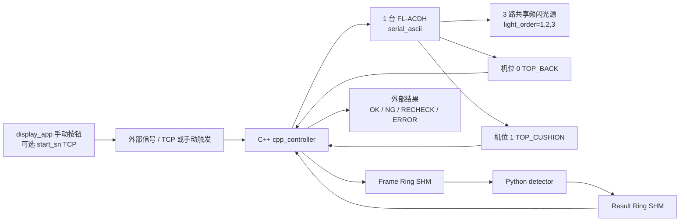

# Seat Surface AOI

汽车座椅表面缺陷检测系统参考实现。当前在线主链路已经收敛为固定多机位、N 路共享频闪光源的生产形态：C++ 负责外部信号、相机、FL-ACDH 频闪控制器、共享内存和结果回传；Python 作为独立检测进程，只负责图像质量门禁、预处理、模型推理、融合和规则判定。

## 当前链路



保留的 C++ 主控能力：

- 接收外部信号：`manual_trigger`、`external_signal`、`tcp_signal`（支持 `single` 单行协议和 `start_sn` 两步握手协议），以及本地回归用 `simulated`。
- `trigger_timeout_ms` 生产默认值为 `0`，表示无限等待外部信号；C++ 主控阻塞在 TCP/文件队列监听上，有信号才执行，无超时中断。
- `tcp_signal` 在无限等待模式下使用固定 200ms 内部轮询周期检查 socket 可读状态，连接断开时自动重连，不会因空闲等待而产生业务记录或告警。
- C++ 连续非空闲触发故障（如 PLC 协议错误、TCP 连接持续失败）会自动施加递增退避（前 3 次无额外延迟，之后每多一次增加 200ms，上限 5000ms），避免 Fault ↔ Ready 状态振荡和日志风暴。
- 连接当前型号频闪控制器：`light.backend=serial_ascii`，适配 FL-ACDH。
- 相机链路：本地回归 `simulated`，现场 `hikrobot_mvs`；真实采集对齐现场可工作的参考程序，每轮频闪前先并行 drain 所有相机 SDK 缓冲区的残留帧（arm() 改曝光参数可能在 Continuous 模式下即时产生一帧），再触发 FL-ACDH 并用 `GetImageBuffer` 读取硬触发帧；启动和相机故障重启时也会排空旧帧。当前生产、联调和采图配置统一使用 `COM1 / 9600 8N1`、30ms 相机曝光和 300/500/700us 三路频闪脉宽，FL-ACDH 触发路径只发送已在现场验证稳定的 `8/9/A/7` 命令，其中 `9` 命令按手册 `000~3E7` 范围编码为三位十六进制数据。单台相机连续失败后自动 stop+start 重启恢复。
- 固定采集方式：2 个机位共享 3 路光源，`capture_mode=fixed_camera`、`capture_schedule=shared_light_parallel`、`light_order=1,2,3`。
- 当前现场接线：工控机通过 RS232/USB 转串口连接 FL-ACDH；FL-ACDH 同步输出 `F1~F3` 已短接合成一根触发线，并联到两台相机黄色 `Line0`；FL-ACDH `GND` 与相机 IO `GND` 共地；相机 `Line1` 仅保留为调试输出。
- 在线模式使用共享内存和 Python detector；采图模式不启用共享内存，只采图保存原图并向外部信号回传 `RECHECK`。
- `display_app` 默认仍是只读展示；显式加 `--enable-manual-trigger` 后，首页 SN 输入框和”手动触发”按钮会按 C++ `tcp_signal` 的 `start_sn` 两步协议发送 `start` 与 `sn <SN>`，只模拟外部信号源，不直接控制相机、频闪或共享内存。手动触发提交中按钮显示”提交中”，收到 `sn_ack` 后切换为”等待结果”加载态并继续禁用输入框，直到同一 SN 的新版 `display_latest.json` 刷新后才恢复并清空输入。
- Python detector 返回的 `RECHECK/ERROR` 中，若消息匹配 ROI 未识别到目标物体模式（如”未识别到目标”），前端展示为信息性黄色提示而非告警/复检红色错误，不触发 `trigger_error`。

C++ 主控只保留上述当前链路。非当前链路的兼容路径、未使用 backend 枚举和对应源码已移除；共享内存协议布局保持与 Python detector 二进制兼容，C++ 结构命名统一为固定机位视图语义。

## 快速开始

```powershell
uv sync --group dev
uv run pytest
uv run python -m tools.validate_protocol
uv run python tools/run_simulated_ipc.py
```

默认模拟 IPC 会生成临时 C++ runtime config，把 trace/images 指向系统临时目录并关闭磁盘水位门禁，避免开发机磁盘余量影响本地回归；生产和测试机配置仍保留 `image_save.cleanup_min_free_ratio=0.20`。

C++ 单独构建与验证：

```powershell
cmake -S cpp_controller -B cpp_controller/build/codex-check -DCMAKE_BUILD_TYPE=Release
cmake --build cpp_controller/build/codex-check --config Release
cpp_controller\build\codex-check\Release\ipc_safety_checks.exe
```

配置校验：

```powershell
cpp_controller\build\codex-check\Release\seat_aoi_controller.exe --config cpp_controller\config\station_runtime.production.conf --validate-config
cpp_controller\build\codex-check\Release\seat_aoi_controller.exe --config cpp_controller\config\station_runtime.test.conf --validate-config
cpp_controller\build\codex-check\Release\seat_aoi_controller.exe --config cpp_controller\config\station_runtime.capture_only.conf --validate-config
cpp_controller\build\codex-check\Release\seat_aoi_controller.exe --config cpp_controller\config\station_runtime.replay_capture.conf --validate-config
```

## 运行配置

| 配置 | 用途 |
| --- | --- |
| `cpp_controller/config/station_runtime.production.conf` | 正式生产在线模式：TCP 外部信号、Hikrobot MVS、FL-ACDH、共享内存、Python 检测；默认 30ms 曝光、300/500/700us 频闪脉宽，`trace_root=trace`，C++ 原图副本默认关闭。 |
| `cpp_controller/config/station_runtime.test.conf` | 工控机联调模式：手动触发、Hikrobot MVS、FL-ACDH、共享内存、Python 检测，默认相机取帧超时 5s；频闪参数对齐外部成功程序。 |
| `cpp_controller/config/station_runtime.capture_only.conf` | 采图模式：手动触发、Hikrobot MVS、FL-ACDH，只保存原图，不创建共享内存，默认相机取帧超时 5s；频闪参数对齐外部成功程序。 |
| `cpp_controller/config/station_runtime.capture_only.single_camera.conf` | 单相机诊断采图：对齐外部成功程序的 `DA9184676 + COM1 + 光源1`，FL-ACDH 命令使用 ACK 节拍。 |
| `cpp_controller/config/station_runtime.replay_capture.conf` | `images_capture` 真实 PNG 回放：C++ simulated camera 从采图目录随机抽完整两机位三光源样本，写入共享内存，Python detector 从共享内存检测；不控制真实相机或频闪。 |

现场配置显式包含 `arm_settle_ms=50` 和 `max_camera_failures_before_reset=2`。如果程序提示未知运行配置字段，说明运行的不是当前源码重新构建出的控制器，需要先重建对应 Hikrobot MVS 版本的 `seat_aoi_controller.exe`。

`controller_mode` 只有两个值：

- `online`：初始化 Frame/Result 共享内存，采图后发布给 Python detector，等待检测结果并回传外部信号。
- `capture_only`：不初始化共享内存，不等待 Python detector；采图保存到 `image_save.root_dir/YYYYMMDD/<seat_id>/`，完成后回传 `RECHECK`。

## 工控机部署顺序

当前正式交付按“两个后台服务 + 一个展示快捷方式”执行：`SeatAoiController` 后台服务先启动并创建共享内存，`SeatAoiDetector` 后台服务随后打开共享内存并等待任务，桌面快捷方式启动 `display_app` 并只读消费 `trace` 展示通道。生产现场不要启用 display_app 手动触发按钮，除非已经确认不会抢占真实 PLC/上位机的 `tcp_signal` 连接。

构建、依赖安装和模型拷贝都可以在工控机交付安装阶段完成；交付成功后的长期运行阶段不要求网络连接。以下命令在工控机管理员 PowerShell 中按顺序执行。

```powershell
# 0. 首次确认：已安装 Git、Python 3.10+、uv、CMake、VC++ Runtime、Hikrobot MVS SDK。
#    nssm.exe 放到 bin\nssm.exe 或 tools\nssm\nssm.exe；真实模型文件由现场交付提供。
$ProjectRoot = "C:\seat-surface-aoi"
$RepoUrl = "<REPO_URL>"
$ModelRoot = "D:\seat-aoi-model"

# 1. 首次部署：拉取项目代码
git clone $RepoUrl $ProjectRoot
Set-Location $ProjectRoot

# 2. 后续更新：只拉代码，不覆盖现场 trace/images
git fetch --all --prune
git checkout main
git pull --ff-only

# 3. 复制真实模型资产
New-Item -ItemType Directory -Force model\roi_yolo, model\wideresnet50, model\patchcore | Out-Null
Copy-Item "$ModelRoot\roi_yolo\seat_roi_seg.onnx" ".\model\roi_yolo\seat_roi_seg.onnx" -Force
Copy-Item "$ModelRoot\wideresnet50\seat_wrn50_embedding.onnx" ".\model\wideresnet50\seat_wrn50_embedding.onnx" -Force
Copy-Item "$ModelRoot\patchcore\seat_pca.json" ".\model\patchcore\seat_pca.json" -Force
Copy-Item "$ModelRoot\patchcore\seat_patchcore_bank.json" ".\model\patchcore\seat_patchcore_bank.json" -Force
Copy-Item "$ModelRoot\patchcore\seat_patchcore_bank.npy" ".\model\patchcore\seat_patchcore_bank.npy" -Force
Copy-Item "$ModelRoot\patchcore\seat_patchcore.faiss" ".\model\patchcore\seat_patchcore.faiss" -Force

# 4. 配置生产环境参数：按现场确认 COM 口、相机 SN、结果回传 IP/端口
notepad .\cpp_controller\config\station_runtime.production.conf

# 5. 一键安装：安装 Python 运行依赖、构建 C++ 主控、注册后台服务、创建展示快捷方式
powershell -ExecutionPolicy Bypass -File .\tools\windows\install_station.ps1 `
  -BuildController `
  -EnableHikrobotMvs `
  -LineId LINE1_AOI_01 `
  -GridLayout 2x1
```

如果 `bin\seat_aoi_controller.exe` 已经由现场手工构建好，可以省略 `-BuildController -EnableHikrobotMvs`：

```powershell
Set-Location C:\seat-surface-aoi
powershell -ExecutionPolicy Bypass -File .\tools\windows\install_station.ps1 -LineId LINE1_AOI_01 -GridLayout 2x1
```

联调或需要 display_app 手动触发全链路时，安装脚本追加 `-EnableDisplayManualTrigger`，快捷方式会启用首页 SN 输入和“手动触发”按钮，并向 C++ `tcp_signal` 端口发送 `start`/`sn <SN>` 两步协议：

```powershell
powershell -ExecutionPolicy Bypass -File .\tools\windows\install_station.ps1 `
  -BuildController `
  -EnableHikrobotMvs `
  -EnableDisplayManualTrigger `
  -ManualTriggerHost 127.0.0.1 `
  -ManualTriggerPort 9000 `
  -LineId LINE1_AOI_01 `
  -GridLayout 2x1
```

如果 C++ 主控正在监听但没有 PLC/上位机/display_app 客户端连接，或客户端已连接但尚未发送完整 `start` + `sn <SN>`，这属于空闲等待，不会触发采图、不会写入共享内存、不会等待 Python detector，也不会在展示端形成复检记录。只有完整触发已进入采集/检测后发生缺帧、设备故障、共享内存错误、检测超时、质量门禁失败或协议/CRC 错误，才会按 fail-closed 规则输出 `RECHECK` 或 `ERROR`。

安装脚本默认会执行：

- `uv export --no-emit-project ...` 生成运行依赖清单，并安装到 `.venv`；不会构建或安装当前项目 wheel，因此不会因为缺少文档文件阻断生产安装。
- `seat_aoi_controller.exe --validate-config`
- `python -m tools.validate_protocol`
- `python -m tools.validate_model_assets --recipe seat_a_black_leather_production_v1`
- 注册 `SeatAoiDetector` 和 `SeatAoiController` 两个自启动后台服务。
- 创建 `Seat AOI Display.lnk` 桌面快捷方式，目标为 `.venv\Scripts\pythonw.exe -m display_app.main --trace-root trace --line-id LINE1_AOI_01 --grid-layout 2x1`。

`tools\windows\*.ps1` 交付脚本保持 ASCII 文本，兼容工控机常见的 Windows PowerShell 5.1，避免 UTF-8 无 BOM 脚本中的中文字符串被系统 ANSI 代码页误读后触发解析错误。

服务和快捷方式安装后，日常运行只需要：

```powershell
Start-Service SeatAoiController
Start-Service SeatAoiDetector
```

操作员从桌面双击 `Seat AOI Display` 打开展示前端。展示前端是 GUI 程序，不注册为 Windows Service；如需登录后自动打开，可安装时追加 `-CreateStartupShortcut`。后台服务日志写入 `logs\services\`，检测和展示事件仍写入 `trace\`。

卸载服务和快捷方式时执行：

```powershell
powershell -ExecutionPolicy Bypass -File .\tools\windows\uninstall_station.ps1
```

卸载脚本只移除 `SeatAoiDetector`、`SeatAoiController` 和快捷方式，不删除项目代码、模型、`trace` 或日志。

仍可手动启动三进程做排障：

```powershell
# 终端 1：Python detector，必须传入同一份 production.conf
.\.venv\Scripts\python.exe -m python_detector.detector_main --config cpp_controller\config\station_runtime.production.conf

# 终端 2：C++ 主控，持续生产循环
.\bin\seat_aoi_controller.exe --config cpp_controller\config\station_runtime.production.conf --loop

# 终端 3：展示前端，只读展示
.\.venv\Scripts\python.exe -m display_app.main --trace-root trace --line-id LINE1_AOI_01 --grid-layout 2x1
```

完整触发进入采集/检测后，任一超时、缺帧、质量门禁失败、模型异常或 trace 写入失败都必须输出 `RECHECK` 或 `ERROR`；外部触发尚未完整到达时仅继续等待，不输出检测结果。

## 工程地图

```text
seat-surface-aoi/
├── cpp_controller/      # C++ 主控、相机/频闪/外部信号、共享内存 IPC
├── python_detector/     # Python 检测进程、模型后端、ROI、融合和 trace
├── display_app/         # PySide6/QML 展示前端，可选 TCP 手动触发入口
├── training_tools/      # 离线样本、embedding、PCA/PatchCore/FAISS、benchmark
├── model/               # 模型产物目录
├── docs/                # 架构、协议和运维文档
└── tools/               # 协议校验、模拟 IPC、打包、预检和 Windows 交付安装脚本
```

ROI 定位模型当前只映射一个目标 ROI 名称 `seat`。训练数据应采用 YOLO segmentation 格式，导出的产物放入 `model/roi_yolo/seat_roi_seg.onnx`，并与 `python_detector/config/*recipe*.yaml` 中的 `roi_locator.class_names: [seat]`、ROI 模板和标定文件保持一致；这里的 `class_names` 只服务 ROI 定位，不代表缺陷类别。

已有 ROI 模型和 `images_capture/` 真实平铺 PNG 后，先把采图目录转换成现有训练链路可消费的 ROI manifest，再训练 PatchCore/PCA/FAISS 或监督模型：

```powershell
uv sync --group training
uv run python -m training_tools.collect_capture_dataset `
  --input images_capture\20260623\LINE1_AOI_CAPTURE_MANUAL_SEAT_9000 `
  --output datasets\seat_capture_20260623_9000 `
  --recipe seat_a_black_leather_production_v1 `
  --split train `
  --label-status unverified_ok `
  --skip-failed
```

`collect_capture_dataset` 默认按所选配方的 `light_order` 生成 `L1/L2/L3...` 到算法光源 ID 的映射；当前生产配方即 `L1/L2/L3 -> DIFFUSE/POLAR_DIFFUSE/HIGH_LEFT`。它调用 `model/roi_yolo/seat_roi_seg.onnx` 做 ROI segmentation 定位，先按 mask 外接矩形裁出座椅 ROI，再把 mask 外像素置黑，只保留 mask 内目标物体，最后输出 `dataset_manifest.jsonl` 和当前配方光源数量一致的 ROI PNG。默认保留 ROI 原生尺寸，避免把纹理和细小缺陷压缩失真；只有在需要和 PatchCore 固定输入尺寸对齐时，才应显式传 `--roi-output-size WIDTHxHEIGHT`，并且该缩放会采用等比例 letterbox，而不是直接拉伸。`dataset_summary.json` 会记录 `roi_size_policy` 和 ROI 尺寸分布，`patchcore_training_summary.json` 会记录实际训练输入 `input_shape_summary`，用于确认训练和在线裁剪策略一致。ROI 冲突、低置信或越界样本会被跳过，不进入训练集。PatchCore 只能用人工确认的正常样本建库。
生产缺陷判定链路采用无监督 PatchCore 主模型，不依赖缺陷类别识别模型。真实 OK 样本用于训练 WideResNet50 embedding、PCA、PatchCore memory bank 和可选 FAISS 索引；训练 embedding 默认使用配方 `models.<key>.input_channels`，与在线检测层保持一致，当前 2 个机位、3 种光源只是生产配方事实，算法层不固定光源数或输入通道数。NG/RECHECK 与人工复核样本用于阈值曲线和放行验证；检测结果只表达缺陷存在性、位置、分数和处置判定，不输出缺陷类别。

**生产配方默认启用空间 PatchCore 模式（`spatial_mode: true`）**，检测链路提取 layer2+layer3 中间层特征图构建 H×W patch 嵌入，当前生产配方显式使用 `256x256` 空间 patch 网格，原始 patch embedding 为 1536 维，经 `seat_pca.json`（v3, 524 维，95% 累积方差）投影后进入 PatchCore memory bank/FAISS。离线训练和最终 memory bank 向量均使用 `.npy` 二进制矩阵保存，`seat_patchcore_bank.json` 只保存版本、维度、`vectors_path`、向量数和 metadata；默认训练完成后清理 `embeddings.npy/pca_embeddings.npy` 中间矩阵。**KNN 评分已改为训练数据自校准 z-score**：`anomaly_score = clip((nearest - μ_train) / σ_train / 6.0, 0, 1)`，μ 和 σ 由训练阶段对 memory bank 做 self-KNN (k=2) 自动计算并写入 `bank.json` 的 `distance_mean`/`distance_std` 字段；配方中 `anomaly_score_scale: 0.0` 启用自校准，设为正值则回退到旧行为。KNN 评分后生成像素级 `anomaly_map`，经 `scipy.ndimage.label` 连通域分析自动定位缺陷区域并输出 bbox。在线推理会先把 `anomaly_map` 和 `nearest_distances` 归一化为二维有限矩阵并确认形状一致，再做最大值统计和连通域提取，避免 numpy 数组布尔歧义或异常形状静默进入判定。TraceWriter 热力图渲染管线使用**双线性插值**上采样 anomaly_map → 高斯平滑消除栅格残余 → 形态学闭运算填补掩码孔洞，最终仅在缺陷候选 bbox 内叠加黄/红热色，并绘制判定框和缺陷 bbox 供前端生产展示通道消费。若需回退到全局嵌入路径（整个 ROI → 1 个标量分数），在配方中设置 `spatial_mode: false`。

Python 检测层性能优化历程和量化数据见 [docs/python_detector_performance_report.md](docs/python_detector_performance_report.md)（2026-06 向量化重构：6 轮优化，23× 算法加速，PCA 精度 38.5%→95.0%）。

生产配方的亮度质量门禁采用比例阈值：单帧过曝像素比例 `max_saturation_ratio` 和过暗像素比例 `max_dark_ratio` 当前均为 `0.40`；Python 检测层对亮度统计、过曝/欠曝比例、Laplacian 锐度、运动梯度、ROI 裁剪/透视展开、Dome ROI 输入 letterbox、YOLO 候选/mask decode（含非有限输出保守失败校验）、seg mask 统计/腐蚀、ECC 相关性/重采样、特征通道、NCHW tensor、空间 embedding 拼接、PCA 投影、PatchCore KNN 评分与 anomaly map 形状校验、trace PNG scanline 构造和 raw overlay/heatmap 渲染使用 `numpy` 批量处理，避免高分辨率原图和 patch 向量在 Python 层逐像素/逐维度循环；256x256 anomaly map 连通域分析仍作为小图控制流保留。缺帧、时序、曝光/增益一致性、锐度、运动梯度、配准失败、模型非有限输出等不确定状态仍会输出 `RECHECK` 或 `ERROR`。

从 `images_capture/` 抽取一组两机位样本做完整链路模拟并生成检测图：

```powershell
uv run python -m training_tools.simulate_capture_detection `
  --input images_capture\20260623\LINE1_AOI_CAPTURE_MANUAL_SEAT_9000 `
  --output reports\capture_detection_20260623_9000 `
  --recipe seat_a_black_leather_production_v1 `
  --sample-index 1
```

该命令会构造真实 `SeatInspectionJob`，调用生产配方的质量门禁、ROI YOLO segmentation、ROI 裁剪、ECC、WideResNet50 embedding、PCA、PatchCore/FAISS、融合和规则判定。默认只输出最终检测报告 `detection_summary.json`、原图 `original_images/` 和检测图 `detection_images/`；OK、NG、RECHECK 和 ERROR 都会生成检测图。需要排障时再追加 `--write-trace` 输出完整 trace 明细。

从 `images_capture/` 抽取一组两机位样本做共享内存全链路回放：

```powershell
uv run python tools/run_simulated_ipc.py --config cpp_controller/config/station_runtime.replay_capture.conf
# 等价快捷入口：
uv run python tools/run_simulated_ipc.py --replay-capture
```

该命令会先构建/启动 C++ 主控，由 C++ simulated camera 读取 `images_capture/20260623/LINE1_AOI_CAPTURE_MANUAL_SEAT_9000` 中随机完整样本并发布 Frame SHM，再启动 Python detector 读取共享内存、运行生产配方并写回 Result SHM。文件名时间戳仅用于排序分组，写入共享内存时仍使用本次在线模拟采集 metadata；若真实 PNG 触发质量门禁或模型保守规则，结果会按规则返回 `RECHECK/ERROR`，不会输出 `OK`。`trace/replay_capture/display_latest.json` 会记录展示通道摘要，检测 trace 按生产配方的 `trace.save_ok_ratio/save_ng/save_recheck` 策略保存到配方 trace 根目录。

## 展示前端手动触发

联调时可以让 `display_app` 首页按钮模拟外部到位信号和 SN 条码，向 C++ 主控 `signal.backend=tcp_signal` 发送两步协议：

```powershell
uv run seat-aoi-display `
  --trace-root trace `
  --line-id AOI-1 `
  --enable-manual-trigger `
  --manual-trigger-host 127.0.0.1 `
  --manual-trigger-port 9000
```

按钮提交的是控制面触发信号，不传图、不读写 Frame/Result 共享内存。C++ 收到 `start` 与 `sn <SN>` 后仍按 `StationController` 完整执行相机、频闪、共享内存检测和保守结果校验；`sn_ack` 只表示触发信号提交成功，不表示检测完成。前端会在等待同一 SN 的展示结果期间保持按钮 loading 和输入禁用，默认 30 秒超时，可用 `--manual-trigger-result-timeout-ms` 调整。生产现场如果同一个 `9000` 端口已有 PLC/外部上位机长连接，需要先确认连接仲裁策略，避免展示前端抢占真实触发连接。

## 安全边界

- Python 不控制 PLC、相机或频闪。
- C++ 不做深度学习推理。
- 在线图像和检测结果只通过共享内存交换，不使用 TCP 传图。
- 超时、缺帧、协议错误、CRC 错误、质量门禁失败、配置错误和采图模式都不能输出 `OK`，必须输出 `RECHECK` 或 `ERROR`。

更多 C++ 主控细节见 [cpp_controller/README.md](cpp_controller/README.md)，共享内存协议见 [docs/shm_protocol.md](docs/shm_protocol.md)。
当前工控机已调通链路的模块职责、采集时序和故障闭环见 [C++ 主控当前逻辑梳理](docs/cpp_controller_current_logic.md)。
