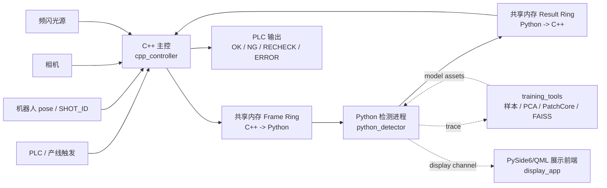

# Seat Surface AOI

> 汽车座椅表面缺陷检测系统参考实现，面向生产线 AOI 场景，采用 **C++ 实时主控 + Python 独立检测进程 + 跨平台共享内存 IPC**。当前主链路覆盖固定机位多光源和机器人飞拍多光源两类采集模式，支持 Linux/macOS POSIX 共享内存与 Windows Named Shared Memory。


<p align="center">
  <a href="#快速开始"></a>
  <a href="docs/shm_protocol.md"></a>
  
  
  
  
</p>

<p align="center">
  <a href="#系统总览">系统总览</a> ·
  <a href="#快速开始">快速开始</a> ·
  <a href="#工程地图">工程地图</a> ·
  <a href="#部署打包">部署打包</a> ·
  <a href="#验证矩阵">验证矩阵</a> ·
  <a href="#文档地图">文档地图</a> ·
  <a href="#安全边界">安全边界</a>
</p>

## 项目定位

Seat Surface AOI 是一套可验证、可扩展的汽车座椅表面缺陷检测参考工程。仓库重点不是单一模型 demo，而是一条接近产线集成方式的在线闭环：

| 层级 | 职责 | 当前实现 |
| --- | --- | --- |
| 实时主控 | PLC、相机、频闪、机器人 pose/shot、触发同步、节拍控制 | `cpp_controller/` C++17 主控、按 `light_index/light_seq_index` 生成元数据的模拟相机、Hikrobot MVS 相机 (Line0 硬触发)、FL-ACDH RS232 多控制器频闪、TCP 信号 (SN+结果回传)、距离传感器触发、按日期分目录的图像落盘 PGM、低磁盘容量旧数据清理、JSON 结果输出、生产配置校验和故障注入 |
| 检测进程 | 质量门禁、预处理、ROI、配准、多光源特征、模型推理、融合判定 | `python_detector/` 独立进程，默认 fake 后端，可接 ONNX/PatchCore/FAISS |
| 在线通信 | 图像包与检测结果交换 | 跨平台共享内存 frame/result ring buffer，固定布局、CRC 和协议校验 |
| 离线闭环 | trace 转样本、embedding、PCA、PatchCore/FAISS、回放、benchmark | `training_tools/` 只消费在线检测公开入口，不反向耦合 detector |

**适合用来做：**

- 工业 AOI 在线链路参考实现。
- 固定机位和机器人飞拍多光源采集方案验证。
- C++ 控制侧与 Python 算法侧边界设计。
- 共享内存协议、质量门禁、保守判定和离线训练闭环验证。

**不直接包含：**

- 真实 PLC、工业相机、频闪控制器、机器人 SDK 驱动实现。
- 现场训练数据、大模型权重、MES/报警平台和生产监控服务。
- 可跳过安全降级的“演示型 OK”链路。

## 系统总览




核心边界很明确：

- C++ 负责设备控制、采集调度、共享内存写入、结果读取和生产节拍。
- Python 只负责检测算法，不控制 PLC、相机、机器人或频闪。
- 在线图像和结果只走共享内存，不使用 TCP。
- 缺帧、超时、协议错误、CRC 错误、质量门禁失败、模型异常都不能输出 `OK`。

<details>
<summary>展开 V4.0 双采集模式统一架构图</summary>


</details>

## 当前能力

| 能力 | 状态 |
| --- | --- |
| 双采集模式 | 支持固定机位 `fixed_camera` 与机器人飞拍 `robot_flyshot`，二者在 C++ Capture Plan 层统一为检测视角序列。 |
| 参考模拟链路 | C++ 内置 fallback、`station_runtime.example.conf` 与 `station_runtime.robot_flyshot.example.conf` 均使用 4 路模拟光源，对齐默认 Python 配方的 `DIFFUSE/POLAR_DIFFUSE/HIGH_LEFT/HIGH_RIGHT`。 |
| 同机位多角度输入 | 固定机位默认配置可接收同一 `camera_id` 下动态 `pose_id` 的多张照片，按同一机位配方、标定、模型处理并在 trace/result 中保留原始 `pose_id`；显式机器人飞拍 pose 仍必须精确匹配配方。 |
| 视角级串行 TDM | 每个检测视角按 `light_order` 完成多光源采集后再切换下一视角，降低频闪互相污染风险。 |
| 共享内存 IPC | C++/Python 双端固定布局结构体、frame/result ring buffer、slot 状态机、CRC、layout/对象大小 fail-fast 和协议校验工具。 |
| V4 算法接口 | Dome ROI YOLO segmentation 自动生成 ROI polygon、ECC 配准、WideResNet50 embedding、PCA、PatchCore KNN 和 FAISS 可选加速接入点。 |
| 生产光源对齐 | 当前固定机位产线是 2 相机 + 3 光源，C++ `light_order=1,2,3` 与 Python 生产配方 `DIFFUSE/POLAR_DIFFUSE/HIGH_LEFT` 已对齐；第 4 路 `HIGH_RIGHT` 仅作为后续扩展。 |
| 保守判定 | 协议异常、CRC 错误、缺帧、超时、质量失败、shot/机器人位姿不一致、ROI 冲突、机器人 FAULT、候选融合溢出和模型异常返回 `RECHECK` 或 `ERROR`。 |
| 无模型采样兜底 | 生产模型文件缺失、仍是占位文件或 ONNX/numpy 依赖未安装时，Python detector 返回 `RECHECK/CONFIGURATION_ERROR`，保存原始采集图和可用 ROI 图，不输出 `OK` 或 `NG`。 |
| 前端展示页面 | `display_app/` 迁移 PySide6/QML 监控界面，轮询 `display_latest.json` 与 C++ 主控事件，展示相机/视角图像、OK/NG/复检/异常计数、采样模式、日志、复核队列和 NG 弹窗。 |
| 前端展示通道 | Python detector 成功写回共享内存后，额外输出 `display_latest.json` 和 `display_events.jsonl`；C++ 主控输出 `cpp_controller_events.jsonl`；展示桥优先显示 ROI 图，缺 ROI 时显示原始采集图。 |
| 操作员追溯 | `display_app` 持久化 `display_operator_events.jsonl` 与 `display_review_queue.json`，记录主控告警、复核队列和操作员确认/忽略动作，便于训练标注闭环。 |
| 数据闭环 | trace、按 `camera_id/pose_id` 隔离的 ROI 图、overlay、manifest、embedding、PCA/PatchCore/FAISS 资产训练、回放与 benchmark；C++ 原图可落盘到 `images/YYYYMMDD/<seat_id>/`，并在可用容量低于 20% 时按文件时间清理最早图片。 |

## 快速开始

### 1. 安装开发依赖

```bash
uv sync --group dev
```

Windows 工控机与中文区域设置环境下，项目使用 `uv_build` 作为 Python 包构建后端，避免 `setuptools.build_meta`
在 editable 构建阶段输出 `running egg_info` 日志时被 uv 误解析为构建协议 JSON，导致
`expected value at line 1 column 1`。如遇到历史虚拟环境残留，可先删除 `.venv/` 后重新执行上述命令。

### 2. 跑单元测试和协议校验

```bash
uv run pytest
uv run python -m tools.validate_protocol
uv run python -m tools.validate_architecture_readiness --scope reference
uv run python -m tools.validate_deployment_preflight
```

### 3. 跑端到端模拟 IPC

```bash
bash tools/run_simulated_ipc.sh
```

Windows 工控机或希望使用跨平台入口时运行：

```bash
uv run python tools/run_simulated_ipc.py
```

Windows 跨平台入口会显式探测 CMake 生成器：优先使用 Ninja，其次使用已安装的 Visual Studio/MSBuild 生成器，再在可用时回退到 `clang++`/`g++` 直接编译；不会因为 CMake 默认选中缺失的 `nmake.exe` 而提前失败。若需手动指定构建环境，仍可进入 x64 VS 开发命令环境后运行同一命令。C++ 工程已为 MSVC 固化 `/utf-8` 编译选项，避免中文日志字符串在本地代码页下被误解析。

模拟 IPC 会构建 C++ 主控，默认使用 `cpp_controller/config/station_runtime.example.conf` 发布一次多视角四光源图像包，Python detector 从共享内存读取任务并写回结果。正常模拟链路应返回 `OK`；故障注入、协议错误或 detector 超时必须返回 `RECHECK` 或 `ERROR`。

## 常用入口

```bash
# 固定机位模拟链路
bash tools/run_simulated_ipc.sh
uv run python tools/run_simulated_ipc.py

# 机器人飞拍模拟链路
bash tools/run_simulated_ipc.sh \
  --config cpp_controller/config/station_runtime.robot_flyshot.example.conf
uv run python tools/run_simulated_ipc.py \
  --config cpp_controller/config/station_runtime.robot_flyshot.example.conf

# Python detector 在线入口
uv run python -m python_detector.detector_main --once --timeout-ms 8000
uv run seat-aoi-detector --once --timeout-ms 8000

# Python detector 写前端展示通道，默认输出到 trace_root
uv run python -m python_detector.detector_main \
  --config cpp_controller/config/station_runtime.example.conf \
  --display-root trace \
  --once --timeout-ms 8000

# 启动 PySide6/QML 展示前端，读取 trace/display_latest.json
uv sync --extra display
uv run seat-aoi-display --trace-root trace --line-id AOI-1

# 真实模型资产上线前检查
uv run python -m tools.validate_model_assets --recipe seat_a_black_leather_production_v1
uv run python -m tools.validate_model_assets --recipe seat_a_robot_flyshot_production_v1

# 生成离线部署包，默认集成根目录 model/
bash tools/package_release.sh

# 架构就绪度检查
uv run python -m tools.validate_architecture_readiness --scope reference
uv run python -m tools.validate_architecture_readiness --scope production

# Windows 工控机上机前交接预检
uv run python -m tools.validate_deployment_preflight
uv run python -m tools.validate_deployment_preflight --strict-production
```

`validate_model_assets --recipe seat_a_black_leather_production_v1` 和 `seat_a_robot_flyshot_production_v1` 在仓库占位模型未替换时应失败，并列出需要部署的真实模型产物；这属于上线前阻塞检查，不是默认模拟链路失败。

## 工程地图

```text
seat-surface-aoi/
├── cpp_controller/      # C++ 主控、采集调度、硬件抽象、共享内存 IPC、生产配置
├── python_detector/     # Python 检测算法、配方、标定、模型适配、共享内存客户端、trace
├── display_app/         # PySide6/QML 展示前端，只读 detector display 通道
├── training_tools/      # trace 转样本、embedding、PCA/PatchCore/FAISS、评估、回放、benchmark
├── model/               # 真实模型产物占位：YOLO、WideResNet50、PCA、PatchCore、FAISS
├── docs/                # 架构、协议、C++ 运维、Python 算法运维、调用关系摘要
└── tools/               # 项目级协议/资产/架构校验和 C++/Python IPC 联调脚本
```

| 目录 | 读者入口 | 主要关注点 |
| --- | --- | --- |
| `cpp_controller/` | [C++ 主控 README](cpp_controller/README.md) | PLC/Robot/Camera/Light 抽象、Capture Plan、共享内存发布、故障注入。 |
| `python_detector/` | [Python 检测算法层导览](python_detector/README.md) | 质量门禁、ROI、ECC、多光源特征、模型后端、融合、规则、trace。 |
| `display_app/` | [PySide6/QML 展示前端](display_app/README.md) | 读取 `display_latest.json`、C++ 主控事件和 trace 图，显示监控/统计/日志/复核页面并持久化操作员动作。 |
| `training_tools/` | [Python 运维文档](docs/python_detector_operations.md) | 离线样本、embedding、PCA、PatchCore/FAISS、回放、benchmark。 |
| `tools/` | [验证矩阵](#验证矩阵) | 跨 C++/Python 的协议、模型资产、架构就绪度、部署预检和 IPC 联调校验。 |
| `model/` | [模型产物目录说明](model/README.md) | 真实 ONNX、PCA、memory bank、FAISS 索引的部署约定。 |
| `docs/` | [文档总览](docs/README.md) | V4 架构、共享内存协议、运维和代码调用关系。 |

<details>
<summary>展开项目功能与代码映射图</summary>


</details>

## 部署打包

项目提供 `tools/package_release.sh` 生成离线部署包。打包边界是“可部署的在线检测链路”，默认包含：

| 内容 | 说明 |
| --- | --- |
| `bin/` | 已构建的 `seat_aoi_controller`、`protocol_layout`、`ipc_safety_checks`。 |
| `cpp_controller/` | C++ 主控源码、配置模板、CMake 工程和诊断工具源码。 |
| `python_detector/` | Python detector、配方、标定、ROI 模板、算法和测试。 |
| `display_app/` | PySide6/QML 展示前端源码和样式资源；运行需安装 `display` extra。 |
| `training_tools/` | 离线回放、benchmark、embedding、PCA/PatchCore/FAISS 资产生成工具。 |
| `model/` | 根目录 `model/` 下的模型目录结构或真实模型产物。 |
| `tools/`、`docs/` | 协议校验、模型资产校验、架构检查、模拟 IPC 脚本和运维文档。 |

参考联调包可以直接执行：

```bash
bash tools/package_release.sh
```

生产包必须先把真实模型产物替换到根目录 `model/`，再直接执行打包脚本：

```bash
bash tools/package_release.sh
```

脚本会生成 `dist/<package>.tar.gz` 和对应 `.sha256`，并默认集成根目录 `model/`。解包后可先运行 `bash validate_package.sh` 做协议和 IPC 基础校验；如需使用包内已构建的 C++ 产物跑模拟 IPC，可运行 `bash run_packaged_simulated_ipc.sh`。生产包不默认包含现场训练数据、trace、日志、`.venv` 或本地构建缓存。

部署包和源码树都提供上机前预检入口：

```bash
uv run python -m tools.validate_deployment_preflight
uv run python -m tools.validate_deployment_preflight --strict-production
```

默认预检用于交接，验证当前仓库可实现的参考链路、Windows 共享内存映射、跨平台 IPC 入口、部署包入口和 PLC 前手动联调路径；真实模型资产和 MES/报警/监控协议会列为现场 ACTION。`--strict-production` 用于 Windows 工控机放行前，把固定双机位正式 `production.conf` 缺失、生产光源/配方不一致和真实模型资产缺失升级为阻塞项。

## 在线链路

### C++ 主控链路

```text
main.cpp
  -> StationRuntimeConfig
  -> HardwareFactory
  -> StationController
      -> ISignalClient.wait_trigger()
      -> FrameAssembler.capture_job()
      -> FrameRingBuffer.publish()
      -> ResultRingBuffer.wait_result()
      -> validate detector result
      -> ISignalClient.publish_result()
```

C++ 侧负责生产节拍和设备安全，不能实现深度学习推理。当前仓库已实现：模拟 backend、Hikrobot MVS 相机 backend（Line0 硬件触发）、FL-ACDH RS232 多控制器频闪 backend、TCP 信号 backend（SN 接收 + 结果回传）、距离传感器触发 backend（JK-LRD Modbus RTU）、按日期分目录的图像落盘（PGM）和低容量旧数据清理、JSON 结果输出、生产配置 fail-fast 校验和故障注入路径；机器人真实 backend 仍需按现场协议或 SDK 接入。

常驻生产闭环是：`seat_aoi_controller` 启动后持续等待外部信号/手动触发，按 Capture Plan 控制相机和频闪采集多光源图，写入共享内存 Frame Ring；Python detector 常驻读取 READY slot，完成检测或采样兜底后写 Result Ring；C++ 读取结果并通过 `ISignalClient` 输出给 PLC/上位机。`ERROR` 会被 C++ 映射为外部信号侧 `RECHECK` 输出，避免产线误放行。

### Python 检测链路

```text
python_detector.detector_main
  -> ShmClient.acquire_job()
  -> SeatSurfaceAoiAlgorithm.inspect()
  -> InspectionPipeline.run()
      -> ImageQualityGate
      -> Preprocessor / RoiLocator
      -> ReflectanceCubeBuilder / EccRegistration
      -> FeatureBuilder
      -> InferenceEngine / ModelRegistry
      -> FusionEngine / DefectFilter / RuleEngine
      -> TraceWriter
  -> ShmClient.publish_result()
```

Python 侧只处理检测链路。任意输入不可信、配方不一致、输出越界或质量失败，都会进入保守结果，不用 `OK` 掩盖异常。生产模型文件缺失、仍是占位文件、ONNX/numpy 依赖未安装、PCA 或 PatchCore memory bank 未就绪时，当前任务返回 `RECHECK` 并带 `CONFIGURATION_ERROR`，同时写 trace 样本用于后续训练；这类资产未就绪状态不会被报成 `NG`。

Python detector 默认启用前端展示通道。每次检测完成并成功写回共享内存结果后，会在 `trace_root` 下追加 `display_events.jsonl`，并原子更新 `display_latest.json`。事件字段包括 `sequence_id`、`trigger_id`、`seat_id`、`sku`、`recipe_id`、`decision`、`quality_pass`、`error_code`、`elapsed_ms`、缺陷列表、质量/错误消息、`sample_collection`、`trace_dir`、原始采集 PGM 图、ROI PGM 图路径和 overlay PPM 路径。该通道由本仓库 `display_app/` 的 PySide6/QML 展示前端只读消费，也可供外部 `online-detection-app` 对接；它不参与 C++/Python 在线共享内存协议。展示通道落盘失败只会打印告警，不改变 detector 已写回 C++ 的判定结果。C++ 侧采集失败或 detector timeout 等没有 Python 结果的场景，前端读取 `trace_root/cpp_controller_events.jsonl` 补充主控事件。

### PySide6/QML 展示前端

`display_app/` 迁移了 `/Users/yyh/code/online-detection-app` 中已经开发好的监控展示资源，并收敛成当前项目内的只读操作页面。它复用相机网格、检测图/原图切换、NG 弹窗、统计、日志和复核交互，但不启动原项目的相机、PLC、触发服务、模型部署或 `seat_defect_core`。前端会显示 OK、NG、复检和异常计数，模型资产未就绪时显示“采样模式”，并把主控告警、复核队列和操作员动作持久化到 `trace_root`。

```bash
uv sync --extra display
uv run seat-aoi-display --trace-root trace --line-id AOI-1
```

展示前端读取 `trace/display_latest.json` 和 `trace/cpp_controller_events.jsonl`，按事件中的图片路径更新 `image://camera/<camera_id>` 图像源。正常检测优先显示 ROI PGM 和 overlay PPM；模型资产未就绪或 ROI 未产出时，前端会显示 `raw_images/<camera_id>/<pose_id>/<light_id>.pgm` 中的原始采集图。若事件没有 trace 图像，页面仍会更新状态、计数和日志；图像区域等待下一次带图像的检测事件。前端会额外写入 `display_operator_events.jsonl` 与 `display_review_queue.json`，用于操作员复核追溯和训练标注闭环。

### 共享内存协议

| 方向 | 共享内存逻辑名称 | 内容 |
| --- | --- | --- |
| C++ -> Python | `/seat_aoi_cpp_to_py_frames_v1` | `SeatJobMeta`、`LightFrameMeta[]` 和图像 payload。 |
| Python -> C++ | `/seat_aoi_py_to_cpp_results_v1` | `InspectionResultMeta`、`DefectResultMeta[]` 和结果 payload。 |

协议当前为 `SHM_PROTOCOL_VERSION = 2`，固定小端布局，包含 slot 状态机、header CRC 和 payload CRC。Linux/macOS 使用 POSIX 共享内存逻辑名；Windows 平台层把同一逻辑名映射为 `Local\seat_aoi_cpp_to_py_frames_v1` 和 `Local\seat_aoi_py_to_cpp_results_v1`，协议结构和 CRC 不变。C++ 打开既有共享内存时会校验对象实际大小以及 magic/version/slot_count/slot_size，不匹配且未显式 reset 时直接失败，避免静默重写布局；结果 ring 会回收旧序号或坏状态 slot，但当前序号的 corrupted/timeout 仍按 CRC 或 detector timeout 保守失败。C++ 回收 detector 结果时会再次校验语义：`OK` 必须质量通过、无错误且无缺陷，`NG` 必须质量通过、无错误且存在缺陷，其余不一致组合会转成 `RECHECK/InvalidPayload`。协议细节见 [共享内存协议](docs/shm_protocol.md)。

## 模型与训练闭环

生产模型产物默认不提交到仓库，`model/` 只保留目录约定和占位文件：

| 产物 | 默认路径 | 用途 |
| --- | --- | --- |
| Dome ROI YOLO segmentation | `model/roi_yolo/seat_roi_seg.onnx` | 从 Dome 语义光源分割座椅 ROI，并自动生成运行时 `polygon_xy`。 |
| 监督缺陷检测 | `model/supervised_defect/seat_defect_detector.onnx` | 已知缺陷检测 ONNX。 |
| WideResNet50 embedding | `model/wideresnet50/seat_wrn50_embedding.onnx` | 多光源 ROI embedding。 |
| PCA | `model/patchcore/seat_pca.json` | unified embedding 降维。 |
| PatchCore memory bank | `model/patchcore/seat_patchcore_bank.json` | 正常样本近邻检索安全网。 |
| FAISS 索引 | `model/patchcore/seat_patchcore.faiss` | 可选 KNN 加速，失败时回退 exact KNN 并记录 trace。 |

模型补齐后，Python detector 通过两个可加载生产配方启用完整检测链路：

| 配方 | 采集模式 | 作用 |
| --- | --- | --- |
| `seat_a_black_leather_production_v1` | 固定机位 | `production_recipe.yaml`，启用 ONNX ROI、ECC、监督 ONNX、WideResNet50 embedding、PCA、PatchCore/FAISS safety net；同一固定机位的动态角度 `pose_id` 可复用该机位默认配置。 |
| `seat_a_robot_flyshot_production_v1` | 机器人飞拍 | `production_robot_flyshot_recipe.yaml`，同一末端相机按 `pose_id` 区分标定、ROI 和结果。 |

C++ 生产模板已把 `recipe_id` 对齐到上述生产配方；上线前还必须用现场标定替换 `python_detector/config/calibration/*/*production*.yaml` 和 `python_detector/config/roi/production_full_roi.yaml` 的模板 ROI/矩阵。

当前固定机位硬件基线已记录到 `cpp_controller/config/station_runtime.production.example.conf` 和已生成的 `cpp_controller/config/station_runtime.production.conf`：海康 MV-CH120-20GC 工业相机 2 台，4096 x 3072，Hikrobot MVS backend；MVL-KF0814M-12MPE FA 镜头，8mm F1.4，1.1"，C 接口；FL-ACDH-20048-4 四通道频闪控制器（RS232 serial_ascii backend，支持多控制器扩展）；当前产线接入 3 组光源，按 `light_order=1,2,3` 串行 TDM 采集。Python 固定机位生产配方同步要求 `DIFFUSE/POLAR_DIFFUSE/HIGH_LEFT` 三个必需光源，模型输入通道为 `ch0_diffuse/ch1_polar_diffuse/ch2_high_left`。

**已实现的真实硬件后端：**
- **相机**：Hikrobot MVS（Line0 硬件触发 + Software 软件触发），`-DSEAT_AOI_ENABLE_HIKROBOT_MVS=ON` 构建
- **频闪**：FL-ACDH RS232 串口 ASCII 协议（XOR 校验和，多控制器 `light.<M>.<N>.<field>` 格式）
- **信号**：TCP 信号客户端（SN 接收 + `result|seat_id|OK\n` 结果回传）、距离传感器触发（JK-LRD Modbus RTU，消抖触发状态机）
- **辅助**：图像落盘 PGM（纯 C++ 零依赖，路径 `images/YYYYMMDD/<seat_id>/`，可用容量低于 20% 时按文件时间清理最早图片）、JSON 详细结果 TCP 输出、生产配置 fail-fast 校验

测试阶段可先用手动/模拟触发验证相机、频闪、共享内存和 Python 收图链路。

PLC 接入前的工控机联调使用 `cpp_controller/config/station_runtime.lab_manual.example.conf`：`hardware_mode=lab` 配合 `signal.backend=manual_trigger`，只生成手动触发任务并记录结果，不输出真实 PLC IO；`production` 模式仍禁止 `manual_trigger` 和 `simulated` backend。`tools/run_simulated_ipc.*` 与打包后的 `run_packaged_simulated_ipc.sh` 会把 `--config` 同步传给 Python detector，detector 会读取同一份 `slot_count/frame_slot_size/result_slot_size`，4096 x 3072 图像不需要现场再改 Python 共享内存参数。

典型离线闭环：

```text
共享内存多光源图像或 trace/
  -> training_tools.collect_shm_dataset / training_tools.collect_trace_dataset
  -> dataset_manifest.jsonl
  -> training_tools.export_wideresnet_embedding
  -> training_tools.extract_embeddings
  -> training_tools.train_patchcore_assets
  -> model/*
  -> training_tools.evaluate_pipeline
```

训练、回放、benchmark 和模型资产生成入口只放在 `training_tools/`；`tools/` 只放项目级校验和联调脚本，避免同一能力出现双入口。`dataset_manifest.jsonl` 包含 `pose_id`，`collect_trace_dataset` 同时兼容旧的 `images/<camera>/<roi>/<light>.pgm` 和新的 `images/<camera>/<pose>/<roi>/<light>.pgm` trace 目录，机器人飞拍同一末端相机的不同 pose 不会互相覆盖或混用标签。

## 验证矩阵

| 场景 | 命令 | 期望 |
| --- | --- | --- |
| Python 单元测试 | `uv run pytest` | 协议、配方、质量门禁、ROI、模型、融合、trace 和训练工具测试通过。 |
| 前端展示通道测试 | `uv run pytest python_detector/tests/test_display_channel.py` | `display_latest.json`、`display_events.jsonl` 和 trace 图像/overlay 路径输出正确。 |
| PySide6 展示桥接测试 | `uv run pytest display_app/tests/test_display_app_bridge.py` | PGM/PPM 解码、`display_latest.json`、C++ 主控事件、采样模式和前端 ViewModel 持久化状态更新正确。 |
| 协议布局校验 | `uv run python -m tools.validate_protocol` | C++/Python 结构体大小和协议常量一致。 |
| 参考架构检查 | `uv run python -m tools.validate_architecture_readiness --scope reference` | 参考链路能力完整。 |
| 生产阻塞检查 | `uv run python -m tools.validate_architecture_readiness --scope production` | 占位配置或模型未替换时返回阻塞项。 |
| 部署上机预检 | `uv run python -m tools.validate_deployment_preflight` | 当前环境可实现项无阻塞，并列出现场硬件、模型和平台 ACTION。 |
| 严格生产预检 | `uv run python -m tools.validate_deployment_preflight --strict-production` | 固定双机位正式生产配置、生产光源配方对齐或真实模型资产缺失时返回阻塞项。 |
| 模型资产检查 | `uv run python -m tools.validate_model_assets --recipe seat_a_black_leather_production_v1` | 真实模型缺失时失败并列出待替换资产。 |
| 无模型采样兜底 | `uv run pytest python_detector/tests/test_trace_and_tools.py::test_pipeline_model_error_context_is_traceable python_detector/tests/test_trace_and_tools.py::test_pipeline_roi_model_asset_unavailable_saves_raw_images display_app/tests/test_display_app_bridge.py::test_display_bridge_publishes_raw_image_when_roi_is_unavailable` | 模型/ROI 模型资产缺失时返回 `RECHECK`，trace 保存原始图，前端能显示 raw 图。 |
| 端到端模拟 IPC | `bash tools/run_simulated_ipc.sh` 或 `uv run python tools/run_simulated_ipc.py` | C++ 和 Python 通过共享内存完成一次检测闭环；Windows 使用 Python 跨平台入口，并自动选择可用的 CMake/MSBuild 或直接编译回退路径。 |

## 文档地图

建议阅读顺序：

1. [docs 总览](docs/README.md)
2. [V4.0 双采集模式架构对齐说明](docs/v4_architecture_alignment.md)
3. [共享内存协议](docs/shm_protocol.md)
4. [项目调用关系摘要](docs/project_function_call_map.md)
5. [C++ 主控部署与硬件运维](docs/cpp_controller_operations.md)
6. [Python 检测算法与模型运维](docs/python_detector_operations.md)
7. [Python 检测算法层导览](python_detector/README.md)
8. [模型产物目录说明](model/README.md)

## 安全边界

- Python 不控制 PLC、相机、机器人或频闪。
- C++ 主控不实现深度学习推理。
- 在线图像和结果不走 TCP，必须使用共享内存。
- PySide6/QML 展示前端只读 `display_latest.json`、`display_events.jsonl`、trace 图和后续 C++ 事件日志，不参与设备控制和检测判定。
- 任意不确定状态、超时、缺帧、协议错误、CRC 错误、质量门禁失败或模型异常都不能输出 `OK`；模型资产未就绪时返回 `RECHECK` 并保存样本，不直接输出 `NG`。
- 修改共享内存协议必须同步更新 C++、Python、校验工具、测试和协议文档。
- 真实生产配置不得静默回退到 simulated backend。

## 开源状态

当前仓库尚未声明开源许可证。正式公开发布前建议补充 `LICENSE` 文件，并确认真实模型权重、现场图片、产线配置和供应商 SDK 均不被误提交。
