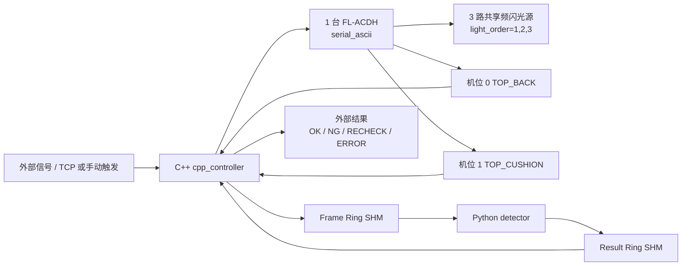

# Seat Surface AOI

汽车座椅表面缺陷检测系统参考实现。当前在线主链路已经收敛为固定多机位、N 路共享频闪光源的生产形态：C++ 负责外部信号、相机、FL-ACDH 频闪控制器、共享内存和结果回传；Python 作为独立检测进程，只负责图像质量门禁、预处理、模型推理、融合和规则判定。

## 当前链路



保留的 C++ 主控能力：

- 接收外部信号：`manual_trigger`、`external_signal`、`tcp_signal`，以及本地回归用 `simulated`。
- 连接当前型号频闪控制器：`light.backend=serial_ascii`，适配 FL-ACDH。
- 相机链路：本地回归 `simulated`，现场 `hikrobot_mvs`；真实采集对齐现场可工作的参考程序，每轮频闪前先并行 drain 所有相机 SDK 缓冲区的残留帧（arm() 改曝光参数可能在 Continuous 模式下即时产生一帧），再触发 FL-ACDH 并用 `GetImageBuffer` 读取硬触发帧；启动和相机故障重启时也会排空旧帧。当前生产、联调和采图配置统一使用 `COM1 / 9600 8N1`、30ms 相机曝光和 300/500/700us 三路频闪脉宽，FL-ACDH 触发路径只发送已在现场验证稳定的 `8/9/A/7` 命令，其中 `9` 命令按手册 `000~3E7` 范围编码为三位十六进制数据。单台相机连续失败后自动 stop+start 重启恢复。
- 固定采集方式：2 个机位共享 3 路光源，`capture_mode=fixed_camera`、`capture_schedule=shared_light_parallel`、`light_order=1,2,3`。
- 当前现场接线：工控机通过 RS232/USB 转串口连接 FL-ACDH；FL-ACDH 同步输出 `F1~F3` 已短接合成一根触发线，并联到两台相机黄色 `Line0`；FL-ACDH `GND` 与相机 IO `GND` 共地；相机 `Line1` 仅保留为调试输出。
- 在线模式使用共享内存和 Python detector；采图模式不启用共享内存，只采图保存原图并向外部信号回传 `RECHECK`。

C++ 主控只保留上述当前链路。非当前链路的兼容路径、未使用 backend 枚举和对应源码已移除；共享内存协议布局保持与 Python detector 二进制兼容，C++ 结构命名统一为固定机位视图语义。

## 快速开始

```powershell
uv sync --group dev
uv run pytest
uv run python -m tools.validate_protocol
uv run python tools/run_simulated_ipc.py
```

C++ 单独构建与验证：

```powershell
cmake -S cpp_controller -B cpp_controller/build/codex-check -DCMAKE_BUILD_TYPE=Release
cmake --build cpp_controller/build/codex-check --config Release
cpp_controller\build\codex-check\Release\ipc_safety_checks.exe
```

配置校验：

```powershell
cpp_controller\build\codex-check\Release\seat_aoi_controller.exe --config cpp_controller\config\station_runtime.production.conf --validate-config
cpp_controller\build\codex-check\Release\seat_aoi_controller.exe --config cpp_controller\config\station_runtime.test.conf --validate-config
cpp_controller\build\codex-check\Release\seat_aoi_controller.exe --config cpp_controller\config\station_runtime.capture_only.conf --validate-config
cpp_controller\build\codex-check\Release\seat_aoi_controller.exe --config cpp_controller\config\station_runtime.replay_capture.conf --validate-config
```

## 运行配置

| 配置 | 用途 |
| --- | --- |
| `cpp_controller/config/station_runtime.production.conf` | 生产在线模式：TCP 外部信号、Hikrobot MVS、FL-ACDH、共享内存、Python 检测；默认 30ms 曝光和 300/500/700us 频闪脉宽。 |
| `cpp_controller/config/station_runtime.test.conf` | 工控机联调模式：手动触发、Hikrobot MVS、FL-ACDH、共享内存、Python 检测，默认相机取帧超时 5s；频闪参数对齐外部成功程序。 |
| `cpp_controller/config/station_runtime.capture_only.conf` | 采图模式：手动触发、Hikrobot MVS、FL-ACDH，只保存原图，不创建共享内存，默认相机取帧超时 5s；频闪参数对齐外部成功程序。 |
| `cpp_controller/config/station_runtime.capture_only.single_camera.conf` | 单相机诊断采图：对齐外部成功程序的 `DA9184676 + COM1 + 光源1`，FL-ACDH 命令使用 ACK 节拍。 |
| `cpp_controller/config/station_runtime.replay_capture.conf` | `images_capture` 真实 PNG 回放：C++ simulated camera 从采图目录随机抽完整两机位三光源样本，写入共享内存，Python detector 从共享内存检测；不控制真实相机或频闪。 |

现场配置显式包含 `arm_settle_ms=50` 和 `max_camera_failures_before_reset=2`。如果程序提示未知运行配置字段，说明运行的不是当前源码重新构建出的控制器，需要先重建对应 Hikrobot MVS 版本的 `seat_aoi_controller.exe`。

`controller_mode` 只有两个值：

- `online`：初始化 Frame/Result 共享内存，采图后发布给 Python detector，等待检测结果并回传外部信号。
- `capture_only`：不初始化共享内存，不等待 Python detector；采图保存到 `image_save.root_dir/YYYYMMDD/<seat_id>/`，完成后回传 `RECHECK`。

## 工程地图

```text
seat-surface-aoi/
├── cpp_controller/      # C++ 主控、相机/频闪/外部信号、共享内存 IPC
├── python_detector/     # Python 检测进程、模型后端、ROI、融合和 trace
├── display_app/         # PySide6/QML 展示前端
├── training_tools/      # 离线样本、embedding、PCA/PatchCore/FAISS、benchmark
├── model/               # 模型产物目录
├── docs/                # 架构、协议和运维文档
└── tools/               # 协议校验、模拟 IPC、打包和预检工具
```

ROI 定位模型当前使用单类别 `seat`。训练数据应采用 YOLO segmentation 格式，导出的产物放入 `model/roi_yolo/seat_roi_seg.onnx`，并与 `python_detector/config/*recipe*.yaml` 中的 `roi_locator.class_names: [seat]`、ROI 模板和标定文件保持一致。

已有 ROI 模型和 `images_capture/` 真实平铺 PNG 后，先把采图目录转换成现有训练链路可消费的 ROI manifest，再训练 PatchCore/PCA/FAISS 或监督模型：

```powershell
uv sync --group training
uv run python -m training_tools.collect_capture_dataset `
  --input images_capture\20260623\LINE1_AOI_CAPTURE_MANUAL_SEAT_9000 `
  --output datasets\seat_capture_20260623_9000 `
  --recipe seat_a_black_leather_production_v1 `
  --split train `
  --label-status unverified_ok `
  --skip-failed
```

`collect_capture_dataset` 默认按所选配方的 `light_order` 生成 `L1/L2/L3...` 到算法光源 ID 的映射；当前生产配方即 `L1/L2/L3 -> DIFFUSE/POLAR_DIFFUSE/HIGH_LEFT`。它调用 `model/roi_yolo/seat_roi_seg.onnx` 做 ROI segmentation 定位，先按 mask 外接矩形裁出座椅 ROI，再把 mask 外像素置黑，只保留 mask 内目标物体，最后输出 `dataset_manifest.jsonl` 和当前配方光源数量一致的 ROI PNG。默认保留 ROI 原生尺寸，避免把纹理和细小缺陷压缩失真；只有在需要和 PatchCore 固定输入尺寸对齐时，才应显式传 `--roi-output-size WIDTHxHEIGHT`，并且该缩放会采用等比例 letterbox，而不是直接拉伸。`dataset_summary.json` 会记录 `roi_size_policy` 和 ROI 尺寸分布，`patchcore_training_summary.json` 会记录实际训练输入 `input_shape_summary`，用于确认训练和在线裁剪策略一致。ROI 冲突、低置信或越界样本会被跳过，不进入训练集。PatchCore 只能用人工确认的正常样本建库；`seat_defect_detector.onnx` 仍需要按缺陷类别人工标注后的 YOLO detect 数据集训练。
生产缺陷判定链路采用无监督 PatchCore 主模型，不依赖 `model/supervised_defect/seat_defect_detector.onnx`。真实 OK 样本用于训练 WideResNet50 embedding、PCA、PatchCore memory bank 和可选 FAISS 索引；训练 embedding 默认使用配方 `models.<key>.input_channels`，与在线检测层保持一致，当前 2 个机位、3 种光源只是生产配方事实，算法层不固定光源数或输入通道数。NG/RECHECK 与人工复核样本用于阈值曲线和放行验证。

**生产配方默认启用空间 PatchCore 模式（`spatial_mode: true`）**，检测链路提取 layer2+layer3 中间层特征图构建 H×W patch 嵌入，当前原始 patch embedding 为 1536 维，经 `seat_pca.json` 投影到 3 维后进入 PatchCore memory bank/FAISS。KNN 评分后生成像素级 `anomaly_map` 热力图，经 BFS 连通域分析自动定位缺陷区域并输出 bbox。TraceWriter 将 anomaly_map 渲染为 JET 伪彩色 40% 混合 overlay PNG（绿色 bbox 轮廓），供前端展示通道消费。若需回退到全局嵌入路径（整个 ROI → 1 个标量分数），在配方中设置 `spatial_mode: false`。

生产配方的亮度质量门禁采用比例阈值：单帧过曝像素比例 `max_saturation_ratio` 和过暗像素比例 `max_dark_ratio` 当前均为 `0.40`；缺帧、时序、曝光/增益一致性、锐度、运动梯度、配准失败等不确定状态仍会输出 `RECHECK` 或 `ERROR`。

从 `images_capture/` 抽取一组两机位样本做完整链路模拟并生成检测图：

```powershell
uv run python -m training_tools.simulate_capture_detection `
  --input images_capture\20260623\LINE1_AOI_CAPTURE_MANUAL_SEAT_9000 `
  --output reports\capture_detection_20260623_9000 `
  --recipe seat_a_black_leather_production_v1 `
  --sample-index 1
```

该命令会构造真实 `SeatInspectionJob`，调用生产配方的质量门禁、ROI YOLO segmentation、ROI 裁剪、ECC、WideResNet50 embedding、PCA、PatchCore/FAISS、融合和规则判定。默认只输出最终检测报告 `detection_summary.json`、原图 `original_images/` 和检测图 `detection_images/`；OK、NG、RECHECK 和 ERROR 都会生成检测图。需要排障时再追加 `--write-trace` 输出完整 trace 明细。

从 `images_capture/` 抽取一组两机位样本做共享内存全链路回放：

```powershell
uv run python tools/run_simulated_ipc.py --config cpp_controller/config/station_runtime.replay_capture.conf
# 等价快捷入口：
uv run python tools/run_simulated_ipc.py --replay-capture
```

该命令会先构建/启动 C++ 主控，由 C++ simulated camera 读取 `images_capture/20260623/LINE1_AOI_CAPTURE_MANUAL_SEAT_9000` 中随机完整样本并发布 Frame SHM，再启动 Python detector 读取共享内存、运行生产配方并写回 Result SHM。文件名时间戳仅用于排序分组，写入共享内存时仍使用本次在线模拟采集 metadata；若真实 PNG 触发质量门禁或模型保守规则，结果会按规则返回 `RECHECK/ERROR`，不会输出 `OK`。`trace/replay_capture/display_latest.json` 会记录展示通道摘要，检测 trace 按生产配方的 `trace.save_ok_ratio/save_ng/save_recheck` 策略保存到配方 trace 根目录。

## 安全边界

- Python 不控制 PLC、相机或频闪。
- C++ 不做深度学习推理。
- 在线图像和检测结果只通过共享内存交换，不使用 TCP 传图。
- 超时、缺帧、协议错误、CRC 错误、质量门禁失败、配置错误和采图模式都不能输出 `OK`，必须输出 `RECHECK` 或 `ERROR`。

更多 C++ 主控细节见 [cpp_controller/README.md](cpp_controller/README.md)，共享内存协议见 [docs/shm_protocol.md](docs/shm_protocol.md)。
当前工控机已调通链路的模块职责、采集时序和故障闭环见 [C++ 主控当前逻辑梳理](docs/cpp_controller_current_logic.md)。
