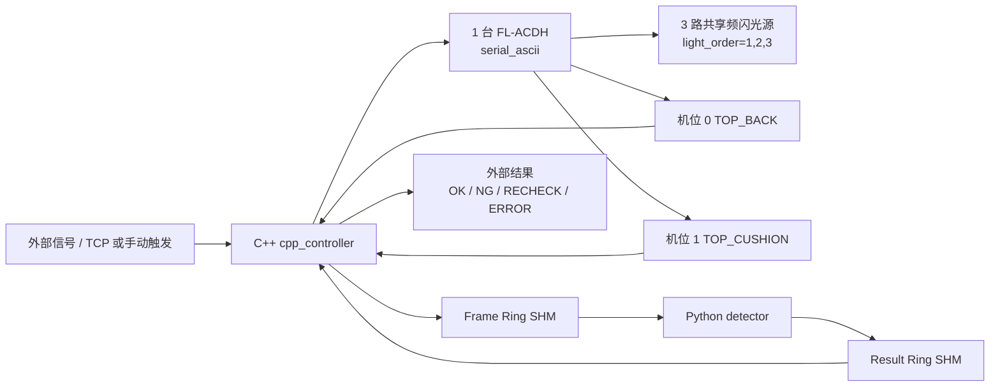

# Seat Surface AOI

汽车座椅表面缺陷检测系统参考实现。当前在线主链路已经收敛为固定多机位、N 路共享频闪光源的生产形态：C++ 负责外部信号、相机、FL-ACDH 频闪控制器、共享内存和结果回传；Python 作为独立检测进程，只负责图像质量门禁、预处理、模型推理、融合和规则判定。

## 当前链路



保留的 C++ 主控能力：

- 接收外部信号：`manual_trigger`、`external_signal`、`tcp_signal`，以及本地回归用 `simulated`。
- 连接当前型号频闪控制器：`light.backend=serial_ascii`，适配 FL-ACDH。
- 相机链路：本地回归 `simulated`，现场 `hikrobot_mvs`；真实采集对齐现场可工作的参考程序，每轮频闪前先并行 drain 所有相机 SDK 缓冲区的残留帧（arm() 改曝光参数可能在 Continuous 模式下即时产生一帧），再触发 FL-ACDH 并用 `GetImageBuffer` 读取硬触发帧；启动和相机故障重启时也会排空旧帧。当前生产、联调和采图配置统一使用 `COM1 / 9600 8N1`、30ms 相机曝光和 300/500/700us 三路频闪脉宽，FL-ACDH 触发路径只发送已在现场验证稳定的 `8/9/A/7` 命令，其中 `9` 命令按手册 `000~3E7` 范围编码为三位十六进制数据。单台相机连续失败后自动 stop+start 重启恢复。
- 固定采集方式：2 个机位共享 3 路光源，`capture_mode=fixed_camera`、`capture_schedule=shared_light_parallel`、`light_order=1,2,3`。
- 当前现场接线：工控机通过 RS232/USB 转串口连接 FL-ACDH；FL-ACDH 同步输出 `F1~F3` 已短接合成一根触发线，并联到两台相机黄色 `Line0`；FL-ACDH `GND` 与相机 IO `GND` 共地；相机 `Line1` 仅保留为调试输出。
- 在线模式使用共享内存和 Python detector；采图模式不启用共享内存，只采图保存原图并向外部信号回传 `RECHECK`。

C++ 主控只保留上述当前链路。非当前链路的兼容路径、未使用 backend 枚举和对应源码已移除；共享内存协议布局保持与 Python detector 二进制兼容，C++ 结构命名统一为固定机位视图语义。

## 快速开始

```powershell
uv sync --group dev
uv run pytest
uv run python -m tools.validate_protocol
uv run python tools/run_simulated_ipc.py
```

C++ 单独构建与验证：

```powershell
cmake -S cpp_controller -B cpp_controller/build/codex-check -DCMAKE_BUILD_TYPE=Release
cmake --build cpp_controller/build/codex-check --config Release
cpp_controller\build\codex-check\Release\ipc_safety_checks.exe
```

配置校验：

```powershell
cpp_controller\build\codex-check\Release\seat_aoi_controller.exe --config cpp_controller\config\station_runtime.production.conf --validate-config
cpp_controller\build\codex-check\Release\seat_aoi_controller.exe --config cpp_controller\config\station_runtime.test.conf --validate-config
cpp_controller\build\codex-check\Release\seat_aoi_controller.exe --config cpp_controller\config\station_runtime.capture_only.conf --validate-config
```

## 运行配置

| 配置 | 用途 |
| --- | --- |
| `cpp_controller/config/station_runtime.production.conf` | 生产在线模式：TCP 外部信号、Hikrobot MVS、FL-ACDH、共享内存、Python 检测；默认 30ms 曝光和 300/500/700us 频闪脉宽。 |
| `cpp_controller/config/station_runtime.test.conf` | 工控机联调模式：手动触发、Hikrobot MVS、FL-ACDH、共享内存、Python 检测，默认相机取帧超时 5s；频闪参数对齐外部成功程序。 |
| `cpp_controller/config/station_runtime.capture_only.conf` | 采图模式：手动触发、Hikrobot MVS、FL-ACDH，只保存原图，不创建共享内存，默认相机取帧超时 5s；频闪参数对齐外部成功程序。 |
| `cpp_controller/config/station_runtime.capture_only.single_camera.conf` | 单相机诊断采图：对齐外部成功程序的 `DA9184676 + COM1 + 光源1`，FL-ACDH 命令使用 ACK 节拍。 |

现场配置显式包含 `arm_settle_ms=50` 和 `max_camera_failures_before_reset=2`。如果程序提示未知运行配置字段，说明运行的不是当前源码重新构建出的控制器，需要先重建对应 Hikrobot MVS 版本的 `seat_aoi_controller.exe`。

`controller_mode` 只有两个值：

- `online`：初始化 Frame/Result 共享内存，采图后发布给 Python detector，等待检测结果并回传外部信号。
- `capture_only`：不初始化共享内存，不等待 Python detector；采图保存到 `image_save.root_dir/YYYYMMDD/<seat_id>/`，完成后回传 `RECHECK`。

## 工程地图

```text
seat-surface-aoi/
├── cpp_controller/      # C++ 主控、相机/频闪/外部信号、共享内存 IPC
├── python_detector/     # Python 检测进程、模型后端、ROI、融合和 trace
├── display_app/         # PySide6/QML 展示前端
├── training_tools/      # 离线样本、embedding、PCA/PatchCore/FAISS、benchmark
├── model/               # 模型产物目录
├── docs/                # 架构、协议和运维文档
└── tools/               # 协议校验、模拟 IPC、打包和预检工具
```

ROI 定位模型当前使用单类别 `seat`。训练数据应采用 YOLO segmentation 格式，导出的产物放入 `model/roi_yolo/seat_roi_seg.onnx`，并与 `python_detector/config/*recipe*.yaml` 中的 `roi_locator.class_names: [seat]`、ROI 模板和标定文件保持一致。

## 安全边界

- Python 不控制 PLC、相机或频闪。
- C++ 不做深度学习推理。
- 在线图像和检测结果只通过共享内存交换，不使用 TCP 传图。
- 超时、缺帧、协议错误、CRC 错误、质量门禁失败、配置错误和采图模式都不能输出 `OK`，必须输出 `RECHECK` 或 `ERROR`。

更多 C++ 主控细节见 [cpp_controller/README.md](cpp_controller/README.md)，共享内存协议见 [docs/shm_protocol.md](docs/shm_protocol.md)。
当前工控机已调通链路的模块职责、采集时序和故障闭环见 [C++ 主控当前逻辑梳理](docs/cpp_controller_current_logic.md)。
