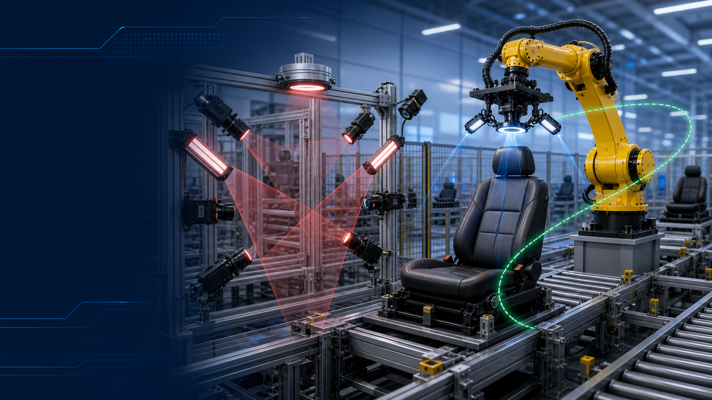
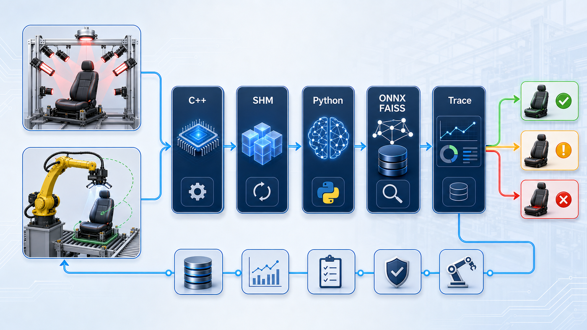
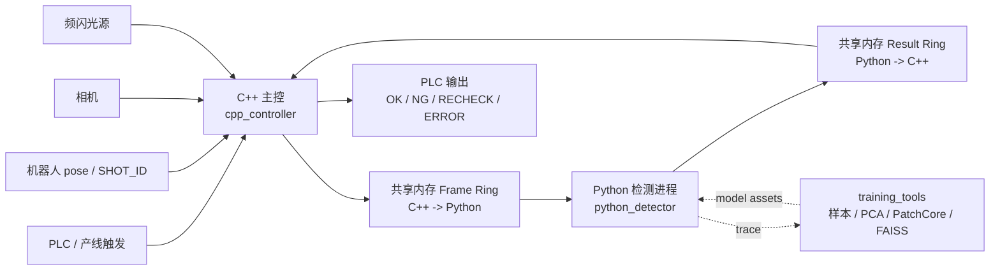
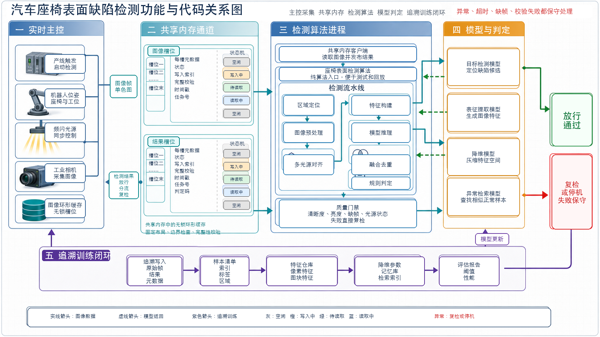

# Seat Surface AOI

> 汽车座椅表面缺陷检测系统参考实现，面向生产线 AOI 场景，采用 **C++ 实时主控 + Python 独立检测进程 + 跨平台共享内存 IPC**。当前主链路覆盖固定机位多光源和机器人飞拍多光源两类采集模式，支持 Linux/macOS POSIX 共享内存与 Windows Named Shared Memory。



<p align="center">
  <a href="#快速开始"></a>
  <a href="docs/shm_protocol.md"></a>
  
  
  
  
</p>

<p align="center">
  <a href="#系统总览">系统总览</a> ·
  <a href="#快速开始">快速开始</a> ·
  <a href="#工程地图">工程地图</a> ·
  <a href="#部署打包">部署打包</a> ·
  <a href="#验证矩阵">验证矩阵</a> ·
  <a href="#文档地图">文档地图</a> ·
  <a href="#安全边界">安全边界</a>
</p>

## 项目定位

Seat Surface AOI 是一套可验证、可扩展的汽车座椅表面缺陷检测参考工程。仓库重点不是单一模型 demo，而是一条接近产线集成方式的在线闭环：

| 层级 | 职责 | 当前实现 |
| --- | --- | --- |
| 实时主控 | PLC、相机、频闪、机器人 pose/shot、触发同步、节拍控制 | `cpp_controller/` C++17 主控、模拟硬件、生产配置校验和故障注入 |
| 检测进程 | 质量门禁、预处理、ROI、配准、多光源特征、模型推理、融合判定 | `python_detector/` 独立进程，默认 fake 后端，可接 ONNX/PatchCore/FAISS |
| 在线通信 | 图像包与检测结果交换 | 跨平台共享内存 frame/result ring buffer，固定布局、CRC 和协议校验 |
| 离线闭环 | trace 转样本、embedding、PCA、PatchCore/FAISS、回放、benchmark | `training_tools/` 只消费在线检测公开入口，不反向耦合 detector |

**适合用来做：**

- 工业 AOI 在线链路参考实现。
- 固定机位和机器人飞拍多光源采集方案验证。
- C++ 控制侧与 Python 算法侧边界设计。
- 共享内存协议、质量门禁、保守判定和离线训练闭环验证。

**不直接包含：**

- 真实 PLC、工业相机、频闪控制器、机器人 SDK 驱动实现。
- 现场训练数据、大模型权重、MES/报警平台和生产监控服务。
- 可跳过安全降级的“演示型 OK”链路。

## 系统总览





核心边界很明确：

- C++ 负责设备控制、采集调度、共享内存写入、结果读取和生产节拍。
- Python 只负责检测算法，不控制 PLC、相机、机器人或频闪。
- 在线图像和结果只走共享内存，不使用 TCP。
- 缺帧、超时、协议错误、CRC 错误、质量门禁失败、模型异常都不能输出 `OK`。

<details>
<summary>展开 V4.0 双采集模式统一架构图</summary>


</details>

## 当前能力

| 能力 | 状态 |
| --- | --- |
| 双采集模式 | 支持固定机位 `fixed_camera` 与机器人飞拍 `robot_flyshot`，二者在 C++ Capture Plan 层统一为检测视角序列。 |
| 视角级串行 TDM | 每个检测视角按 `light_order` 完成多光源采集后再切换下一视角，降低频闪互相污染风险。 |
| 共享内存 IPC | C++/Python 双端固定布局结构体、frame/result ring buffer、slot 状态机、CRC、layout/对象大小 fail-fast 和协议校验工具。 |
| V4 算法接口 | Dome ROI YOLO、ECC 配准、WideResNet50 embedding、PCA、PatchCore KNN 和 FAISS 可选加速接入点。 |
| 保守判定 | 协议异常、CRC 错误、缺帧、超时、质量失败、shot/机器人位姿不一致、ROI 冲突、机器人 FAULT、候选融合溢出和模型异常返回 `RECHECK` 或 `ERROR`。 |
| 数据闭环 | trace、按 `camera_id/pose_id` 隔离的 ROI 图、overlay、manifest、embedding、PCA/PatchCore/FAISS 资产训练、回放与 benchmark。 |

## 快速开始

### 1. 安装开发依赖

```bash
uv sync --group dev
```

### 2. 跑单元测试和协议校验

```bash
uv run pytest
uv run python -m tools.validate_protocol
uv run python -m tools.validate_architecture_readiness --scope reference
```

### 3. 跑端到端模拟 IPC

```bash
bash tools/run_simulated_ipc.sh
```

Windows 工控机或希望使用跨平台入口时运行：

```bash
uv run python tools/run_simulated_ipc.py
```

模拟 IPC 会构建 C++ 主控，发布一次多视角多光源图像包，Python detector 从共享内存读取任务并写回结果。正常模拟链路应返回 `OK`；故障注入、协议错误或 detector 超时必须返回 `RECHECK` 或 `ERROR`。

## 常用入口

```bash
# 固定机位模拟链路
bash tools/run_simulated_ipc.sh
uv run python tools/run_simulated_ipc.py

# 机器人飞拍模拟链路
bash tools/run_simulated_ipc.sh \
  --config cpp_controller/config/station_runtime.robot_flyshot.example.conf
uv run python tools/run_simulated_ipc.py \
  --config cpp_controller/config/station_runtime.robot_flyshot.example.conf

# Python detector 在线入口
uv run python -m python_detector.detector_main --once --timeout-ms 8000
uv run seat-aoi-detector --once --timeout-ms 8000

# 真实模型资产上线前检查
uv run python -m tools.validate_model_assets --recipe production_model_example

# 生成离线部署包，默认集成根目录 model/
bash tools/package_release.sh

# 架构就绪度检查
uv run python -m tools.validate_architecture_readiness --scope reference
uv run python -m tools.validate_architecture_readiness --scope production
```

`validate_model_assets --recipe production_model_example` 在仓库占位模型未替换时应失败，并列出需要部署的真实模型产物；这属于上线前阻塞检查，不是默认模拟链路失败。

## 工程地图

```text
seat-surface-aoi/
├── cpp_controller/      # C++ 主控、采集调度、硬件抽象、共享内存 IPC、生产配置
├── python_detector/     # Python 检测算法、配方、标定、模型适配、共享内存客户端、trace
├── training_tools/      # trace 转样本、embedding、PCA/PatchCore/FAISS、评估、回放、benchmark
├── model/               # 真实模型产物占位：YOLO、WideResNet50、PCA、PatchCore、FAISS
├── docs/                # 架构、协议、C++ 运维、Python 算法运维、调用关系摘要
└── tools/               # 项目级协议/资产/架构校验和 C++/Python IPC 联调脚本
```

| 目录 | 读者入口 | 主要关注点 |
| --- | --- | --- |
| `cpp_controller/` | [C++ 主控 README](cpp_controller/README.md) | PLC/Robot/Camera/Light 抽象、Capture Plan、共享内存发布、故障注入。 |
| `python_detector/` | [Python 检测算法层导览](python_detector/README.md) | 质量门禁、ROI、ECC、多光源特征、模型后端、融合、规则、trace。 |
| `training_tools/` | [Python 运维文档](docs/python_detector_operations.md) | 离线样本、embedding、PCA、PatchCore/FAISS、回放、benchmark。 |
| `tools/` | [验证矩阵](#验证矩阵) | 跨 C++/Python 的协议、模型资产、架构就绪度和 IPC 联调校验。 |
| `model/` | [模型产物目录说明](model/README.md) | 真实 ONNX、PCA、memory bank、FAISS 索引的部署约定。 |
| `docs/` | [文档总览](docs/README.md) | V4 架构、共享内存协议、运维和代码调用关系。 |

<details>
<summary>展开项目功能与代码映射图</summary>



</details>

## 部署打包

项目提供 `tools/package_release.sh` 生成离线部署包。打包边界是“可部署的在线检测链路”，默认包含：

| 内容 | 说明 |
| --- | --- |
| `bin/` | 已构建的 `seat_aoi_controller`、`protocol_layout`、`ipc_safety_checks`。 |
| `cpp_controller/` | C++ 主控源码、配置模板、CMake 工程和诊断工具源码。 |
| `python_detector/` | Python detector、配方、标定、ROI 模板、算法和测试。 |
| `training_tools/` | 离线回放、benchmark、embedding、PCA/PatchCore/FAISS 资产生成工具。 |
| `model/` | 根目录 `model/` 下的模型目录结构或真实模型产物。 |
| `tools/`、`docs/` | 协议校验、模型资产校验、架构检查、模拟 IPC 脚本和运维文档。 |

参考联调包可以直接执行：

```bash
bash tools/package_release.sh
```

生产包必须先把真实模型产物替换到根目录 `model/`，再直接执行打包脚本：

```bash
bash tools/package_release.sh
```

脚本会生成 `dist/<package>.tar.gz` 和对应 `.sha256`，并默认集成根目录 `model/`。解包后可先运行 `bash validate_package.sh` 做协议和 IPC 基础校验；如需使用包内已构建的 C++ 产物跑模拟 IPC，可运行 `bash run_packaged_simulated_ipc.sh`。生产包不默认包含现场训练数据、trace、日志、`.venv` 或本地构建缓存。

## 在线链路

### C++ 主控链路

```text
main.cpp
  -> StationRuntimeConfig
  -> HardwareFactory
  -> StationController
      -> PlcClient.wait_trigger()
      -> FrameAssembler.capture_job()
      -> FrameRingBuffer.publish()
      -> ResultRingBuffer.wait_result()
      -> validate detector result
      -> PlcClient.send_decision()
```

C++ 侧负责生产节拍和设备安全，不能实现深度学习推理。真实生产 backend 需要按现场 PLC、相机、频闪和机器人型号补充 SDK 接入；当前仓库提供模拟 backend、生产配置 fail-fast 校验和故障注入路径。

### Python 检测链路

```text
python_detector.detector_main
  -> ShmClient.acquire_job()
  -> SeatSurfaceAoiAlgorithm.inspect()
  -> InspectionPipeline.run()
      -> ImageQualityGate
      -> Preprocessor / RoiLocator
      -> ReflectanceCubeBuilder / EccRegistration
      -> FeatureBuilder
      -> InferenceEngine / ModelRegistry
      -> FusionEngine / DefectFilter / RuleEngine
      -> TraceWriter
  -> ShmClient.publish_result()
```

Python 侧只处理检测链路。任意输入不可信、配方不一致、模型缺失、输出越界或质量失败，都会进入保守结果，不用 `OK` 掩盖异常。

### 共享内存协议

| 方向 | 共享内存逻辑名称 | 内容 |
| --- | --- | --- |
| C++ -> Python | `/seat_aoi_cpp_to_py_frames_v1` | `SeatJobMeta`、`LightFrameMeta[]` 和图像 payload。 |
| Python -> C++ | `/seat_aoi_py_to_cpp_results_v1` | `InspectionResultMeta`、`DefectResultMeta[]` 和结果 payload。 |

协议当前为 `SHM_PROTOCOL_VERSION = 2`，固定小端布局，包含 slot 状态机、header CRC 和 payload CRC。Linux/macOS 使用 POSIX 共享内存逻辑名；Windows 平台层把同一逻辑名映射为 `Local\seat_aoi_cpp_to_py_frames_v1` 和 `Local\seat_aoi_py_to_cpp_results_v1`，协议结构和 CRC 不变。C++ 打开既有共享内存时会校验对象实际大小以及 magic/version/slot_count/slot_size，不匹配且未显式 reset 时直接失败，避免静默重写布局；结果 ring 会回收旧序号或坏状态 slot，但当前序号的 corrupted/timeout 仍按 CRC 或 detector timeout 保守失败。C++ 回收 detector 结果时会再次校验语义：`OK` 必须质量通过、无错误且无缺陷，`NG` 必须质量通过、无错误且存在缺陷，其余不一致组合会转成 `RECHECK/InvalidPayload`。协议细节见 [共享内存协议](docs/shm_protocol.md)。

## 模型与训练闭环

生产模型产物默认不提交到仓库，`model/` 只保留目录约定和占位文件：

| 产物 | 默认路径 | 用途 |
| --- | --- | --- |
| Dome ROI YOLO | `model/roi_yolo/seat_roi_yolo.onnx` | 从 Dome 语义光源定位座椅 ROI。 |
| 监督缺陷检测 | `model/supervised_defect/seat_defect_detector.onnx` | 已知缺陷检测 ONNX。 |
| WideResNet50 embedding | `model/wideresnet50/seat_wrn50_embedding.onnx` | 多光源 ROI embedding。 |
| PCA | `model/patchcore/seat_pca.json` | unified embedding 降维。 |
| PatchCore memory bank | `model/patchcore/seat_patchcore_bank.json` | 正常样本近邻检索安全网。 |
| FAISS 索引 | `model/patchcore/seat_patchcore.faiss` | 可选 KNN 加速，失败时回退 exact KNN 并记录 trace。 |

典型离线闭环：

```text
共享内存多光源图像或 trace/
  -> training_tools.collect_shm_dataset / training_tools.collect_trace_dataset
  -> dataset_manifest.jsonl
  -> training_tools.export_wideresnet_embedding
  -> training_tools.extract_embeddings
  -> training_tools.train_patchcore_assets
  -> model/*
  -> training_tools.evaluate_pipeline
```

训练、回放、benchmark 和模型资产生成入口只放在 `training_tools/`；`tools/` 只放项目级校验和联调脚本，避免同一能力出现双入口。`dataset_manifest.jsonl` 包含 `pose_id`，`collect_trace_dataset` 同时兼容旧的 `images/<camera>/<roi>/<light>.pgm` 和新的 `images/<camera>/<pose>/<roi>/<light>.pgm` trace 目录，机器人飞拍同一末端相机的不同 pose 不会互相覆盖或混用标签。

## 验证矩阵

| 场景 | 命令 | 期望 |
| --- | --- | --- |
| Python 单元测试 | `uv run pytest` | 协议、配方、质量门禁、ROI、模型、融合、trace 和训练工具测试通过。 |
| 协议布局校验 | `uv run python -m tools.validate_protocol` | C++/Python 结构体大小和协议常量一致。 |
| 参考架构检查 | `uv run python -m tools.validate_architecture_readiness --scope reference` | 参考链路能力完整。 |
| 生产阻塞检查 | `uv run python -m tools.validate_architecture_readiness --scope production` | 占位配置或模型未替换时返回阻塞项。 |
| 模型资产检查 | `uv run python -m tools.validate_model_assets --recipe production_model_example` | 真实模型缺失时失败并列出待替换资产。 |
| 端到端模拟 IPC | `bash tools/run_simulated_ipc.sh` 或 `uv run python tools/run_simulated_ipc.py` | C++ 和 Python 通过共享内存完成一次检测闭环；Windows 使用 Python 跨平台入口。 |

## 文档地图

建议阅读顺序：

1. [docs 总览](docs/README.md)
2. [V4.0 双采集模式架构对齐说明](docs/v4_architecture_alignment.md)
3. [共享内存协议](docs/shm_protocol.md)
4. [项目调用关系摘要](docs/project_function_call_map.md)
5. [C++ 主控部署与硬件运维](docs/cpp_controller_operations.md)
6. [Python 检测算法与模型运维](docs/python_detector_operations.md)
7. [Python 检测算法层导览](python_detector/README.md)
8. [模型产物目录说明](model/README.md)

## 安全边界

- Python 不控制 PLC、相机、机器人或频闪。
- C++ 主控不实现深度学习推理。
- 在线图像和结果不走 TCP，必须使用共享内存。
- 任意不确定状态、超时、缺帧、协议错误、CRC 错误、质量门禁失败或模型异常都不能输出 `OK`。
- 修改共享内存协议必须同步更新 C++、Python、校验工具、测试和协议文档。
- 真实生产配置不得静默回退到 simulated backend。

## 开源状态

当前仓库尚未声明开源许可证。正式公开发布前建议补充 `LICENSE` 文件，并确认真实模型权重、现场图片、产线配置和供应商 SDK 均不被误提交。
