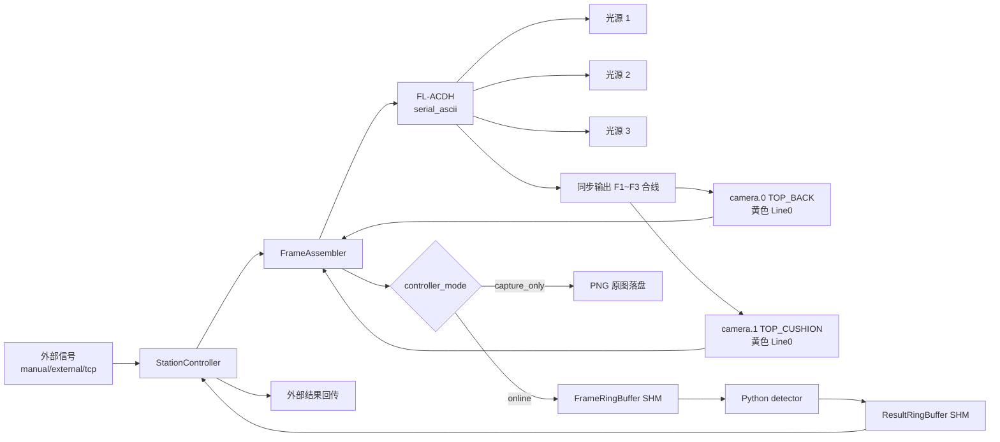

# Seat Surface AOI - C++ Controller

`cpp_controller` 是当前产线主控程序。现阶段只保留一条真实需要的链路：接收外部信号，驱动 1 台 FL-ACDH 频闪控制器，N 个固定机位共享 M 路光源采图，并在在线模式下通过共享内存与 Python detector 交换图像和检测结果。

## 当前架构



固定约束：

- `capture_mode=fixed_camera`
- `capture_schedule=shared_light_parallel`
- `light_order` 至少 1 路光源（生产环境 3 路）
- 相机数量 ≥ 1：`camera.0`, `camera.1`, ... 索引从 0 连续编号
- 只允许 1 台光源控制器：`light.backend=serial_ascii`
- 非模拟现场相机只保留 `camera.backend=hikrobot_mvs`
- 在线模式才启用共享内存；采图模式不创建 Frame/Result ring

当前现场接线事实：

- 工控机通过 RS232/USB 转串口连接 FL-ACDH，当前串口为 `COM1 / 9600 8N1`。
- FL-ACDH 同步输出接口 `F1~F3` 已短接合成一根触发线，并联到两台相机黄色 `Line0` 硬触发输入。
- FL-ACDH `GND` 需要与两台相机 IO `GND` 共地。
- 相机 `Line1` 的 `ExposureStartActive` 仅保留为调试/示波器输出，不参与当前触发闭环。

C++ 主控只保留上述当前链路。非当前链路的兼容路径、未使用 backend 枚举和对应源码已移除；共享内存协议布局保持与 Python detector 二进制兼容，结果缺陷结构只传缺陷 ID、严重度、位置、分数和证据光源，不再携带缺陷类别字段。

当前工控机已调通链路的模块职责、源码调用关系、采集时序和故障闭环见 [C++ 主控当前逻辑梳理](../docs/cpp_controller_current_logic.md)。

## 文件结构

```text
cpp_controller/
├── CMakeLists.txt
├── config/
│   ├── station_runtime.production.conf     # 生产在线模式
│   ├── station_runtime.test.conf           # 工控机手动触发联调
│   ├── station_runtime.capture_only.conf   # 采图模式，不启用共享内存
│   └── station_runtime.replay_capture.conf # images_capture 真实图共享内存回放
├── include/
│   ├── camera/                             # ICamera、模拟相机、Hikrobot MVS 适配声明
│   ├── common/                             # 错误码、协议结构基础类型、字符串/时间工具
│   ├── control/                            # StationController、FrameAssembler、信号、频闪、配置
│   └── ipc/                                # 共享内存、Frame/Result ring、CRC、协议布局
├── src/
│   ├── camera/                             # 模拟相机、Hikrobot MVS、相机 worker
│   ├── control/                            # 主控、采集编排、FL-ACDH、外部信号、配置、事件日志
│   ├── ipc/                                # Windows/POSIX 共享内存和 ring buffer
│   └── main.cpp
└── tools/
    ├── ipc_safety_checks.cpp               # C++ 侧安全回归
    └── protocol_layout.cpp                 # 协议结构大小输出
```

## 核心流程

在线模式 `controller_mode=online`：

1. 等待外部信号，生成 `ExternalTrigger`。`trigger_timeout_ms=0`（默认）表示无限等待，TCP 客户端未连接/无数据时阻塞监听，不浪费 CPU 也不产生超时日志。
2. `FrameAssembler` 初始化 1 台 FL-ACDH 和 2 台相机。
3. 按光源顺序 1、2、3 分两阶段采集：
   - **阶段 A（快速连续触发）**：每路光源先并行 arm 两台相机（仅更新 ExposureTime/Gain），等待 `arm_settle_ms` 稳定后，直接向 FL-ACDH 发送 `8/9/A/7` 完整点亮序列。三路光源连续触发，中间不等待 `GetImageBuffer`，利用 Continuous+Trigger 模式下 arm 仅影响下一次触发沿的特性，将 arm 开销与上一路曝光+传输并行化。相机启动或故障重启时 `start()/cancel_wait()` 仍会排空旧帧。
   - **阶段 B（统一收帧）**：三路光源全部触发后，按光源顺序并行调用 `GetImageBuffer` 收取两台相机共 6 帧硬触发图像。MVS SDK `buffer_count=8 ≥ 6` 帧保证不丢帧，帧按触发顺序返回无需 drain。
   海康 MV-CH120-20GC 在 Continuous+Trigger 模式下 `SetFloatValue(ExposureTime)` 不会向 SDK 缓冲区注入残留帧，因此正常采集路径不再调用 `drain_stale_frames`。
4. 组包为 6 帧，发布到 `/seat_aoi_cpp_to_py_frames_v1`。
5. 等待 Python detector 写回 `/seat_aoi_py_to_cpp_results_v1`。
6. 校验 `sequence_id`、`trigger_id`、`seat_id`、CRC 和结果语义。
7. 通过外部信号回传 `OK`、`NG` 或 `RECHECK`。`ERROR` 会映射为外部 `RECHECK`。

外部触发尚未完整到达时不进入一次检测任务：`tcp_signal` 没有客户端、客户端已连接但还没发送触发行、`start_sn` 只收到 `start` 但未收到 `sn <SN>`、或文件队列暂无新触发行，都只保持 Ready 状态并继续等待；`wait_trigger=false` 且错误文本为空表示本轮无新触发，不记录设备故障。这类空闲等待不会写 `inspection_recheck`，不会发布 Frame SHM，也不会等待 Python detector。只有完整触发进入采集/检测后，缺帧、设备故障、共享内存错误、检测超时、质量门禁失败或协议/CRC 错误才按 fail-closed 输出 `RECHECK/ERROR`。

采图模式 `controller_mode=capture_only`：

1. 仍然等待外部信号并完成相同的多机位多光源采集。
2. 不初始化共享内存，不发布 frame，不等待 Python detector。
3. 必须启用 `image_save.enabled=true` 和 `image_save.save_original=true`。
4. 原图保存为 `image_save.root_dir/YYYYMMDD/<seat_id>/<camera>_<timestamp>_L<light>_original.png`（PNG 格式，可直接查看）。
5. 完成后向外部信号回传 `RECHECK`，返回结果错误码为 `None`，表示这是主动旁路检测的采样任务。

## 配置说明

三份配置入口：

| 文件 | 模式 | 说明 |
| --- | --- | --- |
| `config/station_runtime.production.conf` | `online` | 正式生产 TCP 外部信号 + Hikrobot MVS + FL-ACDH + 共享内存检测；COM1 / 9600 8N1，30ms 曝光，900/950/999us 频闪，gain=1.0，`trace_root=trace`，流水线采集。 |
| `config/station_runtime.test.conf` | `online` | 手动触发联调真实相机和频闪，仍走共享内存检测；COM1 / 9600 8N1，参数同生产配置。 |
| `config/station_runtime.capture_only.conf` | `capture_only` | 手动触发采图，保存 PNG 原图，不启用共享内存；COM1 / 9600 8N1，参数同生产配置。 |
| `config/station_runtime.capture_only.single_camera.conf` | `capture_only` | 单相机诊断采图，对齐外部成功程序的 `DA9184676 + COM1 + 光源1`。 |
| `config/station_runtime.replay_capture.conf` | `online` | 本地/联调共享内存回放：`hardware_mode=simulated`，模拟信号/光源，相机像素从 `images_capture` 真实 PNG 随机完整样本读取，再由 C++ 写入 Frame SHM。 |

关键字段：

```ini
controller_mode=online          # online 或 capture_only
capture_mode=fixed_camera
capture_schedule=shared_light_parallel
light_order=1,2,3

signal.backend=tcp_signal       # production 常用；lab 可用 manual_trigger
camera.backend=hikrobot_mvs
light.backend=serial_ascii

camera.0.camera_id=TOP_BACK
camera.1.camera_id=TOP_CUSHION

light.serial_port=COM1
light.baud_rate=9600            # FL-ACDH 说明书默认 9600 8N1，现场配置固定使用该值
light.response_mode=ack
light.trigger_input_line=F1

# 频闪参数：strobe_width_us 控制单次脉冲亮度（上限 999us），
# current_percent 由 FL-ACDH 物理面板旋钮同步设置；
# gain 控制相机模拟增益。三者配合可避免过度延长曝光时间。
# 如果采图偏暗：先确认 FL-ACDH 物理旋钮/按键设置的 LED 电流档位足够，
# 再在现场可接受范围内尝试增大 strobe_width_us 或 gain（≤ 相机上限）。
# FL-ACDH 协议手册中无串口电流设置命令，电流只能通过设备面板调节。
light.1.exposure_us=30000
light.1.strobe_width_us=900
light.1.current_percent=85
light.1.gain=1.0
light.2.exposure_us=30000
light.2.strobe_width_us=950
light.2.current_percent=85
light.2.gain=1.0
light.3.exposure_us=30000
light.3.strobe_width_us=999
light.3.current_percent=80
light.3.gain=1.0

# 超时配置（毫秒）
camera_timeout_ms=5000
light_timeout_ms=3000
# arm 完成后等待相机寄存器生效（流水线采集下只需 10ms）
arm_settle_ms=10
max_camera_failures_before_reset=2

image_save.enabled=true
image_save.save_original=true
```

正式生产配置默认 `image_save.enabled=false`，避免 C++ 额外保存原图副本占满磁盘；原始图、ROI 图和检测 overlay 由 Python trace 策略写入 `trace`，供 display_app 只读展示。临时排障需要 C++ 原图副本时，先确认磁盘容量，再启用 `image_save.enabled=true`。

> **FL-ACDH 已知协议命令**（来自手册）：C(联动模式)、B(触发电平)、8(触发模式)、9(频闪时间)、A(相机触发延时)、7(远程通信触发)、D(序列数)、E(同步信号 ID)。
> 当前串口远程触发链路只发送 `8→9→A→7`。现场控制器会拒绝当前链路不需要的 `C/B` 设置命令，因此不再在每次触发时发送；`9` 命令频闪时间按三位十六进制数据发送，例如配置 `strobe_width_us=500` 时帧为 `$921F46C`。如果 `8/9/A/7` 返回 `&` 或超时，会按光源故障保守输出 `RECHECK/ERROR`。

`hardware_mode=production` 禁止 simulated/manual backend；`hardware_mode=lab` 可用 `manual_trigger` 做手动联调；不传 `--config` 时仍保留内置 simulated fallback，用于本地 IPC 回归。

`camera.<N>.replay_root`、`camera.<N>.replay_sample_index` 和 `camera.<N>.replay_random` 只允许在 `hardware_mode=simulated` 且 `camera.backend=simulated` 时使用。回放按 `<camera_id>_<timestamp>_L<light>_original.png` 扫描 8-bit 灰度 PNG，以文件名时间戳排序并按 `light_order` 聚合同一相机连续光源组；随机模式只从所有配置相机都完整的样本序号交集中选择。缺图、PNG 解码失败或尺寸与相机配置不一致都会导致采集失败并保守返回 `RECHECK/ERROR`，不会影响 `hikrobot_mvs` 真实相机路径。写入共享内存时使用本次模拟采集 metadata 时间戳，避免把历史采图文件名时间戳误当作在线采集时序。

## 构建

```powershell
cmake -S cpp_controller -B cpp_controller/build/codex-check -DCMAKE_BUILD_TYPE=Release
cmake --build cpp_controller/build/codex-check --config Release
```

启用 Hikrobot MVS SDK 时显式传入 SDK 路径：

```powershell
cmake -S cpp_controller -B cpp_controller/build/hikrobot-release `
  -DCMAKE_BUILD_TYPE=Release `
  -DSEAT_AOI_ENABLE_HIKROBOT_MVS=ON `
  -DSEAT_AOI_HIKROBOT_MVS_INCLUDE_DIR="C:/Program Files (x86)/MVS/Development/Includes" `
  -DSEAT_AOI_HIKROBOT_MVS_LIBRARY="C:/Program Files (x86)/MVS/Development/Libraries/win64/MvCameraControl.lib"
cmake --build cpp_controller/build/hikrobot-release --config Release
```

未启用 SDK 时，`camera.backend=hikrobot_mvs` 会在初始化阶段明确失败，不会回退模拟相机。

## 运行

```powershell
# 配置校验，不初始化硬件和共享内存
cpp_controller\build\codex-check\Release\seat_aoi_controller.exe --config cpp_controller\config\station_runtime.production.conf --validate-config

# 单次在线检测
cpp_controller\build\codex-check\Release\seat_aoi_controller.exe --config cpp_controller\config\station_runtime.test.conf --once

# 循环生产运行
.\bin\seat_aoi_controller.exe --config cpp_controller\config\station_runtime.production.conf --loop

# 采图模式，只保存原图
cpp_controller\build\codex-check\Release\seat_aoi_controller.exe --config cpp_controller\config\station_runtime.capture_only.conf --once

# 单相机诊断采图，对齐外部成功程序
cpp_controller\build\codex-check\Release\seat_aoi_controller.exe --config cpp_controller\config\station_runtime.capture_only.single_camera.conf --once

# images_capture 真实图共享内存回放
uv run python tools/run_simulated_ipc.py --config cpp_controller/config/station_runtime.replay_capture.conf

# 清理共享内存
cpp_controller\build\codex-check\Release\seat_aoi_controller.exe --cleanup
```

常用故障注入：

```powershell
--simulate-light-fault
--simulate-missing-frame
--simulate-signal-result-fault
--simulate-trigger-timeout
```

## 验证

```powershell
cmake --build cpp_controller/build --config Release
cpp_controller\build\ipc_safety_checks.exe
uv run python -m tools.validate_protocol
uv run python tools/run_simulated_ipc.py
uv run python tools/run_simulated_ipc.py --replay-capture
```

默认模拟 IPC 会生成临时 runtime config，并关闭本地磁盘水位门禁；正式生产、测试和采图配置仍按 `image_save.cleanup_min_free_ratio=0.20` 执行容量保护。

本次主控收敛及代码优化后，`ipc_safety_checks` 覆盖了以下关键点：

- CRC/slot 状态错误必须 fail closed。
- 光源故障、缺帧、槽不可用、检测超时必须返回 `RECHECK`。
- 外部触发空闲等待不能污染主控健康状态、业务统计或 `cpp_controller_events.jsonl` 复检记录。
- `capture_only` 必须保存 6 张原图，且不能创建 Frame/Result 共享内存。
- detector 返回语义非法时不能输出 `OK`。
- 并行相机等待失败会透传单台相机的 `camera_message`，避免只看到泛化的 `camera timeout`。

### TCP 信号协议模式

`signal.backend=tcp_signal` 支持两种协议模式，由 `signal.protocol_mode` 控制：

| 模式 | 说明 | 适用场景 |
| --- | --- | --- |
| `single`（默认） | 单行协议：每行 TCP 数据为一个触发信号 | 简单 PLC 直连，向后兼容 |
| `start_sn` | 两步协议：先收到位信号，再收 SN 条码；`delimiter` 非空时额外支持组合格式 `start\|SN` 单行触发 | 外部上位机两步握手或组合单行 |

#### 两步协议 (`protocol_mode=start_sn`)

外部工控机通过 TCP 连接到 C++ 监听端口，分两步发送：

1. **到位信号**: 发送 `start_command`（默认 `start`）→ C++ 回复 `start_ack`（默认 `start_ack`）
2. **SN 条码**: 发送 `sn_prefix <barcode>`（默认 `sn ABC123456`）→ C++ 回复 `sn_ack`（默认 `sn_ack`）

两步均在 `trigger_timeout_ms` 内完成。收到条码后构造 `seat_id = station_id + "_" + barcode`，沿共享内存进入 Python 检测链路，结果中的 `seat_id` 与触发时比对一致才会放行。

配置字段：

```ini
signal.protocol_mode=start_sn    # single（默认）或 start_sn
signal.start_command=start       # 到位信号命令文本
signal.sn_prefix=sn              # SN 条码前缀（实际格式: "sn <barcode>"）
signal.start_ack=start_ack       # 到位信号回复
signal.sn_ack=sn_ack             # SN 接收回复
```

`signal.terminator` 决定行结束标记。设为空时启用字节间超时模式（100ms），适用于外部信号不带 `\n` 终止符的场景。`signal.ok_response`、`signal.start_ack` 和 `signal.sn_ack` 支持 `\n`、`\r`、`\t`、`\0` 和 `\\` 转义。

#### 组合格式 (`protocol_mode=start_sn` + `delimiter` 非空)

当 `signal.delimiter` 设置为非空值（如 `|`）时，`start_sn` 协议额外支持组合格式单行触发：

1. 外部工控机发送单行: `start_command + delimiter + SN`（如 `start|ABC123456`）
2. C++ 直接回复 `sn_ack` 并构造 `seat_id = station_id + "_" + ABC123456`

无需再发送第二步 `sn ABC123456`。旧两步协议仍然兼容：如果收到的行恰好是 `start_command`（不含分隔符），C++ 仍按两步协议回复 `start_ack` 并等待第二步 SN 条码。当 `signal.terminator` 设为空时，采用字节间超时模式判断消息边界。

配置示例：

```ini
signal.protocol_mode=start_sn
signal.start_command=start
signal.delimiter=|
```

`display_app` 可在联调时作为该协议的人工触发客户端：

```powershell
uv run seat-aoi-display --trace-root trace --enable-manual-trigger --manual-trigger-port 9000
```

该按钮只模拟外部到位信号和 SN 条码，不直接控制相机、频闪或共享内存。生产现场如果真实 PLC/外部工控机已连接同一个 TCP 端口，需要先确认不会被手动触发客户端抢占。

错误处理：未收到完整到位/SN 触发时仅继续等待，不进入采集检测，也不输出复检结果；命令不匹配或条码为空会关闭当前客户端连接并在下一轮重新等待接入。

## 安全规则

- 完整触发进入采集/检测后，任意超时、缺帧、协议错误、CRC 错误、质量失败、配置错误都不能输出 `OK`。
- 采图模式不做检测，因此固定回传 `RECHECK`。
- C++ 连续非空闲触发故障（如 TCP 连接反复断开）内置递增退避：前 3 次无额外延迟，之后每多一次增加 200ms，上限 5000ms。故障恢复后计数器自动清零。
- Python 不控制 PLC、相机或频闪。
- C++ 不实现深度学习推理。
- 在线图像和结果交换只使用共享内存。

## 长期运行与进程守护

C++ 主控在触发等待失败或 Python 返回 ERROR 时不会退出（已内置自动恢复）。生产交付推荐使用 `tools\windows\install_station.ps1` 注册 Python detector 和 C++ 主控两个后台服务；display_app 是 GUI 程序，通过桌面快捷方式或登录自启动运行，不注册为 Windows Service。

手动排障启动顺序：

```powershell
# 1. Python detector，必须使用同一份 production.conf 读取 128 MB frame slot 配置
.\.venv\Scripts\python.exe -m python_detector.detector_main --config cpp_controller\config\station_runtime.production.conf

# 2. C++ 主控
.\bin\seat_aoi_controller.exe --config cpp_controller\config\station_runtime.production.conf --loop

# 3. 展示前端，只读 trace
.\.venv\Scripts\python.exe -m display_app.main --trace-root trace --line-id LINE1_AOI_01 --grid-layout 2x1
```

### Windows 交付安装

```powershell
# 管理员 PowerShell；依赖安装和 C++ 构建允许在工控机交付阶段完成。
# nssm.exe 需位于 bin\nssm.exe、tools\nssm\nssm.exe 或 PATH。
powershell -ExecutionPolicy Bypass -File .\tools\windows\install_station.ps1 `
  -BuildController `
  -EnableHikrobotMvs `
  -LineId LINE1_AOI_01 `
  -GridLayout 2x1

# 如果 bin\seat_aoi_controller.exe 已存在，可不传 -BuildController。
powershell -ExecutionPolicy Bypass -File .\tools\windows\install_station.ps1 `
  -LineId LINE1_AOI_01 `
  -GridLayout 2x1
```

安装脚本会安装 Python 运行依赖、执行 C++ 配置校验、协议校验和模型资产校验，然后注册 `SeatAoiController` 与 `SeatAoiDetector` 自启动服务。C++ 主控先创建共享内存，Python detector 后启动并打开共享内存。服务 stdout/stderr 写入 `logs\services\`。桌面快捷方式 `Seat AOI Display` 使用 `pythonw.exe -m display_app.main` 启动，只读 `trace` 展示通道。

如果现场需要通过 display_app 手动触发全链路，安装时追加 `-EnableDisplayManualTrigger -ManualTriggerHost 127.0.0.1 -ManualTriggerPort 9000`，脚本会把 `--enable-manual-trigger` 写入桌面快捷方式参数。生产接入真实 PLC/上位机时不要同时启用该快捷方式的手动触发，除非已经确认 `tcp_signal` 连接仲裁策略。

### PowerShell Watchdog (简易备选)

```powershell
# run_detector_watchdog.ps1
while ($true) {
    $proc = Start-Process -FilePath ".\.venv\Scripts\python.exe" `
        -ArgumentList "-m","python_detector.detector_main","--config","cpp_controller\config\station_runtime.production.conf" `
        -PassThru -NoNewWindow
    $proc.WaitForExit()
    Write-Host "$(Get-Date -Format 'yyyy-MM-dd HH:mm:ss') detector exited code=$($proc.ExitCode), restarting in 5s..."
    Start-Sleep -Seconds 5
}

# run_controller_watchdog.ps1
while ($true) {
    $proc = Start-Process -FilePath ".\bin\seat_aoi_controller.exe" `
        -ArgumentList "--config","cpp_controller\config\station_runtime.production.conf","--loop" `
        -PassThru -NoNewWindow
    $proc.WaitForExit()
    Write-Host "$(Get-Date -Format 'yyyy-MM-dd HH:mm:ss') controller exited code=$($proc.ExitCode), restarting in 5s..."
    Start-Sleep -Seconds 5
}
```

### Linux systemd

```ini
# /etc/systemd/system/seat-aoi-controller.service
[Service]
ExecStart=/opt/seat-surface-aoi/cpp_controller/build/seat_aoi_controller --config .../production.conf --loop
Restart=always
RestartSec=5
[Install]
WantedBy=multi-user.target
```

### 事件日志轮转

`cpp_controller_events.jsonl` 超过 50MB 时自动轮转（重命名为 `cpp_controller_events.YYYYMMDD.jsonl`），保留最近 5 个轮转文件。
