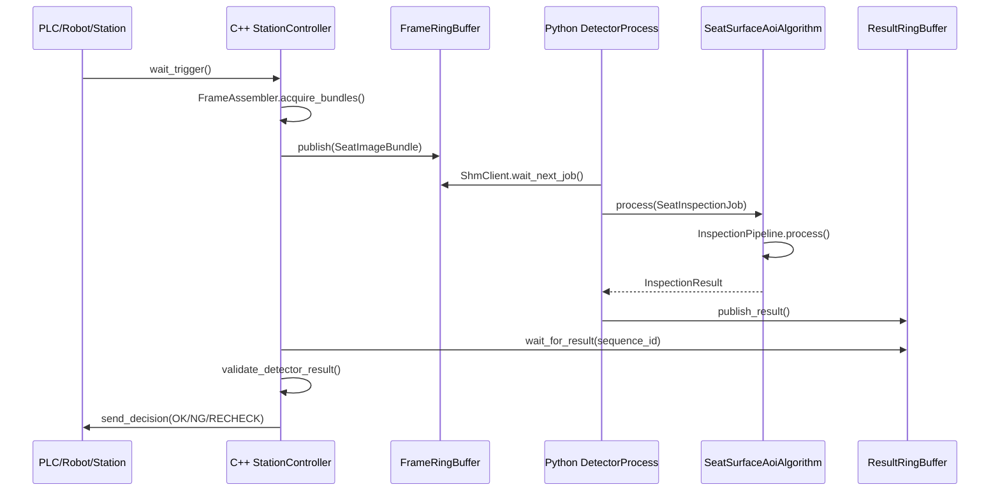
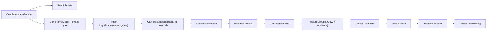

# 项目功能调用关系与封装逻辑深度分析

本文从代码实现出发，梳理 `seat-surface-aoi` 当前参考实现的功能边界、调用链、模块关系和封装逻辑。分析范围以 Git 跟踪文件为准，排除 `.venv/`、`build/`、缓存目录和运行时 trace 输出。

配套内置图像生成的功能与代码关系图：


## 1. 总体定位

项目实现的是汽车座椅表面缺陷检测参考系统，核心是在线主链路：

```text
C++ 主控
  -> 共享内存 Frame Ring Buffer
  -> Python 检测进程
  -> 共享内存 Result Ring Buffer
  -> C++ 主控输出 PLC 判定
```

职责边界非常明确：

| 层 | 主要职责 | 不允许做的事 |
|---|---|---|
| C++ 主控 | PLC 触发、机器人 pose、相机、频闪、节拍、共享内存写入、结果读取、PLC 输出、生产事件日志 | 不做深度学习推理 |
| Python detector | 共享内存读取、质量门禁、ROI、配准、多光源特征、模型推理、融合、规则判定、trace | 不控制 PLC、相机或频闪 |
| 共享内存协议 | 固定布局结构体、CRC、slot 状态机、跨语言数据交换 | 不走 TCP |
| 离线训练工具 | trace 转样本、embedding、PCA、PatchCore memory bank、FAISS、YOLO 导出、评估、回放、benchmark | 不参与在线实时设备控制 |

系统的安全原则是 fail closed：任何超时、缺帧、CRC 错误、协议错误、质量失败、ROI/配准失败、模型异常都不能输出 `OK`，必须输出 `RECHECK` 或 `ERROR`。

## 2. 目录与模块关系

```text
seat-surface-aoi/
├── cpp_controller/        # C++ 实时主控
│   ├── src/main.cpp       # C++ 进程入口
│   ├── src/control/       # 工位流程、硬件抽象、采集编排、健康与事件
│   ├── src/camera/        # 模拟相机设备与相机接口包装
│   ├── src/ipc/           # POSIX shared memory、frame/result ring buffer、CRC
│   ├── include/           # C++ 对外接口、协议结构体、运行配置结构
│   └── tools/             # 协议布局与 IPC 安全检查
├── python_detector/       # Python 在线检测算法包
│   ├── detector_main.py   # Python detector 进程入口
│   ├── algorithm.py       # 纯算法 facade，不含 IPC 控制
│   ├── ipc/               # Python 共享内存协议、解析与结果写回
│   ├── config/            # 配方 schema、标定、ROI 模板
│   ├── pipeline/          # 质量、预处理、ROI、配准、特征、融合、规则
│   ├── models/            # Fake、ONNX、Embedding、PCA、PatchCore/FAISS
│   ├── trace/             # trace JSON、ROI 图、overlay 写入
│   └── tests/             # Python 单元与架构测试
├── training_tools/        # 离线训练和评估工具
├── tools/                 # 验证脚本、端到端 IPC 脚本、兼容包装入口
├── model/                 # 真实模型产物占位目录
└── docs/                  # 架构、协议、部署、硬件、模型与本文
```

关键依赖方向：

```text
cpp_controller/control
  -> cpp_controller/camera
  -> cpp_controller/ipc

python_detector/config + python_detector/ipc data types
  -> python_detector/pipeline
  -> python_detector/models
  -> python_detector/algorithm
  -> python_detector/detector_main

training_tools
  -> python_detector public/pipeline/model APIs
```

`training_tools` 可以消费 `python_detector` 的公开入口和 trace 产物，但在线 detector 不反向 import 离线训练工具。

## 3. 在线主调用链

### 3.1 端到端时序



### 3.2 C++ 入口调用链

入口文件：[cpp_controller/src/main.cpp](../cpp_controller/src/main.cpp)

核心调用：

```text
main()
  -> load_station_runtime_config()              # 可选读取 key=value 配置
  -> validate_station_runtime_config()          # --validate-config 时直接校验退出
  -> StationController::initialize()
  -> loop:
       StationController::wait_for_trigger()
       StationController::inspect_one_seat()
  -> StationController::health_snapshot()
```

`main.cpp` 保持较薄，只负责命令行参数、运行配置覆盖、循环模式和退出码。真正业务封装在 `StationController` 和 `FrameAssembler` 中。

### 3.3 C++ 工位控制调用链

核心文件：

- [station_controller.cpp](../cpp_controller/src/control/station_controller.cpp)
- [frame_assembler.cpp](../cpp_controller/src/control/frame_assembler.cpp)
- [frame_ring_buffer.cpp](../cpp_controller/src/ipc/frame_ring_buffer.cpp)
- [result_ring_buffer.cpp](../cpp_controller/src/ipc/result_ring_buffer.cpp)

`StationController::initialize()`：

```text
保存 StationConfig
  -> event_log_.initialize(trace_root)
  -> health_.configure()
  -> frame_assembler_.configure(runtime_config)
  -> create_plc_client(config.plc.backend)
  -> plc_client_->initialize()
  -> frame_ring_.initialize(kFrameShmName, ...)
  -> result_ring_.initialize(kResultShmName, ...)
  -> health state = Ready
```

`StationController::inspect_one_seat()`：

```text
sequence_id = next_sequence_id_++
recipe = load_recipe(trigger.sku)
record_event("inspection_start")

FrameAssembler::acquire_bundles()
  失败 -> make_and_send_recheck_result()

FrameRingBuffer::publish()
  失败 -> RECHECK / SlotUnavailable

ResultRingBuffer::wait_for_result()
  超时或 CRC/负载错误 -> RECHECK / DetectorTimeout 或具体错误

validate_detector_result()
  sequence/trigger/seat/decision/defect_count/OK 安全约束失败 -> RECHECK / InvalidPayload

plc_client_->send_decision()
  失败 -> RECHECK / DeviceFault

record_result_health()
record_event("inspection_complete")
log_result()
```

这里的安全封装点是 `make_and_send_recheck_result()`：采集、共享内存、detector、结果校验、PLC 输出任一环节失败，C++ 都输出保守 `RECHECK`，并写生产事件日志。

### 3.4 C++ 采集编排调用链

`FrameAssembler` 是采集链路核心封装，负责把配方、运行配置和模拟/生产硬件接口组合成 `SeatImageBundle`。

```text
FrameAssembler::acquire_bundles(recipe, trigger, sequence_id)
  -> ensure_initialized()
       -> create_light_controller(config_.light.backend)
       -> light_controller_->initialize()
       -> create_robot_client(config_.robot.backend)
       -> robot_client_->initialize()
       -> for runtime_camera:
            create_camera(config_.camera_backend)
            camera->initialize()
            camera->start()
  -> build_light_sequence(recipe)
  -> build_capture_plan()
       fixed_camera: camera.<N> 自动生成 view
       robot_flyshot: 必须使用 pose.<N> 显式计划
  -> for each view:
       camera_for_index()
       wait_robot_pose_ready()
       light_controller_->prepare_sequence()
       for each light:
         software:
           light_controller_->trigger_channel()
         camera_exposure_output:
           light_controller_->arm_hardware_trigger()
           camera.arm()
           camera.simulate_exposure_output()
           light_controller_->notify_hardware_triggered()
         camera.wait_frame()
         写入 camera_id / pose_id / shot_id / robot pose / calibration_id
  -> validate_serial_tdm_bundle()
  -> out_bundle
```

采集策略固定为视角级串行 TDM：

```text
view_0: light_0 -> light_1 -> light_2 -> light_3
view_1: light_0 -> light_1 -> light_2 -> light_3
...
```

这样可以避免多视角并行频闪造成光源污染，也让共享内存 payload 顺序可预测。

### 3.5 C++ 硬件抽象封装

接口层：

| 接口/类 | 文件 | 作用 |
|---|---|---|
| `IPlcClient` / `SimPlcClient` | `include/control/iplc_client.hpp`, `src/control/plc_client.cpp` | PLC 触发等待、OK/NG/RECHECK 输出 |
| `IRobotClient` / `SimRobotClient` | `include/control/irobot_client.hpp`, `src/control/robot_client.cpp` | 机器人 pose ready、FAULT、SHOT_ID、TCP 位姿 |
| `ILightController` / `SimLightController` | `include/control/ilight_controller.hpp`, `src/control/light_controller.cpp` | 频闪准备、软件触发、硬触发 arm/confirm、健康状态 |
| `ICamera` / `SimCamera` | `include/camera/icamera.hpp`, `src/camera/camera_worker.cpp` | 相机 arm、曝光输出、等待帧 |
| `CameraDevice` | `src/camera/camera_device.cpp` | 生成模拟图像与 `LightFrameMeta` |
| `hardware_factory.hpp` | `include/control/hardware_factory.hpp` | 按 backend 创建模拟实现或 fail-fast 未支持实现 |

生产 backend 当前是明确的 fail-fast 占位：

```text
create_plc_client(non_simulated)
  -> UnsupportedPlcClient
  -> initialize()/wait_trigger()/send_decision() 返回失败
```

因此生产配置不会静默退回模拟硬件。真实产线要在这些接口后接厂商 SDK。

### 3.6 C++ 健康与事件

`StationHealthMonitor` 维护：

- `StationState`: Created / Initialized / Ready / Running / Fault / Stopped
- `AlarmLevel`: None / Warning / Critical
- 总任务、OK、NG、RECHECK、ERROR、detector timeout、device fault、连续复检计数

报警升级逻辑：

```text
OK/NG       -> 连续复检计数清零
RECHECK     -> 连续复检计数 +1，根据 warning/critical 阈值升级
ERROR       -> 连续复检计数 +1，根据 warning/critical 阈值升级
DeviceFault -> Critical/Fault
```

`ProductionEventLog` 写 `trace/cpp_controller_events.jsonl`，事件包括初始化、开始检测、复检、PLC 输出失败、完成检测等。每条包含 `sequence_id`、`trigger_id`、`seat_id`、`decision`、`error_code`、健康状态和消息。

## 4. 共享内存协议与 IPC

### 4.1 双 ring buffer

| 共享内存名 | 方向 | 写方 | 读方 | 内容 |
|---|---|---|---|---|
| `/seat_aoi_cpp_to_py_frames_v1` | C++ -> Python | C++ | Python | `SeatJobMeta`、`LightFrameMeta[]`、图像字节 |
| `/seat_aoi_py_to_cpp_results_v1` | Python -> C++ | Python | C++ | `InspectionResultMeta`、`DefectResultMeta[]` |

状态机：

```text
EMPTY -> WRITING -> READY -> READING -> EMPTY
```

### 4.2 C++ 发布 frame slot

`FrameRingBuffer::publish()`：

```text
validate_bundle()
  -> 查找 Empty slot
  -> CAS Empty -> Writing
  -> 清 slot
  -> 为每帧计算 image_offset/image_size/image_crc32
  -> 写 image bytes
  -> 写 FrameSlotHeader + SeatJobMeta + LightFrameMeta[]
  -> 计算 payload_crc32
  -> 计算 header_crc32
  -> state = Ready
```

不会覆盖 `READY` 或 `READING` slot。超时找不到空 slot 时返回失败，由 `StationController` 输出 `RECHECK / SlotUnavailable`。

### 4.3 Python 读取 frame slot

`ShmClient.wait_next_job()`：

```text
遍历 frame slots
  -> 找 READY
  -> _read_frame_slot(slot_index)
       state = READING
       解析 FrameSlotHeader prefix
       _validate_frame_header_crc()
       解析 SeatJobMeta
       _validate_frame_payload_bounds()
       校验 payload_crc32
       for LightFrameMeta:
          _make_light_frame()
          校验 image range 和 image_crc32
          转成 LightFrame(memoryview)
          按 (camera_id, pose_id) 聚合 CameraBundle
       校验 view_count
       返回 SeatInspectionJob
```

解析失败但已经得到 `sequence_id/trigger_id/seat_id` 时，`ShmClient` 会调用 `_publish_frame_slot_error()` 写回 `ERROR` 结果，并释放输入 slot；若 identity 都无法信任，则直接释放 slot。

### 4.4 Python 写 result slot

`ShmClient.publish_result()`：

```text
截断 defects 到 MAX_DEFECTS_PER_RESULT
计算 payload_size
查找 Empty result slot
  -> state = WRITING
  -> _write_result_slot()
       InspectionDecision[result.decision]
       pack InspectionResultMeta
       pack DefectResultMeta[]
       计算 payload_crc32
       计算 header_crc32
  -> state = READY
  -> release_frame_slot(sequence_id)
```

`_pack_defect()` 负责把 Python `DefectResult` 转成固定布局，包含：

- `defect_id`
- `class_name`
- `severity`
- `camera_index`
- `camera_id`
- `pose_id`
- `roi_name`
- `bbox_xyxy`
- `score`
- `area_px`
- evidence light indices
- `decision`

机器人飞拍时，同一 `camera_id` 可对应多个 `pose_id`。`ShmClient._remember_camera_index()` 会记录 `(camera_id, pose_id) -> camera_index`，避免结果回写依赖固定静态相机表。

### 4.5 C++ 读取 result slot

`ResultRingBuffer::wait_for_result()`：

```text
deadline 前轮询 result slots
  -> read_ready_slot(slot_index, sequence_id)
       state 必须 READY 且 sequence_id 匹配
       state = READING
       校验 payload_size / defect_count
       校验 payload_crc32
       校验 header_crc32
       copy InspectionResultMeta + DefectResultMeta[]
       state = EMPTY
```

CRC、payload 或超时失败都返回具体 `ErrorCode`，上层统一复检。

## 5. Python 在线检测调用链

### 5.1 detector 进程入口

入口文件：[python_detector/detector_main.py](../python_detector/detector_main.py)

```text
main()
  -> DetectorProcess.initialize()
       self.shm_client = ShmClient()
       self.algorithm = SeatSurfaceAoiAlgorithm()
  -> run_once() 或 run_forever()
       ShmClient.wait_next_job()
       _process_and_publish(job)
          algorithm.process(job)
          shm_client.publish_result(result)
```

`DetectorProcess` 只做 IPC 循环和结果发布，不写算法业务。

### 5.2 算法 facade

文件：[python_detector/algorithm.py](../python_detector/algorithm.py)

`SeatSurfaceAoiAlgorithm.process()`：

```text
recipe = RecipeManager.load(recipe_id or job.recipe_id)
result = InspectionPipeline.process(job, recipe)
if write_trace:
  TraceWriter.write(job, recipe, result, pipeline.last_context)
return AlgorithmRun(result, context, trace_dir)
```

这里的封装意义：

- `SeatSurfaceAoiAlgorithm` 是无 IPC 的纯算法入口，方便测试、回放和离线调用。
- 任何未捕获异常会变成 `InspectionResult(decision="ERROR", error_code=INTERNAL_ERROR)`。
- trace 写入异常不改变检测判定，只记录到 `last_context.trace_error`。

### 5.3 InspectionPipeline 主链路

文件：[python_detector/pipeline/pipeline.py](../python_detector/pipeline/pipeline.py)

```text
InspectionPipeline.process(job, recipe)
  -> ImageQualityGate.check()
       fail -> RuleEngine.make_quality_fail_result()
  -> Preprocessor.run()
  -> ReflectanceCubeBuilder.build()
       registration fail -> RuleEngine.make_quality_fail_result()
  -> FeatureBuilder.build()
  -> InferenceEngine.infer()
  -> FusionEngine.fuse()
  -> RuleEngine.decide()
```

异常处理：

| 异常/失败 | 输出 |
|---|---|
| `quality_report.is_pass == False` | `RECHECK / QUALITY_FAILED` |
| `PreprocessRecheckError` | `RECHECK / QUALITY_FAILED` |
| 配准失败 | `RECHECK / QUALITY_FAILED` |
| `ModelInferenceError` | `ERROR / INTERNAL_ERROR` |
| 其他异常 | `ERROR / INTERNAL_ERROR` |

`last_context` 是 trace 和调试的上下文总线，包含质量报告、ROI 定位报告、配准报告、特征摘要、融合摘要、耗时和错误上下文。

## 6. Python 配方、标定和 ROI 封装

### 6.1 RecipeManager 与 schema

文件：[python_detector/config/recipe_schema.py](../python_detector/config/recipe_schema.py)

`RecipeManager` 从 `python_detector/config/*.yaml` 加载配方，跳过 `.example.yaml`。核心 dataclass：

| dataclass | 含义 |
|---|---|
| `Recipe` | 总配方，包含 SKU、光源、相机视角、质量、ROI、配准、融合、阈值、模型、trace |
| `CameraRecipe` | 一个检测视角配置，固定机位时 `pose_id == camera_id`，机器人飞拍时多个 pose 可共享 `camera_id` |
| `QualityConfig` | 必需光源、曝光/锐度/运动模糊/时间戳/曝光增益漂移阈值 |
| `RoiLocatorConfig` | template/fake_yolo/onnx_yolo ROI 定位配置 |
| `RegistrationConfig` | fixed_calibration/ecc 配准配置 |
| `ModelConfig` | fake/onnx/patchcore_knn 统一模型配置 |
| `FusionConfig` | NMS IoU、是否按类别、每 ROI 最大候选数 |
| `ThresholdConfig` | 类别级 NG/RECHECK 分数阈值和最小面积 |
| `TraceConfig` | trace 开关和保存策略 |

配方校验重点：

- `light_order` 不为空、不重复。
- `quality.required_lights` 必须在 `light_order` 中。
- V4 语义光源 `DOME/DARKFIELD_L/DARKFIELD_R` 必须映射到真实光源。
- ROI 定位使用 `onnx_yolo/fake_yolo` 时必须配置模型路径。
- registration base/fallback 光源必须合法。
- 每个 camera/pose 视角不能重复。
- primary 和 safety_net 模型角色不能混用。
- PatchCore 只能作为 safety net。
- 每个模型 `class_names` 必须有显式 thresholds。

### 6.2 CalibrationManager 与 ROI 模板

文件：[python_detector/config/calibration_manager.py](../python_detector/config/calibration_manager.py)

调用关系：

```text
Preprocessor.run()
  -> CalibrationManager.load(camera_id, calibration_id, roi_template_path)
       -> _resolve_calibration_path()
       -> _parse_calibration()
       -> _with_roi_override()
       -> cache[(camera_id, calibration_id, roi_path)]
```

`Calibration` 包含：

- `image_size`
- `pixel_size_mm`
- `base_light_id`
- `light_alignment`
- `roi_templates`

`RoiTemplate` 包含：

- `roi_name`
- `polygon_xy`
- `output_size`

ROI 模板要求至少 3 点、无重复点、面积大于 0。四点 ROI 支持透视展开。

## 7. Python 检测子模块功能逻辑

### 7.1 ImageQualityGate

文件：[python_detector/pipeline/quality_gate.py](../python_detector/pipeline/quality_gate.py)

检查项：

| 检查 | 失败影响 |
|---|---|
| job SKU 与 recipe SKU 一致 | RECHECK |
| camera/pose 是否在配方启用 | RECHECK |
| 配方启用视角是否缺失 | RECHECK |
| required lights 是否齐全 | RECHECK |
| 时间戳正数、采集跨度、单调性 | RECHECK |
| frame_index 唯一 | RECHECK |
| light_seq_index 唯一且匹配 light_order | RECHECK |
| exposure/gain 正数且漂移不超阈值 | RECHECK |
| pixel format / dtype / color order / stride | RECHECK |
| mean gray、饱和比例、sharpness、motion gradient | RECHECK |
| required lights mean delta | RECHECK |

质量门禁只做可靠性判断，不做缺陷分类。

### 7.2 Preprocessor

文件：[python_detector/pipeline/preprocessor.py](../python_detector/pipeline/preprocessor.py)

调用关系：

```text
run(job, recipe)
  -> for CameraBundle:
       recipe.camera(camera_id, pose_id)
       CalibrationManager.load()
       _decode_frames()
       _assert_calibration_matches()
       RoiLocator.locate()
       for roi/light:
          _crop_to_roi()
            axis aligned rectangle -> _crop_bbox()
            4-point polygon -> _warp_quad()
       PreparedBundle(...)
```

封装边界：

- 只接受 `MONO8 / UINT8 / channels=1`。
- ROI 裁剪后返回新的 `LightFrame`，保留 pose、shot、robot pose、标定、origin、source size、ROI/原图双向矩阵。
- 几何错误会向上变成 `RECHECK` 或 `ERROR`，不会静默裁剪。

### 7.3 RoiLocator

文件：[python_detector/pipeline/roi_locator.py](../python_detector/pipeline/roi_locator.py)

后端：

| backend | 调用 |
|---|---|
| `template` | 直接使用标定/ROI 模板 |
| `fake_yolo` | 从模板生成模拟 YOLO rows |
| `onnx_yolo` | `create_onnx_session()` -> Dome 图转 NCHW -> `run_first_input()` -> 解析 rows |

ROI 定位只使用 `recipe.semantic_light_id(roi_locator.dome_semantic_light)` 映射出的 Dome 语义光源。缺 Dome 图、置信度不足、pose error 超阈值、bbox 越界、class_id 错误都会导致 ROI 定位失败，最终 `RECHECK`。

### 7.4 ReflectanceCubeBuilder 与 EccRegistration

文件：

- [reflectance_cube.py](../python_detector/pipeline/reflectance_cube.py)
- [ecc_registration.py](../python_detector/pipeline/ecc_registration.py)

调用关系：

```text
ReflectanceCubeBuilder.build(job, prepared_bundles, recipe)
  -> for PreparedBundle:
       for ROI:
         _build_roi_cube()
           -> _registration_report()
                fixed_calibration:
                  calibration.light_alignment -> corner error
                ecc:
                  EccRegistration.align_translation(base, moving)
                  if pass -> apply_translation()
           -> ReflectanceCube(...)
```

`ReflectanceCube` 是多光源 ROI 的算法输入单位，包含同一 `camera_id/pose_id/roi_name` 下的光源帧、注册报告、基准光源、ROI bbox、像素尺寸和坐标矩阵。

ECC 当前是轻量参考实现：在整数像素搜索半径内用归一化相关性找最佳平移，并可将非基准光源重采样到基准坐标。相关性不足或位移/误差超阈值时输出配准失败，主链路 `RECHECK`。

### 7.5 FeatureBuilder

文件：[python_detector/pipeline/feature_builder.py](../python_detector/pipeline/feature_builder.py)

调用关系：

```text
FeatureBuilder.build(cubes, recipe)
  -> for ReflectanceCube:
       _build_feature_dict()
       primary model group
       safety net model group(s)
       _make_feature_group()
          _assert_feature_shapes()
          _build_tensor()
```

标准特征：

| feature channel | 来源 |
|---|---|
| `ch0_diffuse` | `DIFFUSE` |
| `ch1_polar_diffuse` | `POLAR_DIFFUSE` |
| `ch2_high_left` | `HIGH_LEFT` |
| `ch3_high_right` | `HIGH_RIGHT` |
| `ch4_high_max_min` | `max(HIGH_LEFT, HIGH_RIGHT) - min(...)` |
| `optional_dark_low_lr_diff` | `abs(LOW_LEFT - LOW_RIGHT)` |
| `optional_dark_low_max_min` | low-angle max-min |
| `aux_local_contrast` | diffuse 局部对比 |
| `aux_specular_removed` | `abs(DIFFUSE - POLAR_DIFFUSE)` |

`FeatureGroup` 是模型输入封装：

- `features`: 每个通道的一维像素列表。
- `tensor_nchw`: `[1, C, H, W]` float 输入。
- `tensor_channel_names`: 当前模型声明的输入通道顺序。
- `evidence_lights_by_channel`: 模型候选回写 evidence lights 的映射。
- `roi_to_source_matrix/source_to_roi_matrix`: bbox 映射与 overlay 使用。
- `embedding_summary/pca_summary/anomaly_summary`: PatchCore trace 摘要。

### 7.6 InferenceEngine 与 ModelRegistry

文件：[python_detector/models/inference_engine.py](../python_detector/models/inference_engine.py)

调用关系：

```text
InferenceEngine.infer(feature_groups, recipe)
  -> for FeatureGroup:
       ModelRegistry.get_model(group.model_key, recipe)
         -> cache_key(model_key + 完整 ModelConfig)
         -> _create_model()
              fake -> FakeModel
              onnx -> OnnxModel
              patchcore_knn -> PatchCoreModel
       model.run(group)
```

`ModelRegistry` 的缓存 key 包含 backend、模型路径、fake mode、模型家族、角色、输入通道、类别、decode、bbox format、embedding/PCA/PatchCore 参数等，防止不同配方误复用模型实例。

后端行为：

| 后端 | 输出 | 失败策略 |
|---|---|---|
| `FakeModel` | 模拟 OK/NG/RECHECK 候选 | 不用于真实生产判定 |
| `OnnxModel` | `detection_rows` 转 `DefectCandidate` | 模型缺失、占位、依赖缺失、输出异常都抛 `ModelInferenceError` |
| `PatchCoreModel` | `unknown_anomaly` safety net 候选 | embedding/PCA/memory bank/FAISS 异常保守失败 |

ONNX detection rows 约定：

```text
[x1, y1, x2, y2, score, class_id]
```

bbox 可为 ROI 像素或归一化坐标，最终通过 ROI 矩阵映射回原图 `bbox_xyxy_pixel`。

### 7.7 Embedding、PCA、PatchCore/FAISS

文件：

- [embedding.py](../python_detector/models/embedding.py)
- [pca.py](../python_detector/models/pca.py)
- [patchcore.py](../python_detector/models/patchcore.py)

PatchCore 调用链：

```text
PatchCoreModel.run(feature_group)
  -> EmbeddingExtractor.extract()
       statistical 或 onnx_wideresnet50
  -> optional PcaProjector.project()
  -> PatchCoreKnnIndex.score()
       load memory bank
       optional FAISS search
       fallback exact KNN
  -> anomaly score >= threshold ? DefectCandidate : []
```

FAISS 是可选加速路径。索引缺失、为空、维度不一致、依赖缺失或加载失败时，运行时回退 exact KNN，并在 `anomaly_summary.fallback_reason` 中记录原因。

### 7.8 FusionEngine、DefectFilter、RuleEngine

文件：

- [fusion_engine.py](../python_detector/pipeline/fusion_engine.py)
- [defect_filter.py](../python_detector/pipeline/defect_filter.py)
- [rule_engine.py](../python_detector/pipeline/rule_engine.py)

调用关系：

```text
FusionEngine.fuse(candidates, recipe.fusion)
  -> 按 (camera_id, pose_id, roi_name, class_name 或 *) 分组
  -> IoU NMS
  -> evidence_lights 合并
  -> 每 ROI 限制 max_candidates_per_roi

DefectFilter.filter(candidates, recipe)
  -> score >= ng_score 且 area >= min_area_px -> NG/critical
  -> score >= recheck_score -> RECHECK/suspect
  -> 低于阈值 -> 丢弃

RuleEngine.decide()
  -> quality fail -> RECHECK
  -> 有 NG candidate -> NG
  -> 只有 RECHECK candidate -> RECHECK
  -> 无有效 candidate -> OK
```

注意：`OK` 只在质量通过、配准通过、模型成功、融合和规则完成、且无达到复检/NG 阈值候选时产生。

## 8. Trace 与离线训练闭环

### 8.1 TraceWriter

文件：[python_detector/trace/trace_writer.py](../python_detector/trace/trace_writer.py)

`TraceWriter.write()` 输出：

```text
trace/YYYYMMDD/<seat_id>_<sequence_id>/
├── job.json
├── result.json
├── recipe_summary.json
├── quality_report.json
├── roi_location_report.json
├── registration_report.json
├── feature_summary.json
├── fusion_summary.json
├── timings.json
├── error.json
├── images/<camera>/<roi>/<light>.pgm
└── overlays/<defect>_<camera>_<roi>.ppm
```

保存策略：

- `OK`: 按 `save_ok_ratio` 稳定采样。
- `NG`: `save_ng=true` 时保存。
- `RECHECK/ERROR`: `save_recheck=true` 时保存。

### 8.2 Trace 到训练样本

`training_tools.collect_trace_dataset`：

```text
collect_trace_dataset(trace_roots, output_dir)
  -> _discover_trace_dirs()
  -> _collect_trace_dir()
       读取 result.json/job.json/recipe_summary.json
       遍历 images/*/*/*.pgm
       defects_by_roi(result)
       复制 ROI PGM 到 dataset/images/...
       写 dataset_manifest.jsonl
       写 dataset_summary.json
```

`training_tools.dataset_manifest`：

```text
load_manifest_rows()
load_manifest_groups()
build_feature_group_from_manifest_group()
  -> light_frame_from_manifest_row()
  -> read_pgm()
  -> 构造 ReflectanceCube(method=manifest_roi)
  -> 复用在线 FeatureBuilder 生成 FeatureGroup
```

这样保证离线 embedding、PCA 和 PatchCore 输入通道与在线 `FeatureBuilder` 一致。

### 8.3 PatchCore 资产训练

完整工具链：

```text
train_patchcore_assets()
  -> extract_embeddings()
       -> load_manifest_groups()
       -> build_feature_group_from_manifest_group()
       -> EmbeddingExtractor.extract()
  -> optional compute_pca()
  -> build_memory_bank()
       -> greedy 或 stride coreset
  -> optional build_faiss_index()
  -> patchcore_training_summary.json
```

输出通常放入：

```text
model/patchcore/
├── embeddings.jsonl
├── seat_pca.json
├── pca_embeddings.jsonl
├── seat_patchcore_bank.json
├── seat_patchcore.faiss
└── patchcore_training_summary.json
```

### 8.4 YOLO 与监督模型训练入口

| 工具 | 作用 |
|---|---|
| `training_tools.train_roi_yolo` | 训练 Dome ROI YOLO 并导出 `model/roi_yolo/seat_roi_yolo.onnx` |
| `training_tools.train_supervised_yolo` | 训练已知缺陷监督 YOLO 并导出 `model/supervised_defect/seat_defect_detector.onnx` |
| `training_tools.evaluate_pipeline` | 对 manifest 标注样本运行当前模型并按整体、类别、ROI、camera、split 统计 precision/recall |
| `training_tools.replay_dataset` | 用模拟 job 回放 Python pipeline |
| `training_tools.benchmark_pipeline` | 统计 pipeline 总耗时和各步骤耗时，可设置阈值失败 |

## 9. 工具与验证链路

### 9.1 C++ 构建目标

文件：[cpp_controller/CMakeLists.txt](../cpp_controller/CMakeLists.txt)

| Target | 内容 |
|---|---|
| `seat_aoi_ipc` | shared memory、CRC、frame/result ring buffer |
| `seat_aoi_control` | PLC、Robot、Light、Camera、FrameAssembler、StationController、健康和事件 |
| `seat_aoi_controller` | C++ 主进程入口 |
| `protocol_layout` | 打印 C++ 协议结构体大小 |
| `ipc_safety_checks` | C++ IPC 与故障注入安全测试 |

### 9.2 端到端模拟

文件：[tools/run_simulated_ipc.sh](../tools/run_simulated_ipc.sh)

调用：

```text
构建 C++
  -> 运行 ipc_safety_checks
  -> seat_aoi_controller --cleanup
  -> 后台启动 seat_aoi_controller --once --wait-ms 8000
  -> 启动 python_detector.detector_main --once --timeout-ms 8000
  -> wait C++ 退出
  -> cleanup
```

该脚本验证 C++ 采集、共享内存发布、Python 读取、算法执行、结果写回、C++ 读取和 PLC 输出闭环。

### 9.3 静态与资产校验

| 工具 | 检查项 |
|---|---|
| `tools.validate_protocol` | Python 协议结构体大小是否符合预期 |
| `cpp_controller/tools/protocol_layout.cpp` | C++ 协议结构体大小 |
| `tools.validate_model_assets` | 生产配方引用的 ONNX/PCA/memory bank/FAISS 是否存在、非占位、版本合法 |
| `tools.validate_architecture_readiness` | V4/PPT 架构要求是否在参考或生产范围内就绪 |
| `cpp_controller/tools/ipc_safety_checks.cpp` | ring buffer、CRC、PLC 超时、采集故障、生产配置、健康升级等安全检查 |

## 10. 功能封装逻辑总结

### 10.1 在线控制封装

C++ 使用“薄入口 + 工位编排 + 设备接口 + IPC 基础设施”的分层：

```text
main.cpp
  -> StationController
       -> IPlcClient
       -> FrameAssembler
            -> IRobotClient
            -> ILightController
            -> ICamera
       -> FrameRingBuffer
       -> ResultRingBuffer
       -> StationHealthMonitor
       -> ProductionEventLog
```

好处：

- 真实硬件 SDK 可替换接口实现，不需要改主流程。
- 所有等待都有 timeout。
- 所有采集异常集中转为 `AcquisitionError`，由工位层统一 fail closed。
- 共享内存和业务编排解耦。

### 10.2 在线算法封装

Python 使用“IPC 进程入口 + 纯算法 facade + 可注入 pipeline 子模块”的分层：

```text
DetectorProcess
  -> ShmClient
  -> SeatSurfaceAoiAlgorithm
       -> RecipeManager
       -> InspectionPipeline
            -> ImageQualityGate
            -> Preprocessor
            -> ReflectanceCubeBuilder
            -> FeatureBuilder
            -> InferenceEngine
            -> FusionEngine
            -> RuleEngine
       -> TraceWriter
```

好处：

- `InspectionPipeline` 可单元测试，也可替换子模块。
- `SeatSurfaceAoiAlgorithm` 可被回放和离线验证复用。
- `ShmClient` 独立处理二进制协议和 slot 生命周期。
- 模型后端通过 `ModelRegistry` 和 `ModelConfig` 隔离，避免缓存串用。

### 10.3 离线闭环封装

训练工具统一消费 trace 和 Python 在线特征/模型接口：

```text
TraceWriter outputs
  -> collect_trace_dataset
  -> dataset_manifest
  -> extract_embeddings
  -> compute_pca
  -> build_patchcore_memory_bank
  -> build_faiss_index
  -> evaluate_pipeline
  -> model assets
  -> production_model.example.yaml
  -> online PatchCore/ONNX runtime
```

这样把“在线检测”和“离线训练”分开，但保持输入通道、特征构建和模型契约一致。

## 11. 关键数据对象关系



对象转换原则：

- 图像原始输入尽量以 `memoryview` 保持少拷贝。
- ROI 裁剪/透视展开产生新 `LightFrame`，带坐标映射矩阵。
- 模型只看到 `FeatureGroup`，不直接读共享内存。
- 规则引擎只看到融合候选，不直接调用模型。
- 结果序列化只在 `ShmClient` 内部完成。

## 12. 安全闭环清单

| 失败点 | 检测位置 | 输出 |
|---|---|---|
| PLC 触发超时 | `SimPlcClient::wait_trigger` / `StationController::wait_for_trigger` | 程序返回失败或 Fault |
| Robot 未到位/FAULT | `FrameAssembler::wait_robot_pose_ready` | `RECHECK / ROBOT_FAULT` |
| 光源 prepare/trigger/arm/confirm 失败 | `FrameAssembler` | `RECHECK / LIGHT_FAULT` 或 `TRIGGER_SYNC_FAULT` |
| 相机 arm/曝光/缺帧 | `FrameAssembler` | `RECHECK / CAMERA_FAULT` 或 `MISSING_FRAME` |
| frame slot 满 | `FrameRingBuffer::publish` | `RECHECK / SLOT_UNAVAILABLE` |
| frame header/payload/image CRC 错 | `ShmClient._read_frame_slot` | `ERROR / CRC_MISMATCH` |
| 重复 camera/pose/light | `ShmClient._read_frame_slot` | `ERROR / INVALID_PAYLOAD` |
| 质量门禁失败 | `ImageQualityGate` | `RECHECK / QUALITY_FAILED` |
| ROI 定位失败 | `RoiLocator` -> `Preprocessor` | `RECHECK / QUALITY_FAILED` |
| 配准失败 | `ReflectanceCubeBuilder` -> `InspectionPipeline` | `RECHECK / QUALITY_FAILED` |
| 模型缺失/占位/依赖缺失/输出异常 | `InferenceEngine` | `ERROR / INTERNAL_ERROR` |
| result CRC/payload 错 | `ResultRingBuffer` | `RECHECK / CRC_MISMATCH` 或 `INVALID_PAYLOAD` |
| detector 超时 | `ResultRingBuffer::wait_for_result` | `RECHECK / DETECTOR_TIMEOUT` |
| detector 返回非法 OK | `StationController::validate_detector_result` | `RECHECK / INVALID_PAYLOAD` |
| PLC 输出失败 | `StationController::inspect_one_seat` | `RECHECK / DEVICE_FAULT` |

## 13. 当前实现与生产落地差距

当前仓库已经具备参考链路闭环，但生产落地仍需要：

1. 接入真实 PLC、相机、频闪、机器人 SDK 或协议适配器。
2. 用现场数据替换 `model/` 下 YOLO、监督检测、WideResNet50、PCA、PatchCore、FAISS 占位产物。
3. 完成真实光学节拍、ExposureOut 触发抖动、缺帧、光源故障、机器人 pose ready 的压测。
4. 训练并验证 Dome ROI YOLO、已知缺陷主检测模型、WideResNet50 embedding、PCA 与 PatchCore memory bank。
5. 产出按缺陷类别、ROI、材质、颜色、相机、光源条件拆分的阈值曲线。
6. 接 MES、报警面板、监控平台和模型版本平台。

## 14. 推荐阅读顺序

1. [README.md](../README.md)
2. [V4.0 架构对齐说明](v4_architecture_alignment.md)
3. [共享内存协议](shm_protocol.md)
4. [C++ 主控 README](../cpp_controller/README.md)
5. [Python 检测算法层导览](../python_detector/README.md)
6. 本文
7. [模型后端说明](model_backend.md)
8. [追溯与回放说明](trace_and_replay.md)
9. [C++ 主控生产上线 SOP](cpp_controller_production_sop.md)
