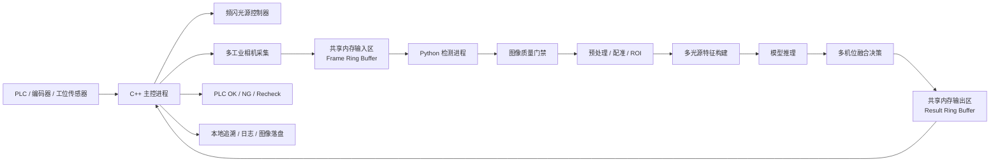

# 汽车座椅表面缺陷检测算法系统方案

> 版本说明：本文是项目早期 v2.0 架构设计文档，保留用于理解当前参考实现的演进背景。当前项目后续开发和验收以 V4.0 集成 ONNX + FAISS 方案架构图 `docs/assets/architecture-v4.png` 以及 [V4.0 架构对齐说明](v4_architecture_alignment.md) 为准。

版本：v2.0
目标：形成一套稳定、严格、高性能、可模块化实现的生产级算法程序架构，支持多机位、多光源频闪图像并行处理，同时降低现场部署和维护复杂度。
核心约束：频闪与采集主控由 C++ 执行；Python 作为独立检测进程运行；C++ 与 Python 之间通过共享内存交换图像和检测结果，不使用 TCP 作为在线检测调用链路。

---

## 1. 方案定位

本方案面向汽车座椅生产线表面缺陷检测，适配以下两类硬件形态：

1. 机械臂飞拍 + 固定相机组合方案。
2. 全固定相机方案。

算法系统不直接绑定某一种硬件布局，而是抽象为：

```text
SeatInspectionJob
  ├── CameraBundle[机位 1]
  │     ├── LightFrame[光源 1]
  │     ├── LightFrame[光源 2]
  │     └── ...
  ├── CameraBundle[机位 2]
  └── ...
```

每个座椅生成一个检测任务；每个机位生成一个多光源图像包；每个图像包进入统一的质量门禁、预处理、特征构建、模型推理、融合决策链路。

### 1.1 V2 生产化设计哲学

V1 思路偏向最大化采集特征，V2 思路改为最大化生产成功率。算法系统必须优先保证成像稳定、ROI 可控、数据闭环可持续、模型维护成本可接受，而不是堆叠尽可能多的光源和特征。

生产标准链路以每机位 4 个必需光源为基础：

```text
DIFFUSE
POLAR_DIFFUSE
HIGH_LEFT
HIGH_RIGHT
```

低角度暗场、前后高角度、NIR 等光源可以作为增强能力进入配方，但不能成为主检测链路输出 OK 的前置依赖。默认目标图像量从每座椅 `40-60` 张收敛到 `20-25` 张左右，减少采集节拍、存储、回放和标定维护压力。

---

## 2. 总体架构

### 2.1 在线系统架构



### 2.2 进程职责

| 进程 | 职责 | 语言 |
|---|---|---|
| C++ 主控进程 | PLC 通信、相机采集、频闪控制、共享内存写入、结果读取、节拍控制、异常联锁 | C++ |
| Python 检测进程 | 图像质量检测、预处理、多光源特征构建、模型推理、多机位融合、结果写回 | Python |
| 离线训练工具 | 数据集构建、标注转换、训练、评估、模型导出 | Python |
| 追溯服务 | 图像、结果、日志、指标、配方版本归档 | C++ / Python / 后端服务均可 |

### 2.3 为什么不用 TCP

在线检测主链路不使用 TCP，原因如下：

1. 图像数据量大，多机位多光源会产生高吞吐压力。
2. TCP 会引入序列化、拷贝、协议栈和端口服务管理成本。
3. 同机 IPC 场景下，共享内存更适合低延迟、高带宽、可控抖动的数据交换。
4. C++ 主控与 Python 检测应解耦为独立进程，但数据面应保持零拷贝或少拷贝。

允许使用 TCP/HTTP 的位置：

1. 非实时配置下发。
2. Web 可视化。
3. 远程日志与报表。
4. 离线数据同步。

不允许使用 TCP 的位置：

1. C++ 主控向 Python 检测进程发送在线图像。
2. Python 检测进程向 C++ 主控返回本次座椅的实时检测结果。

---

## 3. 功能步骤拆分

### 3.1 在线检测主流程

| 步骤 | 模块 | 输入 | 输出 | 失败处理 |
|---:|---|---|---|---|
| 1 | 工位触发 | PLC 触发信号 | seat_id / trigger_id | 超时报警 |
| 2 | 配方加载 | sku / 工位号 | recipe | 配方缺失则停线或复检 |
| 3 | 频闪调度 | recipe.light_sequence | 光源触发序列 | 光源失败则 NG/Recheck |
| 4 | 多相机采集 | 相机触发 | LightFrame[] | 缺帧则 Recheck |
| 5 | 图像打包 | 多机位多光源图 | CameraBundle[] | 包不完整则 Recheck |
| 6 | 写入共享内存 | CameraBundle[] | shm frame slot | slot 满则阻塞或丢弃并报警 |
| 7 | Python 读取 | shm frame slot | SeatInspectionJob | 校验失败则 Recheck |
| 8 | 图像质量门禁 | LightFrame[] | QualityReport | 关键 QC 失败则 Recheck/NG |
| 9 | 预处理/配准 | 图像包 | 对齐 ROI 图像 | 配准失败则 Recheck |
| 10 | 特征构建 | 多光源图 | 多通道 Tensor | 通道缺失则降级或 Recheck |
| 11 | 模型推理 | Tensor / ROI | 缺陷候选 | 模型异常则 Recheck |
| 12 | 多机位融合 | 缺陷候选 | SeatDecision | 不确定则 Recheck |
| 13 | 结果写回 | SeatDecision | shm result slot | 写回失败则报警 |
| 14 | C++ 读结果 | shm result slot | OK/NG/Recheck | 超时则 Recheck |
| 15 | PLC 输出 | 决策结果 | 分拣/报警信号 | 输出失败则停线 |
| 16 | 追溯保存 | 图像/结果/日志 | record | 异步失败不阻塞主判定 |

### 3.2 AI Agent 执行顺序

后续生成代码时，Agent 必须按以下顺序实现，避免一开始写模型代码导致系统不可集成：

1. 定义数据协议：`LightFrame`、`CameraBundle`、`SeatInspectionJob`、`InspectionResult`。
2. 定义共享内存布局：header、frame slot、result slot、状态枚举、序列号。
3. 实现 C++ 共享内存管理模块。
4. 实现 Python 共享内存读取/写回模块。
5. 实现模拟采集器：不接相机也能写入测试图像包。
6. 实现 Python 检测进程主循环：读取任务、返回假结果。
7. 打通 C++ 主控到 Python 检测进程的端到端 IPC。
8. 加入图像质量门禁。
9. 加入预处理、ROI、配准。
10. 加入多光源特征构建。
11. 加入模型推理适配层。
12. 加入多机位融合与规则引擎。
13. 加入日志、追溯、异常恢复、性能统计。
14. 接入真实相机、真实频闪控制器、真实 PLC。
15. 做节拍压测和稳定性测试。

---

## 4. 推荐代码目录结构

```text
seat_inspection/
├── cpp_controller/
│   ├── CMakeLists.txt
│   ├── include/
│   │   ├── common/
│   │   │   ├── inspection_types.hpp
│   │   │   ├── shm_protocol.hpp
│   │   │   └── error_code.hpp
│   │   ├── control/
│   │   │   ├── plc_client.hpp
│   │   │   ├── light_controller.hpp
│   │   │   ├── trigger_scheduler.hpp
│   │   │   └── station_controller.hpp
│   │   ├── camera/
│   │   │   ├── camera_device.hpp
│   │   │   ├── camera_worker.hpp
│   │   │   └── camera_manager.hpp
│   │   ├── ipc/
│   │   │   ├── shared_memory.hpp
│   │   │   ├── frame_ring_buffer.hpp
│   │   │   └── result_ring_buffer.hpp
│   │   └── trace/
│   │       ├── image_writer.hpp
│   │       └── inspection_logger.hpp
│   └── src/
│       ├── main.cpp
│       ├── control/
│       ├── camera/
│       ├── ipc/
│       └── trace/
├── python_detector/
│   ├── pyproject.toml
│   ├── detector_main.py
│   ├── config/
│   │   ├── recipe_schema.py
│   │   └── default_recipe.yaml
│   ├── ipc/
│   │   ├── shm_client.py
│   │   ├── shm_protocol.py
│   │   └── ring_buffer.py
│   ├── pipeline/
│   │   ├── quality_gate.py
│   │   ├── preprocessor.py
│   │   ├── roi_builder.py
│   │   ├── feature_builder.py
│   │   ├── inference_engine.py
│   │   ├── fusion_engine.py
│   │   └── rule_engine.py
│   ├── models/
│   │   ├── model_registry.py
│   │   └── runtime/
│   ├── trace/
│   │   ├── result_writer.py
│   │   └── debug_overlay.py
│   └── tests/
├── tools/
│   ├── simulate_cpp_writer/
│   ├── replay_dataset.py
│   ├── benchmark_pipeline.py
│   └── validate_recipe.py
└── docs/
    ├── shm_protocol.md
    ├── recipe_design.md
    └── deployment.md
```

---

## 5. C++ 主控模块设计

### 5.1 C++ 核心类

```cpp
// inspection_types.hpp

// 单张光源图的元信息。真实图像数据存放在共享内存 slot 的连续图像区。
struct LightFrameMeta {
  uint32_t camera_index;      // 机位编号，用于映射到具体相机
  uint32_t light_index;       // 光源编号，用于映射到具体频闪通道
  uint32_t frame_index;       // 相机内帧序号，用于检查丢帧和乱序
  uint32_t light_seq_index;   // 本次频闪序列中的光源顺序号
  uint32_t width;             // 图像宽度，单位像素
  uint32_t height;            // 图像高度，单位像素
  uint32_t channels;          // 图像通道数，例如 1 或 3
  uint32_t stride_bytes;      // 单行字节数，必须显式记录
  uint32_t pixel_format;      // 像素格式枚举，例如 Mono8、Mono12、BayerRG8、BGR8
  uint32_t bit_depth;         // 有效位深，例如 8、10、12、16
  uint32_t color_order;       // 颜色顺序枚举，例如 Mono、BGR、RGB、BayerRG
  uint32_t dtype_code;        // 数据类型枚举，例如 uint8、uint16、float32
  uint64_t timestamp_us;      // 相机采集时间戳，单位微秒
  uint64_t shot_id;           // 机器人飞拍/位置触发流水号；固定机位可为模拟值
  uint64_t robot_timestamp_us;// 机器人控制器时间戳
  uint32_t exposure_us;       // 曝光时间，单位微秒
  float gain;                 // 相机增益
  float robot_tcp_xyz_mm[3];  // 机器人 TCP xyz，单位 mm
  float robot_rpy_deg[3];     // 机器人 TCP 姿态，单位 deg
  char camera_id[64];         // 相机 ID
  char pose_id[64];           // 检测视角/机器人 pose ID
  char calibration_id[64];    // 本图像使用的标定版本 ID
  uint64_t image_offset;      // 图像数据在 slot 图像区中的偏移
  uint64_t image_size;        // 图像数据字节数
  uint32_t image_crc32;       // 单张图像数据 CRC32，用于检查共享内存数据损坏
  uint32_t reserved;          // 对齐保留
};

// 一个座椅任务的元信息。
struct SeatJobMeta {
  uint64_t sequence_id;       // 全局递增序列号，用于防止读到旧数据
  uint64_t trigger_id;        // PLC 或工位触发编号
  char seat_id[64];           // 座椅唯一编号，可来自扫码或 PLC
  char sku[64];               // 座椅 SKU，用于选择配方和模型
  char recipe_id[64];         // 当前使用的检测配方
  uint32_t view_count;        // 本次任务包含的检测视角数量
  uint32_t frame_count;       // 本次任务包含的总图像张数
  uint32_t capture_mode;      // 1=fixed_camera, 2=robot_flyshot
  uint32_t reserved;          // 保留
  uint64_t created_at_us;     // 任务创建时间戳
};
```

```cpp
// light_controller.hpp

class LightController {
public:
  // 初始化频闪控制器，例如串口、IO 卡、EtherCAT 模块或专用控制器。
  bool initialize(const LightConfig& config);

  // 根据配方执行一次多光源频闪序列。
  // 要求与相机触发严格同步，不能由检测进程控制频闪。
  bool runSequence(const LightSequence& sequence, uint64_t trigger_id);

  // 设置指定光源通道的电流、脉宽和延迟。
  bool setChannel(uint32_t light_index, const LightChannelParam& param);

  // 读取光源健康状态，例如温度、电流、通信状态。
  LightHealth getHealth() const;

  // 关闭所有光源输出，用于异常保护。
  void shutdownAll();
};
```

```cpp
// camera_worker.hpp

class CameraWorker {
public:
  // 初始化单个工业相机，加载曝光、增益、触发模式等参数。
  bool initialize(const CameraConfig& config);

  // 启动采集线程。线程内部只负责采集，不做重模型推理。
  void start();

  // 停止采集线程，并释放相机资源。
  void stop();

  // 等待指定 trigger_id 下某个光源对应的图像。
  // 超时返回 false，主控必须将本次座椅判为 Recheck 或设备异常。
  bool waitFrame(uint64_t trigger_id,
                 uint32_t light_index,
                 CapturedFrame* out_frame,
                 int timeout_ms);

  // 获取相机实时状态，包括丢帧、温度、连接状态。
  CameraHealth getHealth() const;
};
```

```cpp
// station_controller.hpp

class StationController {
public:
  // 初始化整站资源：PLC、相机、光源、共享内存、配方。
  bool initialize(const StationConfig& config);

  // 单次座椅检测主流程，由 PLC 触发后调用。
  InspectionDecision inspectOneSeat(const PlcTrigger& trigger);

private:
  // 根据 SKU 加载对应检测配方。
  Recipe loadRecipe(const std::string& sku);

  // 按配方调度光源和相机，采集多机位多光源图像。
  bool acquireBundles(const Recipe& recipe, SeatImageBundle* out_bundle);

  // 将完整图像包写入共享内存输入 ring buffer。
  bool publishToDetector(const SeatImageBundle& bundle, uint64_t* out_sequence_id);

  // 等待 Python 检测进程写回结果。
  bool waitDetectorResult(uint64_t sequence_id,
                          InspectionResult* out_result,
                          int timeout_ms);

  // 将最终结果输出给 PLC。
  void sendDecisionToPlc(const InspectionResult& result);
};
```

### 5.2 C++ 主控关键原则

1. C++ 负责实时性：PLC、相机、频闪、节拍、超时、联锁。
2. C++ 不负责深度学习推理。
3. C++ 写入共享内存前必须确认图像包完整。
4. C++ 等待 Python 结果必须有超时；超时不能输出 OK。
5. C++ 必须记录每次触发的光源序列、相机状态、共享内存序列号。

---

## 6. 共享内存 IPC 设计

### 6.1 IPC 组成

共享内存分为两个方向：

```text
cpp_to_py_frames_shm
  C++ 写入图像任务
  Python 读取图像任务

py_to_cpp_results_shm
  Python 写入检测结果
  C++ 读取检测结果
```

同步机制建议：

1. 数据面：共享内存 ring buffer。
2. 通知面：命名信号量、eventfd、pthread mutex/condition variable with process-shared，或操作系统等价机制。
3. 状态控制：slot 状态机 + sequence_id。

### 6.2 Slot 状态机

```text
EMPTY
  -> WRITING
  -> READY
  -> READING
  -> EMPTY

异常状态：
  CORRUPTED
  TIMEOUT
```

状态规则：

1. 只有 C++ 可以将 frame slot 从 `EMPTY` 改为 `WRITING`。
2. 只有 C++ 可以将 frame slot 从 `WRITING` 改为 `READY`。
3. 只有 Python 可以将 frame slot 从 `READY` 改为 `READING`。
4. 只有 Python 可以将 frame slot 从 `READING` 改回 `EMPTY`。
5. result slot 方向相反，由 Python 写，C++ 读。

### 6.3 共享内存头

```cpp
// shm_protocol.hpp

enum class SlotState : uint32_t {
  Empty = 0,       // slot 空闲
  Writing = 1,     // 写入方正在写数据
  Ready = 2,       // 数据已就绪，读取方可以读取
  Reading = 3,     // 读取方正在读取
  Corrupted = 4,   // 数据损坏，需要跳过并报警
  Timeout = 5      // 超时状态，需要跳过并报警
};

struct ShmHeader {
  uint32_t magic;            // 固定魔数，用于确认共享内存格式正确
  uint32_t version;          // 协议版本，C++ 与 Python 必须一致
  uint32_t slot_count;       // ring buffer slot 数量
  uint32_t slot_size;        // 每个 slot 字节数
  uint64_t write_index;      // 写入方当前索引
  uint64_t read_index;       // 读取方当前索引
  uint64_t heartbeat;        // 进程心跳，用于互相监控
};

struct FrameSlotHeader {
  std::atomic<uint32_t> state;      // SlotState，跨进程状态机
  uint64_t sequence_id;             // 全局序列号
  uint64_t payload_size;            // 本 slot 有效载荷大小
  uint32_t header_crc32;            // header 和 frame meta 的 CRC32
  uint32_t payload_crc32;           // 图像载荷 CRC32
  uint32_t frame_meta_count;        // LightFrameMeta 数量
  uint32_t reserved;                // 对齐保留
  SeatJobMeta job_meta;             // 座椅任务元信息
  // 后续区域：
  // LightFrameMeta frame_metas[frame_meta_count]
  // uint8_t image_bytes[payload_size - meta_bytes]
};
```

### 6.4 数据一致性要求

1. 所有多字节整数使用小端。
2. C++ 和 Python 必须使用同一份协议版本号。
3. 每个 slot 写完后计算 `header_crc32` 和 `payload_crc32`。
4. 每张图像写入后计算 `image_crc32`，Python 读取时逐张校验。
5. Python 读取前校验 `magic`、`version`、`payload_size`、`frame_meta_count`、`header_crc32`、`payload_crc32`。
6. C++ 不得覆盖 `READY` 或 `READING` 状态的 slot。
7. Python 不得读取 `WRITING` 状态的 slot。
8. 任一进程心跳超时，主控进入降级或停线策略。
9. `std::atomic` 跨进程使用前必须由 C++ 在共享内存初始化阶段完成构造；跨进程状态切换必须使用 release/acquire 语义。
10. 共享内存 header 和 slot header 建议按 64 字节 cache line 对齐，避免伪共享。
11. 若使用 `pthread_mutex` 或 `pthread_cond`，必须设置 `PTHREAD_PROCESS_SHARED`。

### 6.5 标准枚举

```cpp
enum class PixelFormat : uint32_t {
  Mono8 = 1,       // 8bit 单通道灰度
  Mono10 = 2,      // 10bit 单通道，存储格式由 dtype_code 和 bit_depth 约束
  Mono12 = 3,      // 12bit 单通道
  Mono16 = 4,      // 16bit 单通道
  BayerRG8 = 10,   // Bayer RG 8bit
  BayerRG12 = 11,  // Bayer RG 12bit
  BGR8 = 20,       // OpenCV 默认 BGR 8bit
  RGB8 = 21        // RGB 8bit
};

enum class ColorOrder : uint32_t {
  Mono = 1,
  BGR = 2,
  RGB = 3,
  BayerRG = 4,
  BayerGB = 5,
  BayerGR = 6,
  BayerBG = 7
};

enum class DTypeCode : uint32_t {
  UInt8 = 1,
  UInt16 = 2,
  Float32 = 3
};
```

Python 侧必须维护与 C++ 完全一致的枚举值。模型输入前必须显式处理 `pixel_format`、`color_order`、`dtype_code` 和 `bit_depth`，禁止默认按 `uint8 BGR` 处理所有图像。

---

## 7. Python 检测进程模块设计

### 7.1 Python 主循环

```python
class DetectorProcess:
    """检测进程主类，负责从共享内存读取任务并写回检测结果。"""

    def __init__(self, config_path: str) -> None:
        """加载系统配置、配方、模型注册表，并连接共享内存。"""
        self.config_path = config_path
        self.shm_client = None
        self.recipe_manager = None
        self.pipeline = None

    def initialize(self) -> None:
        """初始化共享内存、检测流水线、模型和日志系统。"""
        raise NotImplementedError

    def run_forever(self) -> None:
        """持续监听 C++ 写入的图像任务，处理完成后写回结果。"""
        while True:
            job = self.shm_client.wait_next_job(timeout_ms=100)
            if job is None:
                self._update_heartbeat()
                continue

            recipe = self.recipe_manager.load(job.recipe_id)
            result = self.pipeline.process(job, recipe)
            self.shm_client.publish_result(result)

    def _update_heartbeat(self) -> None:
        """更新检测进程心跳，供 C++ 主控监控进程存活状态。"""
        pass
```

`SeatInspectionJob` 只携带 `recipe_id`，不直接携带完整配方对象。Python 检测进程必须通过 `RecipeManager` 加载配方，并将配方显式传入 pipeline。这样可以避免共享内存载荷过大，也能保证配方版本可追溯。

### 7.2 Pipeline 主类

```python
class InspectionPipeline:
    """座椅检测算法流水线，输入一个 SeatInspectionJob，输出一个 InspectionResult。"""

    def __init__(
        self,
        quality_gate,
        preprocessor,
        reflectance_cube_builder,
        feature_builder,
        inference_engine,
        fusion_engine,
        rule_engine,
    ) -> None:
        """注入各处理模块，便于单元测试和替换实现。"""
        self.quality_gate = quality_gate
        self.preprocessor = preprocessor
        self.reflectance_cube_builder = reflectance_cube_builder
        self.feature_builder = feature_builder
        self.inference_engine = inference_engine
        self.fusion_engine = fusion_engine
        self.rule_engine = rule_engine

    def process(self, job, recipe):
        """执行完整检测流程。任一关键环节失败，必须返回 Recheck 或 NG，不允许默认 OK。"""
        quality_report = self.quality_gate.check(job, recipe)
        if not quality_report.is_pass:
            return self.rule_engine.make_quality_fail_result(job, quality_report)

        prepared = self.preprocessor.run(job, recipe)
        cubes = self.reflectance_cube_builder.build(prepared, recipe)
        features = self.feature_builder.build(cubes, recipe)
        candidates = self.inference_engine.infer(features)
        fused = self.fusion_engine.fuse(candidates, cubes, recipe)
        return self.rule_engine.decide(fused, quality_report)
```

### 7.3 图像质量门禁

```python
class ImageQualityGate:
    """图像质量门禁。用于防止缺帧、过曝、失焦、错位等问题造成漏检。"""

    def check(self, job, recipe):
        """检查一个座椅任务内所有机位和光源图像。"""
        reports = []
        for bundle in job.camera_bundles:
            reports.append(self._check_camera_bundle(bundle, recipe))
        return self._merge_reports(reports)

    def _check_camera_bundle(self, bundle, recipe):
        """检查单个机位图像包，包括完整性、曝光、清晰度和光源稳定性。"""
        pass

    def _check_exposure(self, image):
        """检查过曝、欠曝和灰度动态范围是否满足配方要求。"""
        pass

    def _check_sharpness(self, image):
        """检查图像清晰度，防止失焦或运动模糊。"""
        pass

    def _check_light_stability(self, frames):
        """检查同一机位不同光源的亮度是否存在异常漂移。"""
        pass
```

### 7.4 预处理与 ROI

```python
class Preprocessor:
    """预处理模块，负责图像解码、颜色转换、配准、ROI 裁剪和归一化。"""

    def run(self, job, recipe):
        """对所有机位图像执行预处理，并生成模型可消费的标准数据结构。"""
        prepared_bundles = []
        for bundle in job.camera_bundles:
            decoded = self._decode_frames(bundle, recipe)
            aligned = self._register_light_frames(decoded, recipe)
            rois = self._crop_rois(aligned, recipe)
            normalized = self._normalize(rois)
            prepared_bundles.append(normalized)
        return prepared_bundles

    def _decode_frames(self, bundle, recipe):
        """按 pixel_format、dtype、bit_depth、color_order 解码图像，禁止隐式假设。"""
        pass

    def _register_light_frames(self, decoded_bundle, recipe):
        """将同一机位不同光源图像做像素级对齐，并输出 RegistrationReport。"""
        pass

    def _crop_rois(self, aligned_bundle, recipe):
        """根据配方中的 ROI 模板裁剪检测区域。"""
        pass

    def _normalize(self, rois):
        """执行灰度归一化、颜色归一化或按模型要求的标准化。"""
        pass
```

### 7.5 多光源特征构建

```python
class ReflectanceCubeBuilder:
    """反射立方体构建模块，将同一机位、同一 ROI、不同光源的对齐图像组织为 H x W x L。"""

    def build(self, prepared_bundles, recipe):
        """为每个机位和 ROI 构建 ReflectanceCube，并保留对齐质量报告。"""
        cubes = []
        for bundle in prepared_bundles:
            for roi in bundle.rois:
                cubes.append(self._build_roi_cube(bundle.camera_id, roi, recipe))
        return cubes

    def _build_roi_cube(self, camera_id, roi, recipe):
        """按 camera_recipe.light_order 固定通道顺序生成反射立方体。"""
        pass


class FeatureBuilder:
    """多光源特征构建模块，将 ReflectanceCube 构建为模型输入特征张量。"""

    def build(self, reflectance_cubes, recipe):
        """为每个机位、每个 ROI 构建主模型特征，并按配方附加 unknown safety net 特征。"""
        feature_groups = []
        for cube in reflectance_cubes:
            features = self._build_feature_dict(cube)
            feature_groups.append(self._make_group(cube, recipe.model_key_for(cube.camera_id, cube.roi_name), features))
            for model_key in recipe.safety_net_model_keys_for(cube.camera_id, cube.roi_name):
                feature_groups.append(self._make_group(cube, model_key, features))
        return feature_groups

    def _build_feature_dict(self, cube):
        """构建 V2 生产标准特征。"""
        diffuse = cube.get("DIFFUSE")
        polar = cube.get("POLAR_DIFFUSE")
        high_left = cube.get("HIGH_LEFT")
        high_right = cube.get("HIGH_RIGHT")
        low_left = cube.get("LOW_LEFT")
        low_right = cube.get("LOW_RIGHT")

        features = {
            "ch0_diffuse": self._required(diffuse, "ch0_diffuse"),
            "ch1_polar_diffuse": self._required(polar, "ch1_polar_diffuse"),
            "ch2_high_left": self._required(high_left, "ch2_high_left"),
            "ch3_high_right": self._required(high_right, "ch3_high_right"),
            "ch4_high_max_min": self._max_min([high_left, high_right], "ch4_high_max_min"),
            "aux_local_contrast": self._local_contrast(diffuse, "aux_local_contrast"),
            "aux_specular_removed": self._abs_diff(diffuse, polar, "aux_specular_removed"),
        }
        if low_left is not None and low_right is not None:
            features["optional_dark_low_lr_diff"] = self._abs_diff(low_left, low_right, "optional_dark_low_lr_diff")
            features["optional_dark_low_max_min"] = self._max_min([low_left, low_right], "optional_dark_low_max_min")
        return features

    def _required(self, image, name):
        """读取必需通道；缺失时抛出可被 pipeline 捕获的质量异常。"""
        pass

    def _optional(self, image, name):
        """读取可选通道；缺失时按配方决定补零、跳过或触发 Recheck。"""
        pass

    def _abs_diff(self, image_a, image_b, name):
        """计算两张光源图的绝对差分，用于增强方向性缺陷。"""
        pass

    def _max_min(self, images, name):
        """计算多张方向光图像的 max-min 响应，用于增强表面起伏。"""
        pass

    def _sobel(self, image, name):
        """计算 Sobel 梯度特征，用于增强边缘和纹理突变。"""
        pass

    def _laplacian(self, image, name):
        """计算 Laplacian 特征，用于增强局部凹凸和纹理异常。"""
        pass

    def _local_contrast(self, image, name):
        """计算局部对比度，用于增强低对比度脏污、色差和纹理异常。"""
        pass

    def _specular_removed(self, diffuse, polar, name):
        """基于漫射图和偏振图构建高光抑制特征。"""
        pass

    def _make_group(self, cube, model_key, features):
        """生成 ROI 级模型输入组，model_key 来自配方。"""
        pass
```

### 7.5.1 ReflectanceCube 标准定义

V2 生产标准不再追求 10 个以上原始光源通道的最大特征集合。主链路标准为每机位 4 个必需光源，并在特征构建阶段形成 `H x W x 5` 的标准响应：

| 通道 | 定义 |
|---|---|
| CH0 | `DIFFUSE` |
| CH1 | `POLAR_DIFFUSE` |
| CH2 | `HIGH_LEFT` |
| CH3 | `HIGH_RIGHT` |
| CH4 | `max(HIGH_LEFT, HIGH_RIGHT) - min(HIGH_LEFT, HIGH_RIGHT)` |

低角度暗场、前后高角度和 NIR 只作为可选增强特征。现场无法安装低角度暗场时，主流程仍必须可完成检测；只有配方明确把某个可选通道声明为该 ROI 的关键证据时，缺失才进入 `RECHECK` 或 `ERROR`。

```python
@dataclass
class RegistrationReport:
    """同一机位多光源图像的像素对齐报告。"""
    camera_id: str
    roi_name: str
    base_light_id: str
    calibration_id: str
    max_error_px: float
    mean_error_px: float
    method: str                  # fixed_calibration / homography / affine / optical_flow
    is_pass: bool
    message: str


@dataclass
class ReflectanceCube:
    """同一机位、同一 ROI、不同光源对齐后的反射响应立方体。"""
    sequence_id: int
    trigger_id: int
    seat_id: str
    camera_id: str
    roi_name: str
    base_light_id: str
    light_order: list[str]
    cube_hwl: object             # numpy ndarray, shape = H x W x L
    frames: dict[str, object]    # light_id -> aligned image
    registration: RegistrationReport
    pixel_size_mm: float | None
    calibration_id: str

    def get(self, light_id: str):
        """按 light_id 读取已对齐图像；不存在时返回 None。"""
        return self.frames.get(light_id)
```

ReflectanceCube 是 Python 检测程序中的一等数据结构。所有多光源特征、模型输入、调试图、回放和误判分析，都必须能够追溯到对应的 `camera_id`、`roi_name`、`light_order`、`base_light_id` 和 `registration`。

### 7.5.2 ReflectanceCube 构建规则

1. 同一个 `ReflectanceCube` 内所有图像必须来自同一 `camera_id`、同一 `roi_name`、同一 `trigger_id`。
2. 所有光源图必须对齐到 `base_light_id`，默认基准为 `POLAR_DIFFUSE`；若该通道未启用，则使用 `DIFFUSE`。
3. `cube_hwl` 的通道顺序必须严格等于配方中的 `light_order`。
4. 主链路关键光源为 `DIFFUSE`、`POLAR_DIFFUSE`、`HIGH_LEFT`、`HIGH_RIGHT`；任一缺失必须进入 `RECHECK` 或 `ERROR`，禁止静默补图后输出 OK。
5. 若 `RegistrationReport.is_pass == false`，该 ROI 不允许输出 OK。
6. 若配方启用低角度暗场增强，至少需要成对方向光，例如 `LOW_LEFT + LOW_RIGHT` 或 `LOW_FRONT + LOW_REAR`；暗场缺失不得影响未声明依赖暗场的 ROI 主流程。
7. 高角度主特征默认使用 `HIGH_LEFT + HIGH_RIGHT` 形成 `ch4_high_max_min`；前后高角度可按 ROI 配方作为增强项。

### 7.6 推理引擎

```python
class InferenceEngine:
    """模型推理引擎，屏蔽 TensorRT、ONNX Runtime、PyTorch 等后端差异。"""

    def __init__(self, model_registry) -> None:
        """加载模型注册表，不同 SKU、机位、ROI 可对应不同模型。"""
        self.model_registry = model_registry

    def infer(self, feature_groups):
        """对所有 ROI 特征执行批量推理，输出缺陷候选。"""
        candidates = []
        batches = self._make_batches(feature_groups)
        for batch in batches:
            model = self.model_registry.get_model(batch.model_key)
            outputs = model.run(batch.tensor)
            candidates.extend(self._decode_outputs(outputs, batch))
        return candidates

    def _make_batches(self, feature_groups):
        """按模型、输入尺寸、机位和 ROI 对特征分组，提高 GPU 推理效率。"""
        pass

    def _decode_outputs(self, outputs, batch):
        """将模型输出转换为统一缺陷候选结构，包括 mask、bbox、score 和类别。"""
        pass
```

### 7.7 多机位融合

```python
class FusionEngine:
    """多机位融合模块，将不同相机、不同光源、不同 ROI 的缺陷候选合并为座椅级结果。"""

    def fuse(self, candidates, prepared_bundles):
        """执行候选去重、坐标映射、跨机位证据融合。"""
        mapped = self._map_to_seat_coordinates(candidates, prepared_bundles)
        merged = self._merge_duplicates(mapped)
        return self._build_evidence(merged)

    def _map_to_seat_coordinates(self, candidates, prepared_bundles):
        """将机位图像坐标映射到统一座椅区域坐标或标准展开坐标。"""
        pass

    def _merge_duplicates(self, candidates):
        """合并多个机位或多个光源命中的同一物理缺陷。"""
        pass

    def _build_evidence(self, candidates):
        """为每个缺陷生成证据链，包括机位、光源、ROI、置信度和图像位置。"""
        pass
```

### 7.8 规则引擎

```python
class RuleEngine:
    """最终决策模块。低漏检优先，规则不得轻易过滤疑似缺陷。"""

    def decide(self, fused_result, quality_report):
        """根据缺陷类别、区域、等级和质量报告生成 OK、NG 或 Recheck。"""
        if not quality_report.is_pass:
            return self.make_quality_fail_result(fused_result.job, quality_report)

        if self._has_critical_defect(fused_result):
            return self._make_ng_result(fused_result)

        if self._has_uncertain_defect(fused_result):
            return self._make_recheck_result(fused_result)

        return self._make_ok_result(fused_result)

    def make_quality_fail_result(self, job, quality_report):
        """图像质量失败时生成复检结果，禁止直接 OK。"""
        pass

    def _has_critical_defect(self, fused_result):
        """判断是否存在必须判 NG 的关键缺陷。"""
        pass

    def _has_uncertain_defect(self, fused_result):
        """判断是否存在低置信度但不能忽略的疑似缺陷。"""
        pass
```

---

## 8. 标准输入输出协议

### 8.1 输入：SeatInspectionJob

```python
@dataclass
class LightFrame:
    """单张光源图。image 使用共享内存视图或 numpy ndarray 引用，不主动复制。"""
    camera_id: str
    light_id: str
    frame_index: int
    light_seq_index: int
    width: int
    height: int
    channels: int
    stride_bytes: int
    pixel_format: str
    bit_depth: int
    color_order: str
    dtype: str
    timestamp_us: int
    exposure_us: int
    gain: float
    calibration_id: str
    image_crc32: int
    image: object


@dataclass
class CameraBundle:
    """单个机位的多光源图像包。"""
    camera_id: str
    pose_id: str
    light_frames: dict[str, LightFrame]


@dataclass
class SeatInspectionJob:
    """单个座椅的完整检测任务。"""
    sequence_id: int
    trigger_id: int
    seat_id: str
    recipe_id: str
    sku: str
    camera_bundles: list[CameraBundle]
```

### 8.2 输出：InspectionResult

```python
@dataclass
class DefectResult:
    """单个缺陷的结构化输出。"""
    defect_id: str
    class_name: str
    severity: str
    camera_id: str
    roi_name: str
    bbox_xyxy: tuple[int, int, int, int]
    score: float
    area_px: int
    evidence_lights: list[str]
    mask_offset: int | None
    decision: str


@dataclass
class InspectionResult:
    """座椅级检测结果。"""
    sequence_id: int
    trigger_id: int
    seat_id: str
    decision: str          # OK / NG / RECHECK / ERROR
    defects: list[DefectResult]
    quality_pass: bool
    error_code: int
    elapsed_ms: float
```

---

## 9. 配方系统

### 9.1 配方原则

主程序架构固定，现场差异全部进入配方：

1. 机位启用列表。
2. 光源启用顺序。
3. 曝光、增益、光源电流、脉宽。
4. ROI 模板。
5. 模型文件。
6. 缺陷阈值。
7. 图像质量阈值。
8. 复检规则。

### 9.2 配方示例

```yaml
recipe_id: seat_a_black_leather_v1
sku: seat_a_black_leather

cameras:
  TOP_BACK:
    enabled: true
    model_key: top_back_supervised
    safety_net_model_key: unknown_patchcore_safety_net
    roi_template: roi/top_back_v3.json
    calibration_id: calib/top_back_20260608_v1
    base_light_id: POLAR_DIFFUSE
    light_order:
      - DIFFUSE
      - POLAR_DIFFUSE
      - HIGH_LEFT
      - HIGH_RIGHT
    roi_models:
      backrest_center: backrest_supervised
      seam_region: seam_yolo_seg
      perforated_area: perforation_efficientad
      logo_area: logo_classifier
    roi_safety_net_models:
      backrest_center: unknown_patchcore_safety_net
      perforated_area: unknown_patchcore_safety_net
    pixel_size_mm: 0.12
    lights:
      DIFFUSE:
        exposure_us: 800
        gain: 1.0
        current_percent: 60
      POLAR_DIFFUSE:
        exposure_us: 900
        gain: 1.0
        current_percent: 65
      HIGH_LEFT:
        exposure_us: 500
        gain: 1.0
        current_percent: 70
      HIGH_RIGHT:
        exposure_us: 500
        gain: 1.0
        current_percent: 70

quality:
  required_lights:
    - DIFFUSE
    - POLAR_DIFFUSE
    - HIGH_LEFT
    - HIGH_RIGHT
  max_saturation_ratio: 0.01
  min_mean_gray: 20
  max_mean_gray: 235
  min_sharpness: 80
  max_registration_error_px: 1.5

registration:
  default_method: fixed_calibration
  fail_policy: RECHECK
  base_light_fallback: DIFFUSE
  max_mean_error_px: 0.8
  max_error_px: 1.5

thresholds:
  scratch:
    ng_score: 0.35
    recheck_score: 0.20
    min_area_px: 8
  dent:
    ng_score: 0.30
    recheck_score: 0.18
    min_area_px: 20
  stain:
    ng_score: 0.45
    recheck_score: 0.25
    min_area_px: 30

models:
  top_back_supervised:
    backend: onnx
    model_path: models/top_back_supervised.onnx
    model_family: supervised
    role: primary
  backrest_supervised:
    backend: onnx
    model_path: models/backrest_supervised.onnx
    model_family: supervised
    role: primary
  seam_yolo_seg:
    backend: onnx
    model_path: models/seam_yolo_seg.onnx
    model_family: yolo_seg
    role: primary
  perforation_efficientad:
    backend: onnx
    model_path: models/perforation_efficientad.onnx
    model_family: efficientad
    role: primary
  logo_classifier:
    backend: onnx
    model_path: models/logo_classifier.onnx
    model_family: classifier
    role: primary
  unknown_patchcore_safety_net:
    backend: onnx
    model_path: models/unknown_patchcore.onnx
    model_family: patchcore
    role: safety_net
```

---

## 10. 多光源特征标准

### 10.1 光源通道分级

建议统一以下光源 ID。V2 生产主链路只要求 4 个必需光源，其余光源由配方按 ROI 启用为增强项：

| light_id | 级别 | 用途 |
|---|---|---|
| DIFFUSE | 必需 | 漫射光，检测颜色、脏污、整体纹理 |
| POLAR_DIFFUSE | 必需 | 交叉偏振漫射，抑制高光 |
| HIGH_LEFT | 必需 | 左高角度光，增强凹凸方向性 |
| HIGH_RIGHT | 必需 | 右高角度光，增强凹凸方向性 |
| HIGH_FRONT | 可选增强 | 前高角度光，增强纵向起伏 |
| HIGH_REAR | 可选增强 | 后高角度光，增强纵向起伏 |
| LOW_LEFT | 可选增强 | 左低角度暗场，增强细划伤和凸起边缘 |
| LOW_RIGHT | 可选增强 | 右低角度暗场，增强细划伤和凸起边缘 |
| LOW_FRONT | 可选增强 | 前低角度暗场，增强前后向细划伤 |
| LOW_REAR | 可选增强 | 后低角度暗场，增强前后向细划伤 |
| NIR | 可选增强 | 近红外，用于深色/织物材料 |

### 10.2 标准特征集合

生产标准特征以 `H x W x 5` 为核心，FeatureBuilder 输出名称必须稳定：

| 特征 | 来源 | 作用 |
|---|---|---|
| ch0_diffuse | DIFFUSE | 颜色、脏污、整体纹理 |
| ch1_polar_diffuse | POLAR_DIFFUSE | 去高光后的真实纹理 |
| ch2_high_left | HIGH_LEFT | 左向高角度表面响应 |
| ch3_high_right | HIGH_RIGHT | 右向高角度表面响应 |
| ch4_high_max_min | HIGH_LEFT/HIGH_RIGHT max-min | 表面起伏、压痕、凹坑、褶皱响应 |
| aux_local_contrast | DIFFUSE | 低对比缺陷和纹理突变 |
| aux_specular_removed | DIFFUSE + POLAR_DIFFUSE | 高光抑制后的表面信息 |
| optional_dark_low_lr_diff | LOW_LEFT + LOW_RIGHT | 可选暗场细划伤增强 |
| optional_dark_low_max_min | LOW_LEFT + LOW_RIGHT | 可选暗场异常增强 |

### 10.3 ROI 级模型策略

座椅包含平面皮面、打孔皮、缝线、Logo、侧翼、头枕等不同 ROI，不能依赖单一模型覆盖全部区域。推荐流程：

```text
全局 ROI 定位
  -> ROI Recipe Engine
  -> ROI-specific primary model
  -> unknown defect safety net
  -> Fusion Engine
```

ROI 与模型建议：

| ROI 类型 | 主模型建议 | PatchCore 定位 |
|---|---|---|
| 大面积皮面 | 监督分割/检测、EfficientAD | 可作为未知异常安全网 |
| 缝线区域 | YOLO Seg 或实例分割 | 不作为主模型 |
| 打孔皮 | EfficientAD、专用分类/检测 | 可作为孔型漂移安全网 |
| Logo 区域 | 分类器、模板匹配、检测模型 | 通常不作为主模型 |

PatchCore 只能作为 unknown defect safety net，不能作为全座椅唯一主检测器，也不能通过 `model_key` 或 `roi_models` 被配置成 `primary` 角色。

---

## 11. 标定与像素对齐规范

汽车座椅表面缺陷检测依赖多光源差分和 ReflectanceCube。若同一机位不同光源图像没有像素级对齐，差分特征会把正常边缘、缝线和纹理误增强，导致误报和漏检。因此像素对齐必须是协议级能力，不是可选实现细节。

### 11.1 标定文件结构

每个机位必须有独立标定文件。推荐路径：

```text
calibration/
├── TOP_BACK/
│   └── top_back_20260608_v1.yaml
├── TOP_CUSHION/
│   └── top_cushion_20260608_v1.yaml
├── LEFT/
│   └── left_20260608_v1.yaml
└── RIGHT/
    └── right_20260608_v1.yaml
```

标定文件示例：

```yaml
calibration_id: calib/top_back_20260608_v1
camera_id: TOP_BACK
created_at: "2026-06-08T10:00:00+08:00"
image_size:
  width: 5120
  height: 4096
pixel_size_mm: 0.12

camera_intrinsic:
  fx: 8200.0
  fy: 8190.0
  cx: 2560.0
  cy: 2048.0
distortion:
  model: brown_conrady
  k1: -0.08
  k2: 0.02
  p1: 0.0001
  p2: -0.0001
  k3: 0.0

base_light_id: POLAR_DIFFUSE
light_alignment:
  DIFFUSE:
    method: identity
    matrix_3x3: [1, 0, 0, 0, 1, 0, 0, 0, 1]
  POLAR_DIFFUSE:
    method: identity
    matrix_3x3: [1, 0, 0, 0, 1, 0, 0, 0, 1]
  HIGH_LEFT:
    method: homography
    matrix_3x3: [1.0002, 0.0001, -0.35, -0.0001, 1.0001, 0.20, 0.0, 0.0, 1.0]
  HIGH_RIGHT:
    method: homography
    matrix_3x3: [0.9999, -0.0001, 0.28, 0.0001, 1.0000, -0.18, 0.0, 0.0, 1.0]

roi_templates:
  backrest_center:
    polygon_xy:
      - [1200, 700]
      - [3900, 700]
      - [4100, 3300]
      - [1000, 3300]
    output_size: [1536, 1536]
    rectification_matrix_3x3: [1, 0, 0, 0, 1, 0, 0, 0, 1]
```

### 11.2 对齐对象

必须区分三类对齐：

| 对齐类型 | 目标 | 是否必须 |
|---|---|---|
| 全局 ROI 定位 | 在柔性座椅姿态变化下定位可检测区域 | 生产必须 |
| 同机位多光源对齐 | 同一相机下不同光源图像对齐到基准光 | 必须 |
| 同机位 ROI 局部标准化 | 将曲面区域裁剪/展开为模型输入 ROI | 必须 |
| 多机位统一坐标映射 | 将不同相机缺陷映射到座椅标准区域图 | 推荐，融合时必须 |

### 11.3 同机位多光源像素对齐流程

```text
LightFrame[]
  -> 解码 pixel_format / dtype / bit_depth
  -> 去畸变 undistort
  -> 全局 ROI 定位
  -> 选择 base_light_id
  -> 按 light_alignment 矩阵 warp 到基准图
  -> ROI 局部仿射/单应对齐
  -> 计算 registration_error
  -> 裁剪 ROI
  -> 构建 ReflectanceCube
```

实现要求：

1. 对齐必须发生在 Feature Builder 之前。
2. 固定标定矩阵只能作为模拟环境和刚性夹具条件下的基础能力，生产环境默认策略应为全局 ROI 定位 + ROI 局部对齐。
3. 不建议在线每张图做特征点匹配，因为不同光源下纹理和高光差异大，容易不稳定。
4. 若座椅姿态变化导致固定矩阵不够，必须先做整椅关键点/ROI 定位，再对 ROI 做局部仿射或单应矫正。
5. 若 `max_error_px` 或 `mean_error_px` 超过配方阈值，必须返回 Recheck。

### 11.4 对齐误差计算

对齐误差至少包含：

1. 标定板点位重投影误差。
2. 产线标准样件关键点误差。
3. ROI 边界偏移误差。
4. 多光源差分残差异常比例。

建议指标：

| 指标 | 推荐阈值 |
|---|---:|
| mean_error_px | <= 0.8 px |
| max_error_px | <= 1.5 px |
| roi_boundary_error_px | <= 2.0 px |
| registration_fail_rate | <= 0.1% |

如果检测 `0.5 mm` 级缺陷，像素精度约 `0.10-0.15 mm/px` 时，对齐误差建议控制在 `1 px` 左右；否则差分特征会吞掉小缺陷信号。

### 11.5 多机位坐标映射

多机位融合不要求所有机位图像像素级互相对齐，但必须能映射到统一座椅区域坐标：

```text
camera_pixel_xy
  -> roi_local_xy
  -> seat_region_xy
  -> seat_global_region
```

输出缺陷时必须保留：

1. 原始相机坐标 `camera_bbox_xyxy`。
2. ROI 坐标 `roi_bbox_xyxy`。
3. 座椅标准区域坐标 `seat_region_bbox_xyxy`。
4. 坐标映射使用的 `calibration_id` 和 `roi_template_id`。

### 11.6 标定点检与失效策略

1. 每班开班必须拍标准样件，验证清晰度、曝光、ROI、对齐误差。
2. 更换相机、镜头、光源、支架后必须重新标定。
3. 光源亮度漂移超过阈值时必须做光源校正或停机维护。
4. 标定文件必须版本化，生产记录必须保存 `calibration_id`。
5. Python 读取到图像 `calibration_id` 与配方不一致时，必须返回 Recheck 或 Error。

---

## 12. 并行与性能设计

### 12.1 C++ 并行

```text
PLC Thread
  -> TriggerScheduler

CameraWorker[0..N]
  -> 每个相机独立采集线程

LightController
  -> 按配方执行频闪序列

FrameAssembler
  -> 汇总多机位多光源图像包

ShmPublisher
  -> 写入共享内存

ResultWaiter
  -> 等待 Python 结果
```

### 12.2 Python 并行

```text
ShmReader
  -> 读取完整 SeatInspectionJob

QualityWorker
  -> 图像质量检测，可 CPU 并行

PreprocessWorker
  -> ROI、配准、归一化，可 CPU/GPU 并行

InferenceWorker
  -> GPU batch / stream 推理

FusionWorker
  -> 多机位融合与规则判断

ShmResultWriter
  -> 写回结果
```

### 12.3 性能目标

以 5 机位、每机位 4 张必需图为基准，目标单座椅图像量约 `20-25` 张；若配方启用可选增强光源，需要单独评估节拍和存储影响：

| 环节 | 目标耗时 |
|---|---:|
| 频闪采集 | 150-400 ms |
| 图像传输与打包 | 200-600 ms |
| 共享内存写入/读取 | 10-50 ms |
| 图像质量检测 | 100-300 ms |
| 预处理与 ROI | 150-400 ms |
| GPU 推理 | 300-900 ms |
| 融合决策 | <100 ms |
| 总在线处理 | 1-2.5 s |

性能要求：

1. 图像内存预分配。
2. 共享内存 slot 固定大小。
3. 推理按模型和输入尺寸 batch。
4. OK 图像异步抽样保存，NG/Recheck 全量保存。
5. 日志和落盘不得阻塞主判定。

### 12.4 生产成功优先级

现场上线成功率主要由以下因素决定：

| 领域 | 权重 |
|---|---:|
| 光学成像稳定性 | 50% |
| ROI 设计与定位 | 20% |
| 数据闭环 | 15% |
| AI 模型 | 15% |

图像质量差时，强模型无法补救系统性漏检；图像质量稳定时，中等复杂度模型也能得到更可靠的生产结果。因此新增模型能力前，应优先验证光源、曝光、焦距、ROI 定位和追溯闭环。

---

## 13. 质量门禁与防漏检策略

### 13.1 图像质量门禁

任何关键质量项失败，都不能输出 OK：

1. 缺帧。
2. 错光源。
3. 相机断线。
4. 光源亮度异常。
5. 过曝。
6. 欠曝。
7. 失焦。
8. 运动模糊。
9. ROI 缺失。
10. 配准误差过大。
11. 座椅姿态超差。
12. `calibration_id` 与配方不一致。
13. `pixel_format`、`dtype`、`bit_depth`、`color_order` 不受支持。
14. ReflectanceCube 关键通道缺失。
15. ReflectanceCube 通道顺序与配方 `light_order` 不一致。

### 13.2 低漏检决策策略

1. 关键区域任一高置信缺陷命中，直接 NG。
2. 任一机位质量失败，Recheck 或 NG。
3. 低置信但面积/形态/位置可疑，Recheck。
4. 规则引擎只允许降低误报，不允许过滤关键疑似缺陷。
5. 新 SKU 初期阈值应偏高召回，接受一定过杀。

---

## 14. 追溯与数据闭环

### 14.1 必须保存的信息

1. seat_id、sku、recipe_id、model_version。
2. trigger_id、sequence_id、时间戳。
3. 每张图的 camera_id、light_id、曝光、增益。
4. 每张图的 pixel_format、bit_depth、color_order、dtype、image_crc32。
5. calibration_id、roi_template_id、light_order、base_light_id。
6. 图像质量指标和 RegistrationReport。
7. ReflectanceCube 构建状态。
8. 缺陷类别、bbox、mask、score、证据光源。
9. 原始相机坐标、ROI 坐标、座椅标准区域坐标。
10. 最终 OK/NG/Recheck。
11. C++ 主控耗时、Python 检测耗时、共享内存等待耗时。
12. 异常码和报警信息。

### 14.2 图像保存策略

| 类型 | 保存策略 |
|---|---|
| NG | 全机位、全光源保存 |
| Recheck | 全机位、全光源保存 |
| OK | 按比例抽样保存 |
| 质量失败 | 全量保存，并额外保存 QC 指标 |
| 调试模式 | 可按座椅 ID 全量保存 |

---

## 15. 测试与验收

### 15.1 单元测试

1. 共享内存协议读写测试。
2. slot 状态机测试。
3. Python 解析 C++ 写入数据测试。
4. 图像质量门禁测试。
5. pixel_format、dtype、bit_depth、color_order 解码测试。
6. 标定文件解析测试。
7. 同机位多光源像素对齐测试。
8. ReflectanceCube 构建和 light_order 测试。
9. 多光源特征构建测试。
10. 模型输出解码测试。
11. 规则引擎测试。

### 15.2 集成测试

1. C++ 模拟图像写入，Python 返回假结果。
2. C++ 模拟图像写入，Python 执行真实图像质量检测。
3. C++ 回放真实座椅图像包，Python 执行完整模型推理。
4. 接入真实相机但不接 PLC，验证触发和频闪。
5. 回放不同光源图像，验证 ReflectanceCube 对齐误差和差分特征。
6. 接入 PLC 做连续 8 小时稳定性测试。
7. 接入生产线做节拍和误判统计。

### 15.3 验收指标

| 指标 | 要求 |
|---|---|
| IPC 稳定性 | 连续运行 8 小时无死锁、无 slot 泄漏 |
| 图像包完整率 | 正常硬件条件下 99.99% 以上 |
| 结果超时率 | 正常节拍下接近 0 |
| 平均对齐误差 | 满足配方阈值，例如 <= 0.8 px |
| 最大对齐误差 | 满足配方阈值，例如 <= 1.5 px |
| ReflectanceCube 完整率 | 关键 ROI 和关键光源通道 100% 可判定 |
| 单座椅耗时 | 满足产线节拍，例如 1-2.5 s |
| 漏检率 | 按缺陷类别、尺寸、区域分别验收 |
| 误报率 | 满足现场复检能力 |
| 可追溯性 | 任一结果可回放到机位、光源、模型、配方 |

---

## 16. Agent 任务拆解清单

### 阶段 A：协议与骨架

- [ ] 创建 `inspection_types.hpp` 和 `shm_protocol.hpp`。
- [ ] 创建 Python 侧 `shm_protocol.py`，保持字段顺序和字节对齐一致。
- [ ] 实现 C++ `SharedMemory`。
- [ ] 实现 Python `ShmClient`。
- [ ] 实现 pixel_format、dtype、bit_depth、color_order 的 C++/Python 枚举映射。
- [ ] 实现 CRC32 校验和协议版本校验。
- [ ] 实现 C++ 写入模拟图像包。
- [ ] 实现 Python 读取并打印图像包元信息。
- [ ] 实现 Python 写回模拟结果。
- [ ] 实现 C++ 读取结果并打印。

### 阶段 B：在线主控

- [ ] 实现 `LightController` 接口。
- [ ] 实现 `CameraDevice` 抽象接口。
- [ ] 实现 `CameraWorker` 多线程采集。
- [ ] 实现 `TriggerScheduler`。
- [ ] 实现 `FrameAssembler`。
- [ ] 实现 `StationController.inspectOneSeat()`。
- [ ] 加入超时、异常码、日志。

### 阶段 C：检测流水线

- [ ] 实现 `ImageQualityGate`。
- [ ] 实现 `CalibrationManager` 和标定文件解析。
- [ ] 实现 `Preprocessor`。
- [ ] 实现同机位多光源像素对齐和 `RegistrationReport`。
- [ ] 实现 `ReflectanceCubeBuilder`。
- [ ] 实现 `FeatureBuilder`。
- [ ] 实现 `InferenceEngine` 假模型后端。
- [ ] 实现 `ModelRegistry`。
- [ ] 接入真实 ONNX/TensorRT 模型。
- [ ] 实现 `FusionEngine`。
- [ ] 实现 `RuleEngine`。

### 阶段 D：生产化

- [ ] 配方 schema 校验。
- [ ] 标定文件版本校验和 `calibration_id` 追溯。
- [ ] ReflectanceCube 完整性和通道顺序校验。
- [ ] 图像和结果追溯。
- [ ] 性能统计。
- [ ] 异常恢复。
- [ ] 连续运行压测。
- [ ] 与 PLC、相机、频闪控制器联调。
- [ ] 现场试产数据闭环。

---

## 17. Codex Skills 与 Agent 工程规范

本章节用于约束 AI Agent 生成代码时的工程角色和实现边界。它分为两层：

1. 文档内规范：团队成员和 AI Agent 在阅读本方案时必须遵守。
2. 可安装 Skills：可将 `outputs/codex-skills/` 下的 `SKILL.md` 模板复制到 Codex skills 目录，使 Codex 在相关任务中自动加载对应规范。

### 17.1 Skill 设计原则

Codex skill 必须保持清晰、短小、可执行：

1. `name` 必须稳定，避免使用临时项目名。
2. `description` 必须明确触发场景，例如 C++ 频闪主控、Python 检测进程、汽车座椅视觉算法。
3. skill 正文只放核心流程、边界、检查清单，不放大段项目背景。
4. 所有详细协议仍以本文档为准，skill 只负责让 Codex 以正确工程角色执行。
5. 如果一个任务同时涉及 C++ 主控和 Python 检测，必须先实现共享内存协议，再实现业务逻辑。

### 17.2 推荐 Skills

| Skill | 触发场景 | 目标 |
|---|---|---|
| `seat-inspection-cpp-strobe-controller` | 编写 C++ 频闪、相机、PLC、共享内存主控程序 | 让 Codex 以资深 C++ 工业控制程序员规范实现 |
| `seat-inspection-python-detector` | 编写 Python 检测进程、模型推理、共享内存读取写回 | 让 Codex 以 Python 工程师规范实现高性能检测程序 |
| `seat-inspection-vision-algorithm` | 编写缺陷检测算法、预处理、特征构建、评估和标注规范 | 让 Codex 以资深视觉算法工程师思维实现 |

### 17.3 C++ 频闪主控 Agent 规范

适用范围：

1. PLC 触发。
2. 工业相机采集。
3. 频闪光源控制。
4. 多线程采集和时序调度。
5. 共享内存写入和结果读取。
6. 设备状态、异常码、联锁保护。

必须遵守：

1. C++ 主控只负责实时控制和数据交换，不实现深度学习推理。
2. 频闪控制必须由 C++ 主控执行，Python 不允许直接控制光源。
3. 相机、光源、PLC、共享内存都必须通过接口类封装，禁止在 `main.cpp` 中堆叠业务逻辑。
4. 所有等待相机图像、等待 Python 结果、等待 PLC 响应的操作必须有超时。
5. 超时、缺帧、光源异常、共享内存写入失败，不能输出 OK。
6. 共享内存 slot 状态切换必须严格遵守 `EMPTY -> WRITING -> READY -> READING -> EMPTY`。
7. 每个座椅任务必须有 `sequence_id`、`trigger_id`、`seat_id`、`recipe_id`。
8. 图像写入共享内存前必须记录 width、height、channels、stride、timestamp、exposure、gain、offset、size。
9. 所有设备状态必须可追溯：相机温度、丢帧、光源电流、PLC 状态、主控耗时。
10. 主控异常恢复必须保守：不确定状态进入 Recheck、NG 或停线，不允许静默放行。

推荐代码风格：

1. 使用 RAII 管理设备句柄、共享内存、线程生命周期。
2. 使用强类型枚举表示状态和错误码。
3. 使用固定大小结构体定义 IPC 协议，禁止随意变长字段。
4. 数据结构字段必须显式说明单位，例如 `timestamp_us`、`exposure_us`、`stride_bytes`。
5. 线程之间使用有界队列，禁止无限队列。
6. 日志必须包含 `sequence_id` 和 `trigger_id`。

Agent 实施顺序：

1. 先写 `inspection_types.hpp` 和 `shm_protocol.hpp`。
2. 再写 `SharedMemory` 和 ring buffer。
3. 写模拟图像发布器，证明 Python 可读。
4. 写模拟结果读取器，证明 C++ 可接收 Python 输出。
5. 再接入相机、光源和 PLC。
6. 最后做节拍、异常、连续运行压测。

### 17.4 Python 检测工程 Agent 规范

适用范围：

1. Python 独立检测进程。
2. 共享内存读取图像包。
3. 图像质量门禁。
4. 预处理、配准、ROI 裁剪。
5. 多光源特征构建。
6. 模型推理和结果写回。
7. 检测日志、追溯和调试图保存。

必须遵守：

1. Python 检测进程不控制 PLC、相机和频闪。
2. Python 只从共享内存读取完整 `SeatInspectionJob`，并向共享内存写回 `InspectionResult`。
3. 图像数组必须明确颜色顺序、dtype、shape、stride，禁止隐式假设。
4. OpenCV 读取或处理图像时按 BGR 规则处理，进入 RGB 模型前必须显式转换。
5. 同一机位不同光源图必须做完整性检查，缺关键通道时进入 Recheck 或降级策略。
6. 任一关键图像质量门禁失败，不能输出 OK。
7. 所有 bbox 必须标明格式，例如 `xyxy_pixel`，禁止混用归一化坐标和像素坐标。
8. 模型推理层必须通过 `InferenceEngine` 抽象，禁止业务代码直接散落调用模型。
9. Python 输出结果必须包含缺陷类别、区域、bbox、score、证据光源和最终 decision。
10. OK 图像可抽样保存，NG/Recheck 图像必须完整追溯。

推荐代码风格：

1. 使用 dataclass 或 Pydantic 定义输入输出结构。
2. 将纯图像处理函数与文件 IO、共享内存 IO、模型加载分离。
3. 对特征构建、bbox 映射、质量门禁写单元测试。
4. 对模型输入尺寸、通道顺序、归一化方式写断言。
5. 对性能热点做基准测试，避免无意义复制大图。

Agent 实施顺序：

1. 先实现 Python 侧 `shm_protocol.py` 和 `ShmClient`。
2. 实现假检测流水线，打通 C++ 到 Python 再回 C++。
3. 实现 `ImageQualityGate`。
4. 实现 `Preprocessor` 和 ROI 裁剪。
5. 实现 `FeatureBuilder`。
6. 实现 `InferenceEngine` 假模型后端。
7. 接入 ONNX Runtime、TensorRT 或 PyTorch 后端。
8. 实现 `FusionEngine` 和 `RuleEngine`。
9. 加入追溯、调试图、性能统计。

### 17.5 资深视觉算法 Agent 规范

适用范围：

1. 汽车座椅表面缺陷检测算法。
2. 多光源图像特征构建。
3. 皮革、织物、打孔皮、缝线、侧翼等区域的缺陷建模。
4. 漏检率、误报率、标注规范和评估体系设计。

必须遵守：

1. 优先从光学和成像质量解释问题，不默认靠模型硬扛。
2. 每个缺陷必须明确最小尺寸、检测区域、材质、颜色、光源证据。
3. 不允许只用单张图或单个模型判断所有缺陷。
4. 划伤、压痕、凹坑、起皱应优先利用稳定的高角度左右响应和 `ch4_high_max_min`；低角度暗场只能作为现场具备安装条件时的可选增强。
5. 脏污、色差、油污应充分利用漫射光、交叉偏振和颜色稳定性。
6. 已知缺陷优先使用 ROI 级监督分割或检测模型；未知缺陷使用 PatchCore/EfficientAD 等异常检测作为 safety net。
7. 最终判定低漏检优先：高置信命中判 NG，低置信疑似进入 Recheck。
8. 规则引擎不得随意过滤小缺陷，除非有经过验证的统计证据。
9. 模型评估必须按缺陷类别、区域、材质、颜色、尺寸分层统计。
10. 训练集、验证集、测试集必须按座椅批次和日期隔离，防止数据泄漏。

标注规范：

1. 优先使用像素级 mask，细划伤和脏污不能只标粗框。
2. 每个标注必须包含 `class_name`、`severity`、`roi_name`、`material`、`color`、`light_evidence`。
3. 争议样本必须单独标记，不直接混入训练集。
4. 同一缺陷跨多个光源出现时，应保持同一缺陷 ID。
5. 需要保留 OK 难例、边界样本和误报样本，用于持续学习。

评估规范：

1. 按缺陷类别统计 recall、precision、false reject、false accept。
2. 按区域统计漏检风险，例如侧翼、缝线、前沿、头枕。
3. 按材质和颜色统计，例如黑色皮革、浅色皮革、织物、打孔皮。
4. 输出模型阈值曲线，明确召回率与误报率取舍。
5. 上线阈值必须偏高召回，现场通过复检和二级分类控制过杀。

### 17.6 可安装 Skill 模板位置

本方案已提供三份可安装模板：

```text
outputs/codex-skills/
├── seat-inspection-cpp-strobe-controller/
│   └── SKILL.md
├── seat-inspection-python-detector/
│   └── SKILL.md
└── seat-inspection-vision-algorithm/
    └── SKILL.md
```

要让 Codex 在后续会话中自动识别这些 skill，需要将对应目录安装或复制到 Codex skills 目录。只把 skill 内容写进本文档不会自动触发 Codex skill 机制；真正触发依赖 `SKILL.md` 的 `name` 和 `description` 元数据。

---

## 18. 最终落地原则

1. C++ 是实时主控，Python 是独立检测服务。
2. 在线图像与结果通过共享内存交换，不使用 TCP。
3. 多机位、多光源统一抽象为 `SeatInspectionJob`。
4. 缺帧、失焦、过曝、错位、光源异常不能输出 OK。
5. 主程序固定，差异进入配方、模型和 ROI 模板。
6. 模型可替换，但输入输出协议不能随意变化。
7. 所有结果必须可追溯、可回放、可复现。
8. 为降低漏检，系统应优先保证高召回，再通过复检和二级分类控制误报。
