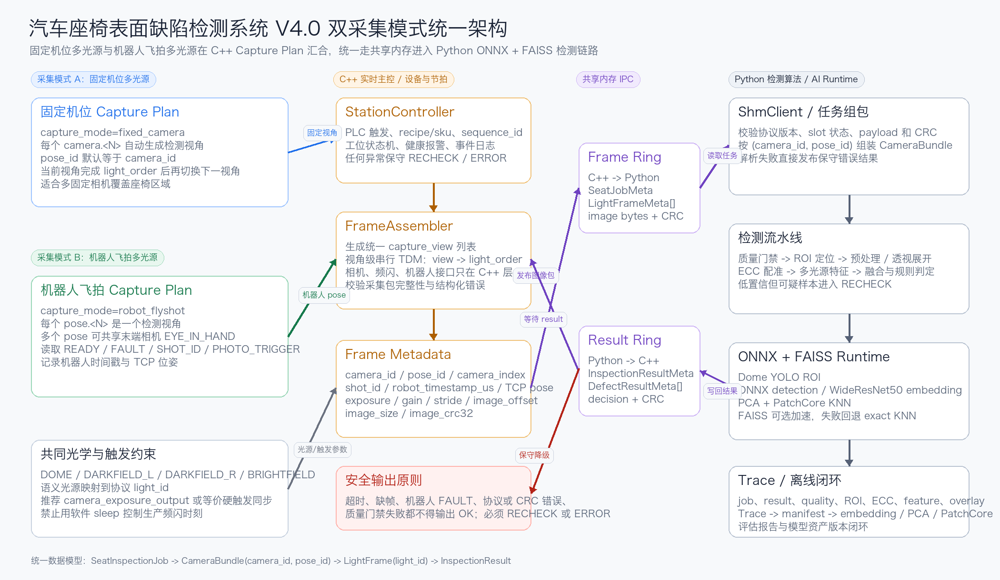

# V4.0 双采集模式架构对齐说明

本文以 `docs/assets/architecture-v4.png` 中的「汽车座椅表面缺陷检测系统 V4.0 双采集模式统一架构」作为目标架构，说明当前仓库已经实现的能力、已验证的边界和后续需要补齐的模块。



## 总体判断

当前项目已经具备 V4.0 双采集模式架构的主干工程骨架：

- C++ 作为实时主控，负责 PLC、相机、光源、机器人 pose/shot 读取、触发同步、共享内存写入、结果读取和保守降级。
- 固定机位多光源和机器人飞拍多光源在 C++ Capture Plan 层统一抽象为 `capture_view` / `pose_id` 检测视角序列。
- Python 作为独立检测进程，按 `(camera_id, pose_id)` 组装 `CameraBundle`，不参与 PLC、相机、频闪或机器人控制。
- 在线图像与结果通过跨平台共享内存传输，不使用 TCP；Linux/macOS 使用 POSIX 共享内存，Windows 工控机使用 Named Shared Memory。
- Python AI Runtime 以 ONNX Runtime 作为 ROI YOLO/WideResNet50 等模型的推理底座，PatchCore 向量检索优先使用 FAISS，缺索引或缺依赖时回退 exact KNN。
- 协议错误、CRC 错误、缺帧、超时、机器人 FAULT、质量门禁失败和模型异常都不会输出 `OK`。

当前实现已经从「工业 AOI 参考骨架 + 基础算法流水线」推进到「固定机位/机器人飞拍双模式可验证参考链路 + V4.0 主要算法接口 + 真实模型工程接入点 + 离线训练样本支撑入口」。真实产线仍需要接入设备 SDK、替换 `model/` 下的真实 YOLO/WideResNet50/PatchCore 产物、完成真实标注与训练评估、MES/报警和监控平台。

## 分层对齐

### 1. 双模式光学采集层

统一架构要求：

- 支持固定机位多光源和机器人飞拍多光源两种采集入口。
- 两类采集入口在 C++ Capture Plan 层统一为检测视角列表。
- Dome 主光源、DarkField-L、DarkField-R、BrightField 可选，其它光源可扩展。
- PLC -> C++ -> 相机/光源控制；机器人飞拍模式下 C++ 还需读取 READY、FAULT、SHOT_ID、PHOTO_TRIGGER、机器人时间戳和 TCP 位姿。
- GPIO/TTL 或相机曝光输出硬触发，微秒级曝光，触发抖动小于 10 微秒。

当前状态：

- 已在 C++ 配置和 Python 配方中支持固定机位和机器人飞拍两类采集方案。
- 固定机位配置通过 `capture_mode=fixed_camera` 生成相机视角；当前 C++ 生产主链路已经收敛为固定机位共享频闪，不再提供可运行的机器人飞拍 C++ 配置入口。
- C++ 主控当前固定使用 `capture_schedule=shared_light_parallel`，同一路共享光源频闪时 2 个固定机位相机同时曝光。
- 当前固定机位产线硬件已经按 2 相机 + 3 路共享频闪光源落地为 `light_order=1,2,3` 与 `capture_schedule=shared_light_parallel`，Python 生产配方同步为 `DIFFUSE/POLAR_DIFFUSE/HIGH_LEFT` 三路必需检测光源。
- Python 配方通过 `v4_lights.semantic_to_light_id` 统一 V4 语义光源；当前固定机位生产映射为 `DOME -> DIFFUSE`、`DARKFIELD_L -> HIGH_LEFT`、`BRIGHTFIELD -> POLAR_DIFFUSE`，`DARKFIELD_R/HIGH_RIGHT` 和常亮 `DOME_ROI` 保留为后续扩展检测/定位光源。
- Python 检测层把 `cameras` 视为检测视角配置，固定机位通常 `pose_id == camera_id`；机器人飞拍允许多个 `pose_id` 共享同一个末端相机 `camera_id=EYE_IN_HAND`。
- C++ 运行配置通过相机 `trigger_line`、`exposure_output_line` 和频闪 `trigger_input_line` 记录触发接线；当前 FL-ACDH 方案已将控制器同步输出接口 F1~F3 短接合成一根触发线，触发两台相机黄色 Line0，Line1 ExposureStartActive 仅保留用于调试/示波器输出。

差距：

- 真实光源控制器、工业相机 SDK、PLC/编码器现场协议和机器人/IO 网关仍需按设备型号接入。
- 微秒级抖动指标需要真实硬件压测证明。
- 两种采集模式都必须验证 `camera_id`、`pose_id`、`shot_id`、`calibration_id`、光源通道和 Python 配方完全一致。

### 2. 控制与通信层

统一架构要求：

- C++ 实时系统负责设备控制、触发管理、相机采集、光源切换、机器人 pose 状态、状态监控和日志记录。
- C++ 在共享内存中写入 `camera_id`、`pose_id`、`shot_id`、机器人时间戳、TCP 位姿、采集参数和多光源图像数据。
- 通信机制使用共享内存传输在线图像和检测结果。

当前状态：

- `cpp_controller` 已实现 C++ 主控、外部信号抽象、相机 worker、FL-ACDH 光源控制器、frame/result ring buffer。
- `python_detector` 通过共享内存读取任务并写回检测结果，按 `(camera_id, pose_id)` 组包。
- C++ 侧会校验 `sequence_id`、`trigger_id`、`seat_id`、decision、质量状态、错误码和缺陷数量。
- detector 超时、slot 不可用、缺帧、机器人异常和协议异常会保守返回 `RECHECK` 或 `ERROR`。

结论：

- 该层与 V4.0 双采集模式主体要求基本对齐。

### 3. 算法处理层

#### 3.1 ROI 定位

统一架构要求：

- 仅使用 Dome 语义光源图。
- 通过 YOLO 目标检测模型输出座椅 ROI 检测结果。
- 固定机位和机器人飞拍都通过 `camera_id + pose_id + calibration_id` 选择对应 ROI、标定和阈值。

当前状态：

- 已支持 ROI 模板加载、轴对齐矩形裁剪和四点多边形透视展开。
- 已增加 `RoiLocator`，支持 `template`、`fake_yolo`、`onnx_yolo` 和 `onnx_yolo_seg` 后端。
- 已在根目录 `model/roi_yolo/seat_roi_seg.onnx` 预留真实 ROI YOLO segmentation 产物路径，并提供 `production_model.example.yaml` 配方模板和 `tools.validate_model_assets` 校验。
- ROI 定位只读取 `DOME` 语义光源映射出的图；当前固定机位生产配方将 `DOME` 暂映射到 `DIFFUSE`，复用第一路频闪图作为 ROI 定位输入。未来补常亮 `DOME_ROI` 后，YOLO segmentation 可改用常亮图按 mask 自动生成运行时 `polygon_xy`，并通过 `roi_locator.class_names` 映射到 ROI 模板安全边界和 `output_size`。
- ROI 置信度不足、姿态误差超差、输出越界或缺 Dome 图会返回 `RECHECK`，不会输出 `OK`。

差距：

- 真实 YOLO ROI 权重、输入尺寸、ROI 标注训练集和评估报告仍需按现场数据产出。
- 机器人飞拍 pose 的 ROI 名称映射、姿态误差和标定版本必须单独用现场样本验证。

#### 3.2 ROI 裁剪与图像配准

统一架构要求：

- 输入所有检测光源图像。
- 以检测配方中的 `base_light_id` 为参考图。
- DarkField-L/R、BrightField 等检测光源 ROI 与参考图对齐；当前三路生产配方只把 `DIFFUSE/POLAR_DIFFUSE/HIGH_LEFT` 进入 ECC 配准和 ReflectanceCube 构建。未来独立 `DOME_ROI` 采集只用于 ROI 定位，不参与 ECC 配准或 ReflectanceCube 构建。
- 使用 ECC 图像配准或等价高精度配准，输出配准后 ROI。

当前状态：

- 已支持所有检测光源 ROI 裁剪。
- 已支持透视展开和 ROI 到原图的双向矩阵。
- 已使用标定文件中的 `light_alignment.matrix_3x3` 计算配准误差。
- 已支持 `registration.method: ecc`，通过 ROI 平移搜索输出 ECC 风格配准矩阵、相关系数、迭代次数、收敛状态和误差报告。

差距：

- 当前 ECC 为轻量参考实现，真实产线可替换为 OpenCV ECC 或设备侧高精度配准并继续复用相同报告字段。
- 固定机位和机器人飞拍应分别验证多光源对齐误差，不能共享未经验证的阈值。

#### 3.3 特征提取

统一架构要求：

- 使用共享特征提取网络，例如 WideResNet50。
- 分别提取 Dome、DarkField-L、DarkField-R、BrightField 等特征。

当前状态：

- 已构建多光源手工特征，包括 diffuse、polar diffuse、high left/right、high max-min、可选 low dark 差分、局部对比和高光抑制特征。
- 已具备 ONNX 推理入口和 fake 后端。
- 已支持统计 embedding 参考后端和 `onnx_wideresnet50` embedding 入口，配置中可声明 embedding 版本、维度和特征层。
- 已在 `model/wideresnet50/seat_wrn50_embedding.onnx` 预留 WideResNet50 embedding 产物路径；占位文件未替换时会被模型资产校验和运行时保守拒绝。

差距：

- 真实 WideResNet50 权重、输入归一化、特征层选择和批处理策略仍需按训练产物确认。
- 训练和评估报告需要按采集模式、ROI、材质、颜色和光源条件分层。

#### 3.4 特征融合与降维

统一架构要求：

- 多光源特征 concat。
- 使用 PCA 降维。
- 输出 unified embedding。

当前状态：

- 已能按模型配置生成 NCHW tensor。
- 已记录 feature summary 和 evidence lights。
- 已实现 unified embedding summary。
- 已实现 PCA JSON 参数加载、版本校验、输入/输出维度校验和投影。

差距：

- PCA 参数训练与版本发布仍需纳入离线模型管理流程。

#### 3.5 PatchCore 异常检测

统一架构要求：

- 训练阶段构建 memory bank。
- 使用正常样本特征，执行 coreset subsampling。
- 推理阶段输入 unified embedding。
- 使用 FAISS/KNN 加速近邻搜索。
- 输出 anomaly score。

当前状态：

- 配方 schema 允许 `patchcore` 模型族，并限制只能作为 `safety_net`。
- 已支持 `patchcore_knn` 后端，读取 memory bank JSON，执行 exact KNN，输出 anomaly score。
- 已提供 `training_tools.build_patchcore_memory_bank`，支持从 JSONL embedding 构建 memory bank 并保存 coreset 参数、PCA 版本和 FAISS 元数据；训练与回放类入口统一归属 `training_tools/`，不再在 `tools/` 保留兼容包装。
- 已支持 `faiss_index_path`，部署环境有有效 FAISS 索引时优先使用 FAISS；缺索引或缺依赖时回退 exact KNN，并在 trace 中记录 `backend` 与 `fallback_reason`。
- 已在 `model/patchcore/` 预留 PCA、memory bank 和 FAISS 索引产物路径，并提供模型资产校验工具。
- anomaly score 会作为通用缺陷候选进入融合、缺陷过滤和规则引擎，低置信但可疑样本走 `RECHECK`。

差距：

- FAISS 索引文件仍需由部署环境基于真实 memory bank 生成并验证延迟、内存占用和回退行为。
- 正常样本库、coreset 策略和阈值曲线仍需通过现场数据训练与验证。

### 4. 后处理与决策层

统一架构要求：

- 缺陷过滤与判定。
- 规则引擎。
- OK/NG 判定、可视化、报警输出、MES 系统对接。

当前状态：

- 已实现候选融合/NMS。
- 已将缺陷过滤抽为 `DefectFilter`，便于维护单一缺陷判定阈值、面积过滤、长宽比过滤和工艺过滤规则。
- 已实现单一 `decision_threshold`、面积阈值、`OK`、`NG`、`RECHECK`、`ERROR` 判定。
- 已支持 trace、ROI 图和检测 overlay；只要 ROI 已完成预处理，OK 与 NG/RECHECK/ERROR 都会生成 overlay，缺陷候选存在时额外绘制候选框。

差距：

- MES、报警输出和可视化界面不是当前仓库完整实现。
- 多 ROI 关联规则需要按实际缺陷工艺继续扩展。

### 5. 系统管理与维护

统一架构要求：

- 数据管理。
- 模型管理。
- 系统监控。
- 固定机位和机器人飞拍两类 trace 都能进入同一训练样本和评估闭环。

当前状态：

- 已有配方、标定、模型配置、trace、Trace 转训练样本、回放、benchmark 和双采集模式运维文档。
- 已有根目录 `model/` 模型产物占位、真实模型配方模板和 `tools.validate_model_assets` 上线前资产校验。
- 已有 `tools.validate_deployment_preflight` 上机前交接预检，可区分当前环境可实现项、现场硬件配置项、真实模型资产项和 MES/报警/监控平台项。
- 已有模型缓存隔离、trace 保存策略、固定机位/机器人飞拍配置模板和测试机集成说明。
- trace 已扩展 ROI 定位、ECC、embedding、PCA、KNN 和 anomaly score 摘要。
- 已将离线训练支撑剥离到 `training_tools/`，只消费 Python 检测层公开入口和 trace 产物，不反向耦合在线 detector。

差距：

- 已补齐 Trace 转训练样本的工程入口；真实人工标注、完整离线训练工程、数据平台、模型版本平台和系统监控服务仍需外部项目或现场平台承接。
- 现场运行指标、健康检查和报警面板仍需结合部署环境建设。

### 6. AI Runtime 与依赖

统一架构要求：

- AI Runtime 使用 ONNX 作为推理底座，承载 YOLOvX ROI 定位和 WideResNet50 特征提取等模型。
- 向量检索引擎使用 FAISS，支持 CPU/GPU、IndexFlatL2、IVF、PQ 等部署选择。
- 基础依赖包括 OpenCV、NumPy、共享内存 SDK 和图像处理组件。

当前状态：

- 已提供统一 ONNX Runtime 适配层，ROI YOLO、通用 ONNX detection rows 和 WideResNet50 embedding 共享 session 创建、输入构建和保守错误处理。
- 已在 `model/` 目录预留 YOLO ROI、WideResNet50 embedding、PCA、PatchCore memory bank 和 FAISS 索引产物路径；当前生产链路不依赖监督缺陷检测 ONNX。
- `pyproject.toml` 已提供 `onnx` 和 `faiss` optional extras；默认模拟链路不强制安装 ONNX Runtime 或 FAISS。
- PatchCore 在线链路配置 `faiss_index_path` 后优先尝试 FAISS，失败时回退 exact KNN，并在 trace 中记录 `backend` 与 `fallback_reason`。
- Python 层当前只负责检测算法，不控制 PLC、相机、机器人或频闪。

差距：

- 真实 ONNX 模型、FAISS 索引、OpenCV 高精度 ECC 后端和现场性能参数仍需部署环境实测确认。
- GPU 推理、FAISS GPU 索引和平台化依赖管理仍需结合产线硬件规格建设。

## 推荐补齐顺序

1. 分别接入固定机位和机器人飞拍生产配置的真实 PLC/编码器、相机、频闪、机器人/IO 网关 SDK，并做节拍、稳定性和故障注入压测。
2. 验证两种采集模式的 `camera_id`、`pose_id`、`shot_id`、`calibration_id`、光源通道和 Python 配方完全一致。
3. 训练并接入真实 Dome YOLO ROI 定位权重，固化 ROI 名称映射、置信度、姿态误差和复检阈值。
4. 用现场数据验证 ECC 参数，必要时替换为 OpenCV ECC 或更高精度配准后端。
5. 接入真实 WideResNet50 embedding 权重，固化输入归一化、特征层、embedding 维度和批处理策略。
6. 使用 `training_tools.collect_trace_dataset` 从两类采集模式的现场 trace 生成训练样本 manifest，完成真实人工标注和数据分层。
7. 基于正常样本训练 PCA 与 PatchCore memory bank，替换 `model/patchcore/` 占位产物，产出阈值曲线和按 ROI/材质/颜色/缺陷尺寸/采集模式分层的检测评估报告。
8. 在部署环境生成并接入 FAISS 加速索引，验证 KNN 延迟、内存占用和 exact KNN 回退。
9. 按现场硬件规格固化 ONNX Runtime、FAISS、OpenCV 和 NumPy 版本，完成 AI Runtime 性能基准。
10. 按现场工艺扩展多 ROI 关联规则、MES/报警接口、数据平台、模型版本平台和系统监控服务。

## 当前验证命令

```powershell
uv run pytest
uv run python -m tools.validate_protocol
uv run python -m tools.validate_model_assets --recipe production_model_example
uv run python -m tools.validate_architecture_readiness --scope reference
uv run python -m tools.validate_deployment_preflight
uv run python tools/run_simulated_ipc.py
```

默认模拟链路要求测试、协议校验、架构就绪度检查和模拟 IPC 通过；`validate_model_assets --recipe production_model_example` 在占位文件未替换时应失败，并列出需要替换的真实模型产物。

上 Windows 工控机放行前再执行：

```powershell
uv run python -m tools.validate_deployment_preflight --strict-production
```

严格模式会把正式 `production.conf` 缺失、固定机位光源/生产配方不一致和真实模型资产缺失作为阻塞；默认模式则用于当前环境交接，只要求本地可实现的参考链路、跨平台共享内存、部署包入口和手动联调路径无阻塞。
